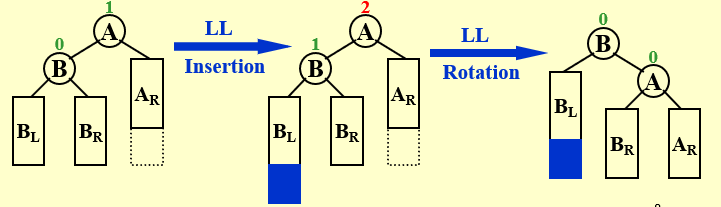
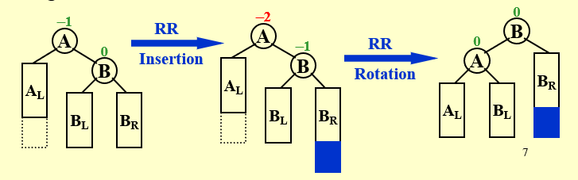
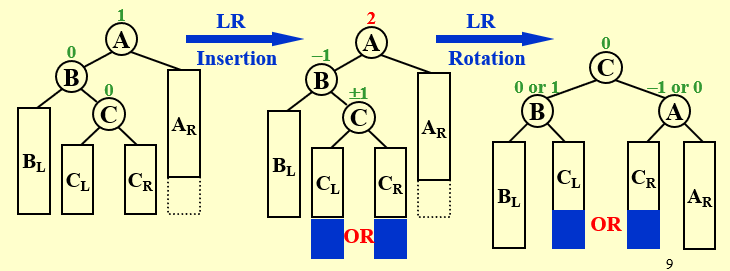
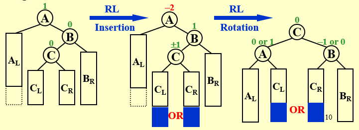
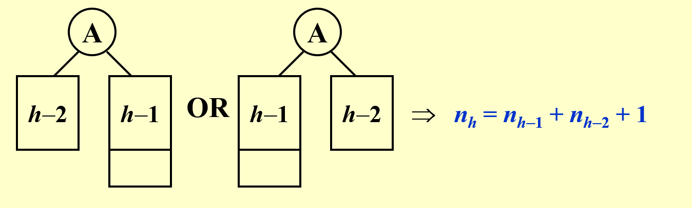
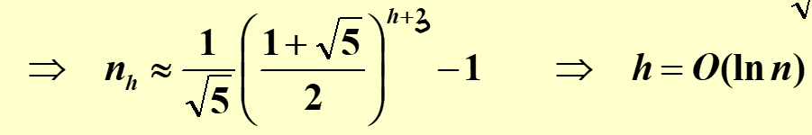
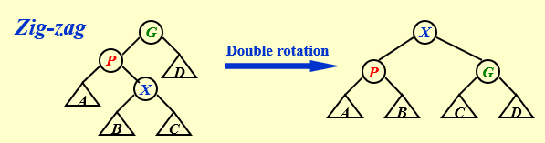
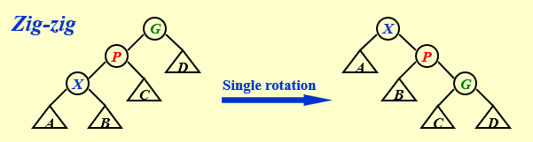
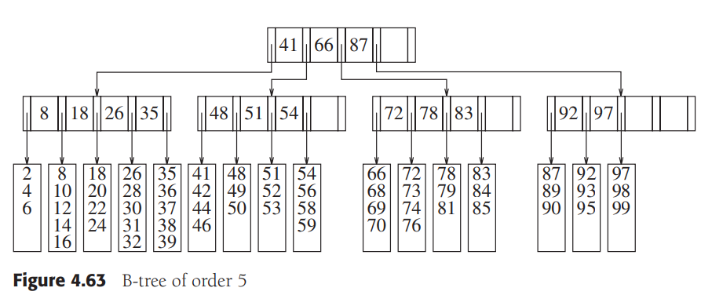
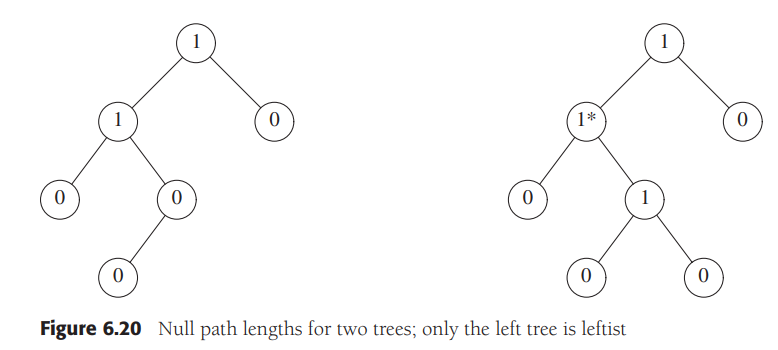

# ADS

## Chapter 1: Tree

### AVL Trees 

#### Defination

>The height of an empty tree is defined to be -1

>An empty binary tree is height balanced. 
>If T is a nonempty binary tree with T~L~ and T~R~ as its left and right subtrees, then T is height balanced if
>1. T~L~ and T~R~ are height balanced
>2. **|h~L~ - h~R~| <= 1**
>
>The **balance factor** BF(node) = h~L~ - h~R~; In an AVL tree, BF(node) = -1, 0 or 1

#### Implementation

- Single Rotation
  - LL Rotation
  
  - RR Rotation
  
- Double Rotation
  - LR Rotation
  
  - RL Rotation
  

>**Trouble finder**: The lowest unbalanced node

#### Time Complexity

T = O(h)
Let n~h~ be the minimum number of nodes in a height balanced tree of height h.  Then the tree must look like:  



*Fibonacci* number theory gives that: 



#### Coding

##### Structure Define
```c
struct AvlNode
{
    ElementType Element;
    AvlTree  Left;
    AvlTree  Right;
    int      Height;
};
```
##### Height
```c
static int
Height( Position P )
{
    if( P == NULL )
        return -1;
    else
        return P->Height;
}
```

##### Single Rotation With Left(LL Rotation)
```c
static Position
SingleRotateWithLeft( Position K2 )  // K2 is grandfather
{
    Position K1;  // K1 is parent

    K1 = K2->Left;
    K2->Left = K1->Right;
    K1->Right = K2;

    K2->Height = Max( Height( K2->Left ), Height( K2->Right ) ) + 1;  // Don't forget "+1"
    K1->Height = Max( Height( K1->Left ), K2->Height ) + 1;

    return K1;  /* New root */
}
```

##### Single Rotation With Right
```c
static Position
SingleRotateWithRight( Position K1 )
{
    Position K2;

    K2 = K1->Right;
    K1->Right = K2->Left;
    K2->Left = K1;

    K1->Height = Max( Height( K1->Left ), Height( K1->Right ) ) + 1;
    K2->Height = Max( Height( K2->Right ), K1->Height ) + 1;

    return K2;  /* New root */
}
```

##### Double Rotation With Left
```c
static Position
DoubleRotateWithLeft( Position K3 )  // K3 is grandfather
{
    /* Rotate between K1 and K2 */
    K3->Left = SingleRotateWithRight( K3->Left );

    /* Rotate between K3 and K2 */
    return SingleRotateWithLeft( K3 );
}
```

##### Double Rotation With Right
```c
static Position
DoubleRotateWithRight( Position K1 )
{
    /* Rotate between K3 and K2 */
    K1->Right = SingleRotateWithLeft( K1->Right );

    /* Rotate between K1 and K2 */
    return SingleRotateWithRight( K1 );
}
```

##### Insert
```c
AvlTree
Insert( ElementType X, AvlTree T )
{
    if( T == NULL )
    {
        /* Create and return a one-node tree */
        T = malloc( sizeof( struct AvlNode ) );
        if( T == NULL )
            FatalError( "Out of space!!!" );
        else
        {  // End of recursion to create a leaf node
            T->Element = X; T->Height = 0;
            T->Left = T->Right = NULL;
        }
    }
    else
    if( X < T->Element )
    {
        T->Left = Insert( X, T->Left );
        if( Height( T->Left ) - Height( T->Right ) == 2 )
            if( X < T->Left->Element )
                T = SingleRotateWithLeft( T );
            else
                T = DoubleRotateWithLeft( T );
    }
    else
    if( X > T->Element )
    {
        T->Right = Insert( X, T->Right );
        if( Height( T->Right ) - Height( T->Left ) == 2 )
            if( X > T->Right->Element )
                T = SingleRotateWithRight( T );
            else
                T = DoubleRotateWithRight( T );
    }
    /* Else X is in the tree already; we'll do nothing */

    T->Height = Max( Height( T->Left ), Height( T->Right ) ) + 1;
    return T;
}
```

### Splay Trees

#### Defination

>After a node is accessed, it is pushed to the root a series of AVL tree rotations

>Target:
>Any M consecutive tree operations starting **from an empty** tree take at most **O(MlogN)** time

easy to implement, no extra space, adaptive(continuous access)

#### Implementation

##### Splay(X)
For any nonroot node X, denote its parent by P and gradparent by G:

case 1: P is the root -> Rotate X and P

case 2: P is not the root
- zig-zag -> double rotation(same as AVL)
    

- zig-zig -> single rotation(different from AVL)
    

##### Findkey
1. find as in BST
2. splay the found node

##### Insert
1. insert as in BST
2. splay the new node

##### Delete(X)
1. Find(X) -> X will be at the root
2. Remove(X)
3. FindMax(T~L~) -> The largest element will be the root of T~L~, and has **no right child**
4. Make T~R~ the right child of the root of T~L~

#### Coding

##### Structure Define
```c
struct SplayNode
{
    ElementType Element;
    SplayTree      Left;
    SplayTree      Right;
};

typedef struct SplayNode *Position;
static Position NullNode = NULL;  /* Needs initialization */
```

##### Splay
```c
SplayTree
Splay( ElementType Item, Position X )
{
    static struct SplayNode Header;
    Position LeftTreeMax, RightTreeMin;

    Header.Left = Header.Right = NullNode;
    LeftTreeMax = RightTreeMin = &Header;
    NullNode->Element = Item;

    while( Item != X->Element )
    {
        if( Item < X->Element )
        {
            if( Item < X->Left->Element )
                X = SingleRotateWithLeft( X );
            if( X->Left == NullNode )
                break;
            /* Link right */
            RightTreeMin->Left = X;
            RightTreeMin = X;
            X = X->Left;
        }
        else
        {
            if( Item > X->Right->Element )
                X = SingleRotateWithRight( X );
            if( X->Right == NullNode )
                break;
            /* Link left */
            LeftTreeMax->Right = X;
            LeftTreeMax = X;
            X = X->Right;
        }
    }  /* while Item != X->Element */

    /* Reassemble */
    LeftTreeMax->Right = X->Left;
    RightTreeMin->Left = X->Right;
    X->Left = Header.Right;
    X->Right = Header.Left;

    return X;
}
```

##### Delete
```c
SplayTree
Remove( ElementType Item, SplayTree T )
{
    Position NewTree;

    if( T != NullNode )
    {
        T = Splay( Item, T );
        if( Item == T->Element )
        {
            /* Found it! */
            if( T->Left == NullNode )
                NewTree = T->Right;
            else
            {
                NewTree = T->Left;
                NewTree = Splay( Item, NewTree );
                NewTree->Right = T->Right;
            }
            free( T );
            T = NewTree;
        }
    }

    return T;
}
```

### Amortized Analysis

consider the worst-case running time for any sequence of M operations

### Red-Black Trees

[红黑树 - 定义, 插入, 构建](https://www.bilibili.com/video/BV1Xm421x7Lg/?spm_id_from=333.788&vd_source=14ad5ada89d0491ad8ab06103ead6ad6)
[红黑树 - 删除](https://www.bilibili.com/video/BV16m421u7Tb/?spm_id_from=333.788&vd_source=14ad5ada89d0491ad8ab06103ead6ad6)

#### Definition

```
1. node color: red or black
2. root is black
3. leaves(NIL) is black
4. children of red must be black
5. for each node v, all descending paths from v to leaves contain the same number of black nodes
    called the black height of v: bh(v)[excluding v]
    bh(T) = bh(root)
```


```
Lemma：
1. A red-black tree with N internal nodes has height at most 2ln(N + 1).
2. bh(Tree) >= h(Tree) / 2
```

#### Insert

```
1. insert it as in BST
2. mark the new node red
```

case 1: father is black -> Done

case 2: uncle is red


- father & uncle & grandfather change color
- check grandfather

case 2: uncle is black


- (LL, LR, RL, RR) rotation
- change the ratated node and center

#### Delete

```
1. delete it as in BST(deleted node u has one most child excluding NIL)
```

case 1: u only has left child or right child -> child replace u and change into black

case 2: u has no child

- u is red -> delete directly
- u is black 
  - u's sibling(s) is black -> double-black
    - s's children are all black -> change s into red + move up the double-black
      - u's father is root -> Done
      - u's  father is red -> change into black
      - u's father is black -> check father as double black
    - s's children are at least one red(r)
      - LL/RR rotation + color change: r -> s, s -> p
      - LR/RL rotation + color change: r -> p, p -> black 
  - u's sibling(s) is red -> color exchange p & s + p rotate towards double-black + check double-black again


### B+ Tree

```
A B+ tree of order M is an M-ary tree with the following properties:

1. The data items are stored at leaves
2. The nonleaf nodes store up to M - 1 keys to guide the searching; key i represents the smallest key in subtree i + 1
3. The root is either a leaf or has between two and M children
4. All nonleaf nodes(excpet the root) have betweeen [M / 2] and M children(fanout of an internal node); for root is between 2 and M
5. All leaves are at the same depth and have between [M / 2] and M data items; for root being the leaf is between 1 and M 
```



## Chapter 2: Heap

### Leftist Heap

define the **null path length**, *npl(X)*, of ant node X to be the length of the shortest path from X to a node without two children

the *npl* of a node with zero or one child is 0, while *npl*(nullptr) = -1

```
for every node X in the heap, the null path length of the left child is at least as large as that of the right child
(for each u, the right decending path from u to null is one of the shortest path from u to null)

ensure the tree is unbalanced, tend to have deep left paths and is preferable to facilitate merging
```



```
Lemma:
For a leftist heap with n nodes, its right path has at most log2(n + 1) nodes.
<==> A leftist heap with r nodes on the right path must have at least 2^r - 1 nodes.
```

#### merge

