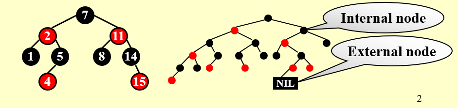
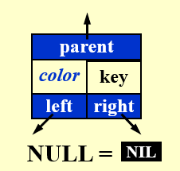
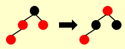
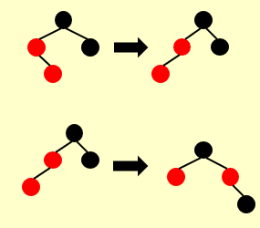
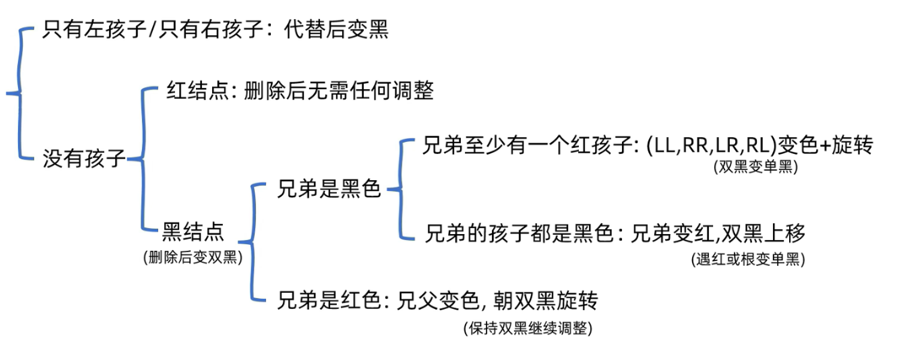
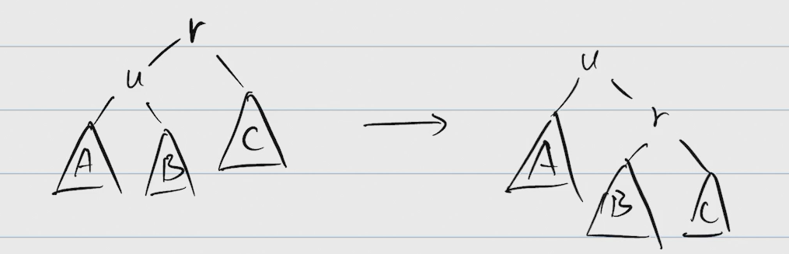
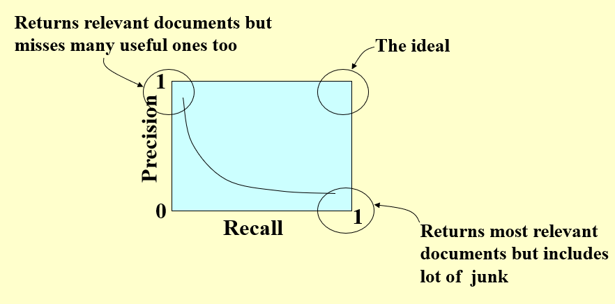
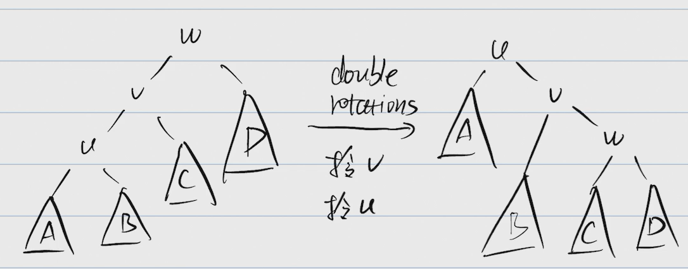

# ADS

## Lesson 1

### AVL Trees 

### Red-Black Trees

[红黑树 - 定义, 插入, 构建](https://www.bilibili.com/video/BV1Xm421x7Lg/?spm_id_from=333.788&vd_source=14ad5ada89d0491ad8ab06103ead6ad6)
[红黑树 - 删除](https://www.bilibili.com/video/BV16m421u7Tb/?spm_id_from=333.788&vd_source=14ad5ada89d0491ad8ab06103ead6ad6)

#### Definition

```
1. node color: red or black
2. root is black
3. leaves(NIL) is black
4. children of red must be black
5. for each node v, all descending paths from v to leaves contain the same number of black nodes
    called the black height of v: bh(v)[excluding v]
    bh(T) = bh(root)
```





```
Lemma：
1. A red-black tree with N internal nodes has height at most 2ln(N + 1).
2. bh(Tree) >= h(Tree) / 2
```

#### Insert

```
1. insert it as in BST
2. mark the new node red
```

case 1: father is black -> Done

case 2: uncle is red


- father & uncle & grandfather change color
- check grandfather

case 2: uncle is black



- (LL, LR, RL, RR) rotation
- change the ratated node and center

#### Delete

```
1. delete it as in BST(deleted node u has one most child excluding NIL)
```

case 1: u only has left child or right child -> child replace u and change into black

case 2: u has no child

- u is red -> delete directly
- u is black 
  - u's sibling(s) is black -> double-black
    - s's children are all black -> change s into red + move up the double-black
      - u's father is root -> Done
      - u's  father is red -> change into black
      - u's father is black -> check father as double black
    - s's children are at least one red(r)
      - LL/RR rotation + color change: r -> s, s -> p
      - LR/RL rotation + color change: r -> p, p -> black 
  - u's sibling(s) is red -> color exchange p & s + p rotate towards double-black + check double-black again



### Amortized Analysis

consider the worst-case running time for any sequence of M operations

### Splay Trees

θ(n) in worst case

O(log n) as amortized cost

easy to implement, no extra space, adaptive(continuous access)

for a BST, **Spaly(u)** repeat the follows until u is the root:

case 1: u is a child of the root



case 2: u has a grandfather
- zig-zag -> double rotation

    

- zig-zig -> double rotation

    

#### Findkey
```
1. find as in BST
2. splay the found node
```

#### Insert
```
1. insert as in BST
2. splay the new node
```

#### Delete(u)
```
1. splay(u)
```

case 1: u has only one child -> delete u directly

case 2: u has two child
- delete u
- splay the largest element v in A
- attach B to v

 
