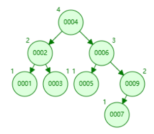
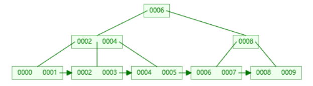

# PTA Homework of ZJU Advanced Data Structure and Algorithm

Reference:
[Jianjun Zhou's Notebook](https://zhoutimemachine.github.io/note/courses/ads-hw-review/)

## HW-1

1. If the depth of an AVL tree is 6 (the depth of an empty tree is defined to be -1), then the minimum possible number of nodes in this tree is:  
A. 13  
B. 17  
C. 20  
==D. 33==  
**n~h~ = h~h-1~ + h~h-2~ + 1**


<br/>
2. For the result of accessing the keys 3, 9, 1, 5 in order in the splay tree in the following figure, which one of the following statements is FALSE?  
  
A. 5 is the root  
B. 1 and 9 are siblings  
C. 6 and 10 are siblings  
<mark>D. 3 is the parent of 4</mark>  
<br/>
3. When doing amortized analysis, which one of the following statements is FALSE?  
A.Aggregate analysis shows that for all n, a sequence of nn operations takes worst-case time T(n) in total.  Then the amortized cost per operation is therefore T(n)/n  
<mark>B. For potential method, a good potential function should always assume its ~~maximum~~（minimum） at the start of the sequence</mark>  
C. For accounting method, when an operation's amortized cost exceeds its actual cost, we save the difference as credit to pay for later operations whose amortized cost is less than their actual cost  
D. The difference between aggregate analysis and accounting method is that the later one assumes that the amortized costs of the operations may differ from each other  
<br/>
4. (**Wrong**)Insert 2, 1, 4, 5, 9, 3, 6, 7 into an initially empty AVL tree.  Which one of the following statements is FALSE?  
A. 4 is the root  
==B. 3 and 7 are siblings==  
C. 2 and 6 are siblings  
D. 9 is the parent of 7  

    
[AVL Tree Visulization](https://www.cs.usfca.edu/~galles/visualization/AVLtree.html)  
<br/>
5. (**Wrong**)Consider the following buffer management problem. Initially the buffer size (the number of blocks) is one. Each block can accommodate exactly one item. As soon as a new item arrives, check if there is an available block. If yes, put the item into the block, induced a cost of one. Otherwise, the buffer size is doubled, and then the item is able to put into. Moreover, the old items have to  be moved into the new buffer so it costs k+1 to make this insertion, where k is the number of old items. Clearly, if there are N items, the worst-case cost for one insertion can be $\Omega (N)$.  To show that the average cost is O(1), let us turn to the amortized analysis. To simplify the problem, assume that the buffer is full after all the N items are placed. Which of the following potential functions works?  
A. The number of items currently in the buffer  
B. The opposite number of items currently in the buffer  
C. The number of available blocks currently in the buffer  
==D. The opposite number of available blocks in the buffer==  

>When given the potential function, we need to calculate $\Delta$$\phi$ and add it to c~i~, which equals to c~i~_hat. The potentail function is working when in every situation the c~i~_hat equals to the target average cost.  
>
>

<br/>

### Root of AVL Tree  
```c
# include <stdio.h>
# include <stdlib.h>

struct node;
typedef struct node* pos;
typedef struct node* tree;
pos LLROTATION( pos );
pos LRROTATION( pos );
pos RRROTATION( pos );
pos RLROTATION( pos );

int max( int a, int b )
{
    return ( a > b ) ? a : b;
}

struct node
{
    int element;
    tree left;
    tree right;
    int height;
};

int height( pos p )
{
    if ( p == NULL )
        return -1;
    else 
        return p->height; 
};

struct node* insert( int x, tree t )
{
    if ( t == NULL ){  // End of recursion
        t = ( struct node* )malloc( sizeof( struct node ) );  
        t->element = x;
        t->height = 0;
        t->left = NULL, t->right = NULL;
    }
    else if ( x < t->element ){  // Decide the type of rotation
        t->left = insert( x, t->left );
        if( height( t->left ) - height( t->right ) == 2 ){
            if( x < t->left->element )
                t = LLROTATION( t );
            else
                t = LRROTATION( t );
        }
    }
    else if ( x > t->element ){
        t->right = insert( x, t->right );
        if( height( t->right ) - height( t->left ) == 2 ){
            if( x > t->right->element )
                t = RRROTATION( t );
            else
                t = RLROTATION( t );
        }
    }

    t->height = max( height( t->left ), height( t->right ) ) + 1;  // "+1"
    return t;
};

pos LLROTATION( pos grandfather)
{
    pos father = grandfather->left;
    grandfather->left = father->right;
    father->right = grandfather;

    grandfather->height = max( height( grandfather->left ), height( grandfather->right ) ) + 1;
    father->height = max( height( father->left ), height( father->right ) ) + 1;

    return father;
}

pos LRROTATION( pos grandfather)
{
    pos father = grandfather->left;
    grandfather->left = RRROTATION( father );
    return LLROTATION( grandfather );
}

pos RRROTATION( pos grandfather )
{
    pos father = grandfather->right;
    grandfather->right = father->left;
    father->left = grandfather;

    grandfather->height = max( height( grandfather->left ), height( grandfather->right ) ) + 1;
    father->height = max( height( father->left ), height( father->right ) ) + 1;

    return father;
}

pos RLROTATION( pos grandfather )
{
    pos father = grandfather->right;
    grandfather->right = LLROTATION( father );
    return RRROTATION( grandfather );
}

int main()
{
    int n;
    scanf("%d", &n);

    int x;
    tree root = NULL;
    for( int i = 1; i <= n; i++){
        scanf("%d", &x);
        root = insert(x, root);
    }

    printf("%d", root->element);

    return 0;
}
```
<br/>

## EX-1

1. Amortized bounds are weaker than the corresponding worst-case bounds, because there is no guarantee for any single operation.  
==A. T==  
B. F  
<br/>
2. Suppose we have a potential function $\phi$ such that for all $\phi$(Di)$\geq$$\phi$(D0) for all ii, but $\phi$(D0)$\neq$0. Then there exists a potential $\phi$′ such that $\phi$′(D0)=0, $\phi$′(Di)$\geq$0 for all i$\geq$1, and the amortized costs using $\phi$′ are the same as the amortized costs using $\phi$.  
==A. T==  
B. F
<br/>
3. For the result of accessing the keys 1 and 2 in order in the splay tree in the following figure, let's define size(v)=number of nodes in subtree of v ( vv included ) and potential $\phi$=$\sum$v[log~⁡2~size(v)], where [x] means the greatest interger no larger than x.  
How many of the following statements is/are TRUE?  
a. the potential change from the initial tree to the resulted tree is -4 ==(-5?)==  
b. ==1 is the sibling of 4==  
c. ==5 is the child of 6==  


<br/>

## HW-2  

1. In the red-black tree that results after successively inserting the keys 41; 38; 31; 12; 19; 8 into an initially empty red-black tree, which one of the following statements is FALSE?  
A. 38 is the root  
==B. 19 and 41 are siblings, and they are both red(41 is black)==  
C. 12 and 31 are siblings, and they are both black  
D. 8 is red  

[Red/Black Tree Visulization](https://www.cs.usfca.edu/~galles/visualization/RedBlack.html)
<br/>
2. After deleting 15 from the red-black tree given in the figure, which one of the following statements **must be**(two way of deletion) FALSE?  
  
A. 11 is the parent of 17, and 11 is black  
B. 17 is the parent of 11, and 11 is red  
==C. 11 is the parent of 17, and 11 is red==  
D. 17 is the parent of 11, and 17 is black  
<br/>
3. Insert 3, 1, 4, 5, 9, 2, 6, 8, 7, 0 into an initially empty 2-3 tree (with splitting).  Which one of the following statements is FALSE?  
==A. 7 and 8 are in the same node==  
B. the parent of the node containing 5 has 3 children  
C. the first key stored in the root is 6  
D. there are 5 leaf nodes  

<br/>
4. After deleting 9 from the 2-3 tree given in the figure, which one of the following statements is FALSE?  
  
A. the root is full  
B. the second key stored in the root is 6  
C. 6 and 8 are in the same node  
==D. 6 and 5 are in the same node==  
<br/>
5. Which of the following statements concerning a B+ tree of order M is TRUE?  
A. the root always has between 2 and M children  
B. not all leaves are at the same depth  
==C. leaves and nonleaf nodes have some key values in common==  
D. all nonleaf nodes have between $\lceil{M/2}\rceil$ and M children  

### Self-printable B+ Tree
