# HPC Notebook

在做 PAC 比赛时第一次接触了 HPC ，由于只上了一个短学期，相关知识极度匮乏，优化根本无从下手。为此，我认为有必要系统性的补全相关的知识，做一些相关的积累，这对日后的计科学习想必也是大有裨益的。  

这个 notebook 一方面记录 HPC 的相关知识，另一方面也是一个学习路径的记录。最为一个完全的小白，从zhb处得到建议，决定以[Bowling's TechStack](https://note.bowling233.top/%E9%AB%98%E6%80%A7%E8%83%BD%E8%AE%A1%E7%AE%97/)为指导框架，往里面填充知识；同时该文档也是一个起点，向外发散拓展。

---

直接盗用 Bowling 的结构图和优化框架：  

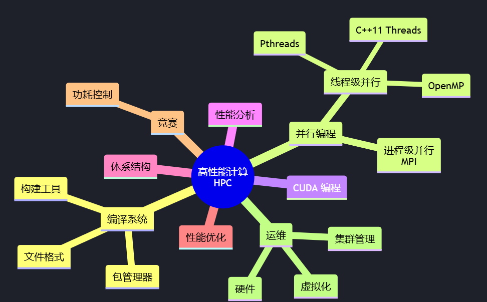  
 
优化主要在两个层面进行：**代码层面**和**运行层面**。

代码优化
- 三大并行编程模型
    - MPI
    - OpenMP
    - CUDA
- 常见实现、编译器和工具链对应的优化策略
    - GCC（OpenMPI）
    - Intel（Intel MPI）
    - NVIDIA（NVCC）

代码优化的目标是编写具有**可扩展性**的代码。可扩展性是指，随着计算资源的增加，代码的性能也能够线性（甚至更好地增长）。在不考虑实现的阶段，我们需要按照对应编程模型的最佳实践编写代码。在考虑实现的阶段，我们需要根据实现的特点和硬件架构的特点，针对性地优化代码，比如采用特定的指令集等。

运行优化
- CPU 计算（MPI）
    - 绑核
    - 节点、进程、线程拓扑
- GPU 计算
    - SM、Warp 调度

运行优化一定程度上是不断的尝试，探索在如何最大化利用硬件资源。  

由于开始这个文档的时间正好是Lab3即将开始的时候，所以我们先从 **CUDA** 开始

## CUDA  

### GPU & SPMD

Where are we?

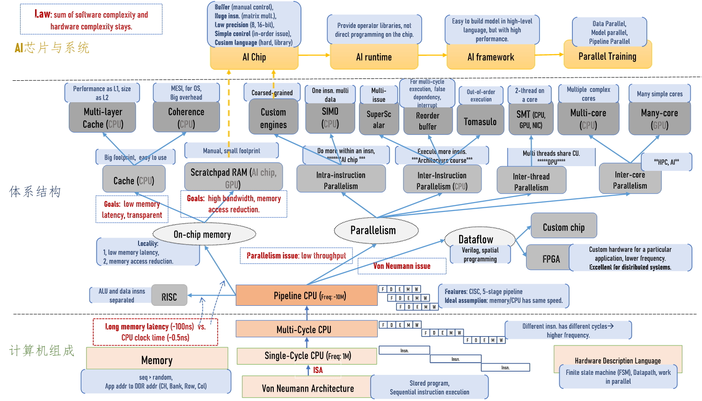  

Why **GPU**? Need More Computing Power.  

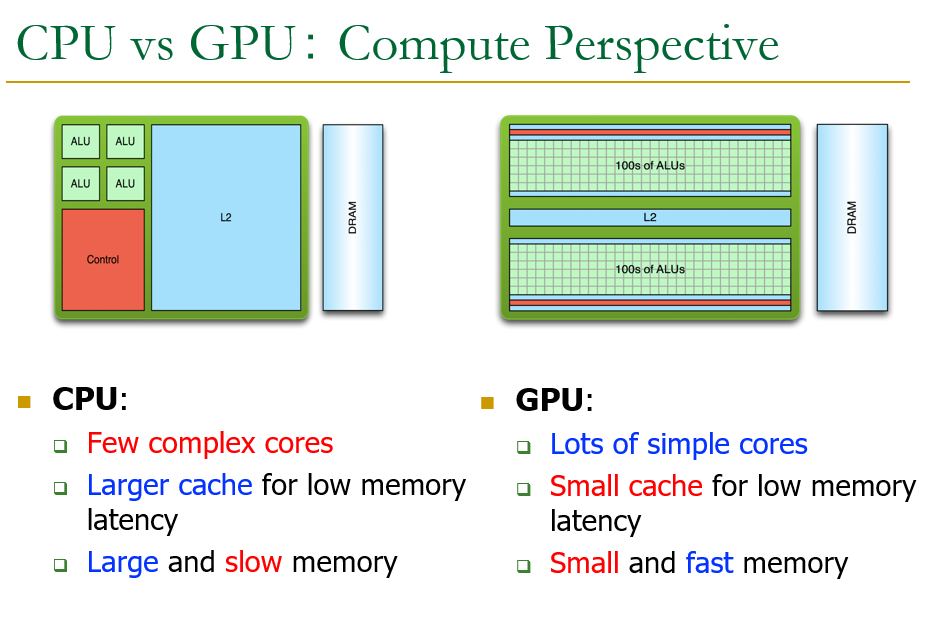  

特别有趣的图片解释了 CPU 与 GPU 之间的关系  

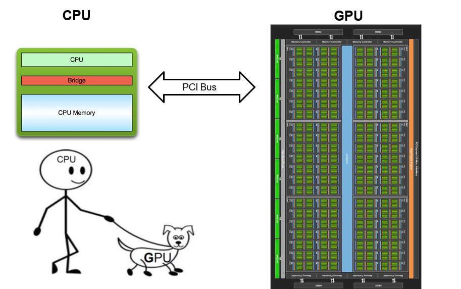  

GPU 只是一个计算工具，依旧需要在 CPU 的指令下工作  

More cores -> More trouble  
How to manipulate them?  

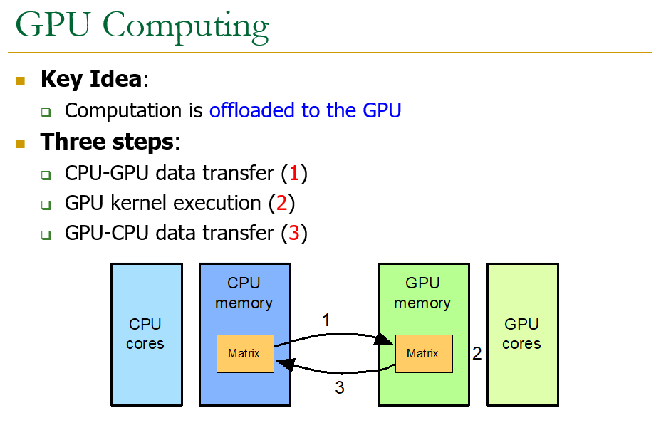  

CPU-GPU Co-processing: 
- CPU: Sequential or modestly parallel sections
- **GPU: Massively parallel sections**

The instruction pipeline operates **like a SIMD pipeline** (e.g., an array processor). However, the programming is done **using threads**, NOT SIMD instructions

First, let’s distinguish between 
- **Programming Model (Software)**
          vs.
- **Execution Model (Hardware)**  

Programming Model： how the programmer expresses the code
E.g., Sequential (von Neumann), Data Parallel (SIMD), Dataflow, Multi-threaded (MIMD, SPMD), …

Hardware Execution Model： how the hardware executes the code underneath
E.g., Out-of-order execution, Vector processor, Array processor, Dataflow processor, Multiprocessor, Multithreaded processor, …

**Execution Model can be very different from Programming Model**
E.g., von Neumann model implemented by an OoO processor
E.g., SPMD model implemented by a SIMD processor (a GPU)

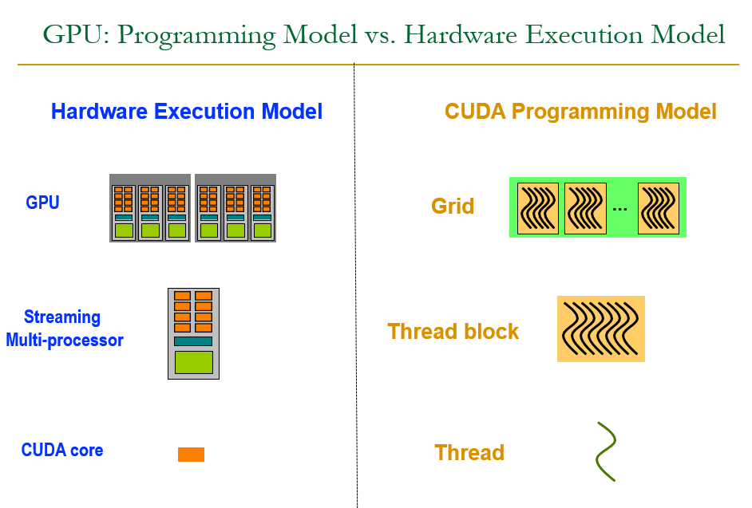  

**NVIDIA A100 & NVIDIA H100** 

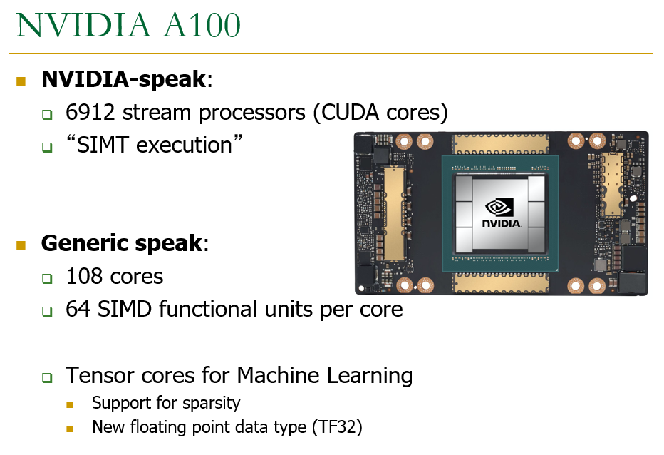  

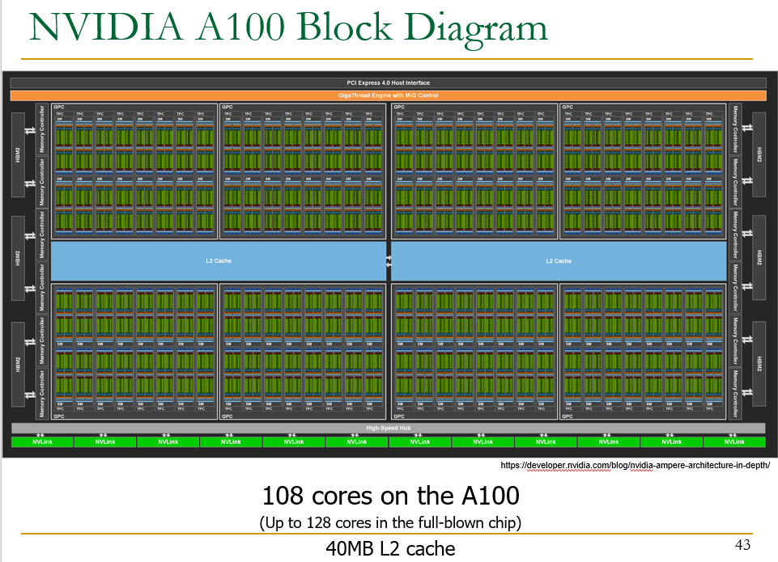  

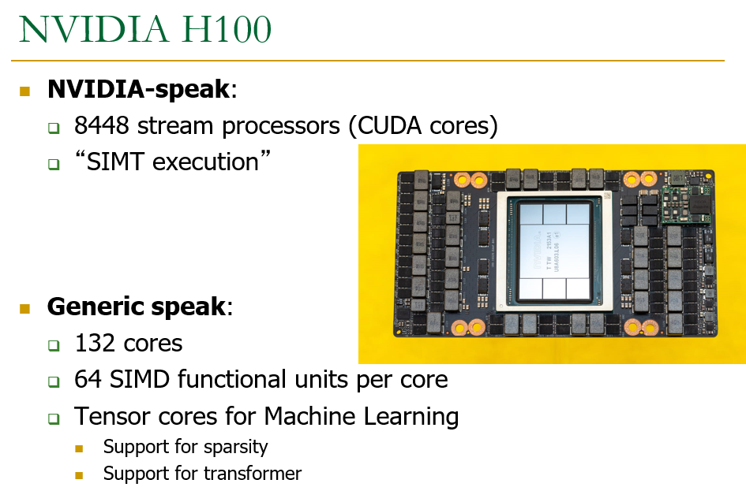  

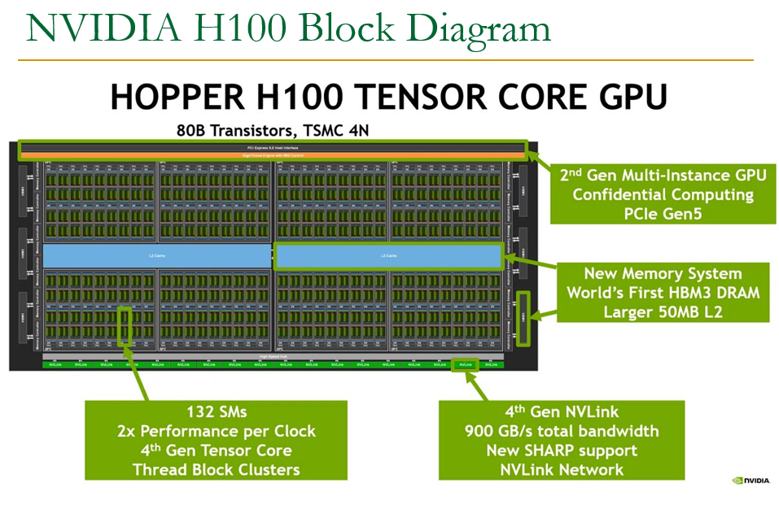  

GPU Trend H100 vs. A100  
**Compute power scales well.**
**GPU memory capacity does not scale well.**

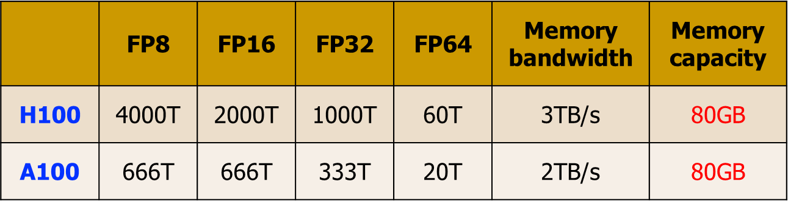  

A GPU is a SIMD (SIMT) Machine，Except it is *NOT* programmed using SIMD instructions

It is **programmed using threads (SPMD programming model)**
- Each thread **executes the same code but operates a different piece of data**
- Each thread **has its own context** (i.e., can be treated/restarted/executed independently)  

**SISD vs. SIMD vs. SPMD**

How Can You Exploit Parallelism Here?  

~~~c  
for (int i=0; i<N; i++)
{
    C[i] = A[i] + B[i];
}
~~~  

Let’s examine three programming options to exploit **instruction-level parallelism** present in this sequential code:
- Sequential (SISD)
- Data-Parallel (SIMD)
- Multithreaded (SPMD)

Prog. Model 1: Sequential (SISD)  

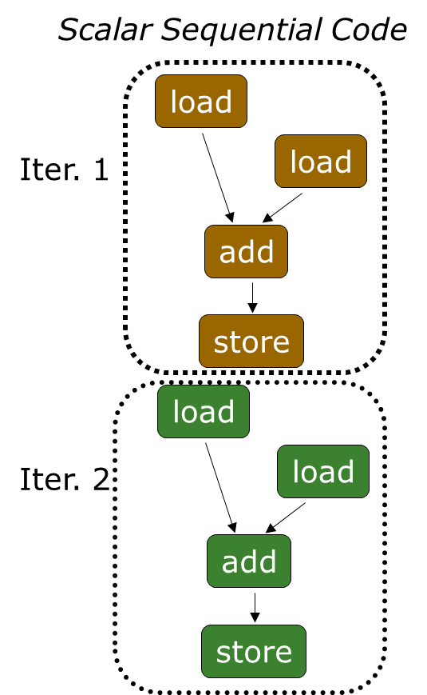  

Can be executed on thee processors:
- Pipelined processor
- Out-of-order execution processor
    - Independent instructions executed when ready
    - Different iterations are present in the instruction window and can execute in parallel in multiple functional units
    - In other words, **the loop is dynamically unrolled by the hardware**
- Superscalar or VLIW processor
Can fetch and execute multiple instructions per cycle

Prog. Model 2: Data Parallel (SIMD)  

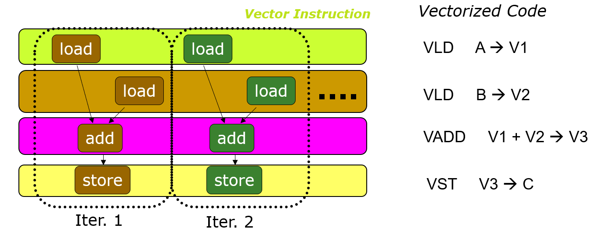  

- Realization: Each iteration is independent
- Idea: Programmer or compiler generates a SIMD instruction to execute the same instruction from all iterations across different data

Prog. Model 3: Multithreaded  

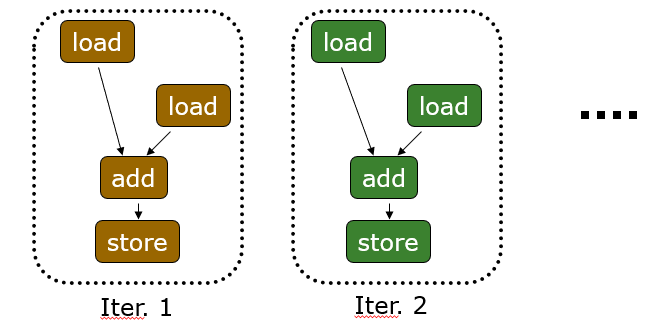  

- Realization: Each iteration is independent
- Idea: Programmer or compiler generates a thread to execute each iteration. Each thread does the same thing (but on different data)  

This programming model (software) is called:  
**SPMD: Single Program Multiple Data**
- This is a **programming model** rather than computer organization  
- Each processing element executes the **same procedure**, except on **different data elements**
    - Procedures can synchronize at certain points in program, e.g. barriers

**Key Idea of SPMD: multiple instruction streams execute the same program**
- Each program/procedure  
    - works on different data,  
    - can execute a different control-flow path, at run-time
- Many scientific applications are programmed this way and run on MIMD hardware (multiprocessors)
- Modern GPUs programmed in a similar way on a SIMD hardware

接下来的部分将参照 NVIDIA 深度学习培训中心（DLI）实战培训课程[计算加速基础——C](https://learn.nvidia.com/courses/course?course_id=course-v1:DLI+C-AC-01+V1-ZH&unit=block-v1:DLI+C-AC-01+V1-ZH+type@vertical+block@b8bf5b6c2f3b4697a2f0751fc4749643)  
在官方教程中使用了 jupyter 交互式笔记本和云端的 NVIDIA GPU 的加速系统。我的电脑上居然也有一块 NVIDIA GEFORCE RTX，所以我想尝试在我的电脑复现。


### 使用 CUDA C/C++ 加速应用程序  
CUDA 提供一种可扩展 C、C++、Python 和 Fortran 等语言的编码范式，能够在世界上性能超强劲的并行处理器 NVIDIA GPU 上运行大量经加速的并行代码。CUDA 可以毫不费力地大幅加速应用程序，具有适用于 [DNN](https://developer.nvidia.com/cudnn)、[BLAS](https://developer.nvidia.com/cublas)、[图形分析](https://developer.nvidia.com/nvgraph) 和 [FFT](https://developer.nvidia.com/cufft) 等的高度优化库生态系统，并且还附带功能强大的 [命令行](http://docs.nvidia.com/cuda/profiler-users-guide/index.html#nvprof-overview) 和 [可视化分析器](http://docs.nvidia.com/cuda/profiler-users-guide/index.html#visual)。  

#### 加速系统  
加速系统又称**异构系统**，由 CPU 和 GPU 组成。加速系统会运行 CPU 程序，这些程序也会转而启动将受益于 GPU 大规模并行计算能力的函数。  

可以使用 `nvidia-smi` (Systems Management Interface) 命令行命令查询有关此 GPU 的信息。  

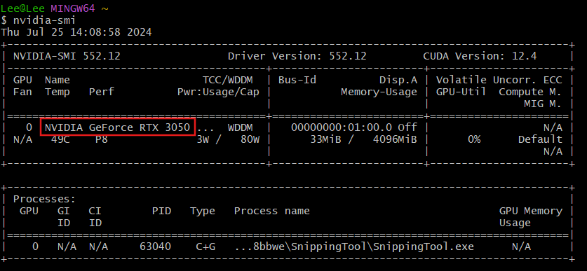  

#### 由GPU加速的还是纯CPU的应用程序  

在 CPU 应用程序中，数据在 CPU 上进行分配，并且所有工作均在 CPU 上进行。  

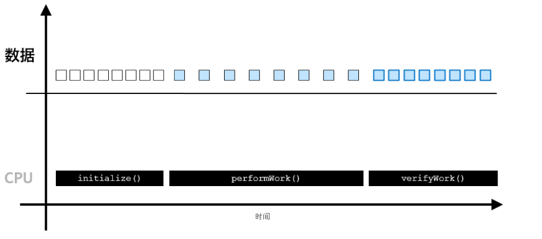  

而在加速应用程序中，则可以使用 `cudaMallocManaged()` 分配数据，其数据可**由 CPU 进行访问和处理**，并能自动迁移至可执行并行工作的 GPU；**GPU 异步执行工作**，与此同时 CPU 可执行它的工作；通过 `cudaDeviceSynchronized`，CPU 代码可与异步 GPU 工作实现**同步**，并等待后者完成；经 CPU 访问的数据将会自动迁移。  

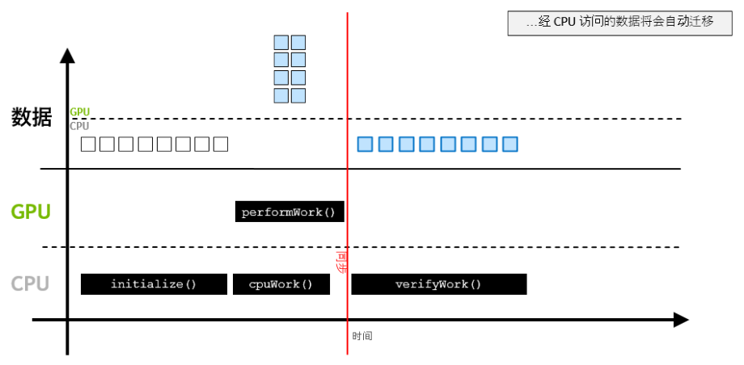  

#### 为GPU编写应用程序代码  

CUDA 为许多常用编程语言提供扩展。这些语言扩展可让开发人员在 GPU 上轻松运行其源代码中的函数。

要复现文档中的 CUDA 程序，需要安装[CUDA Toolkit](https://developer.nvidia.com/cuda-toolkit-archive)。  

显然 CUDA 是可以配置在 VS Code 上的，但鬼知道我找了多少教程配置了多久，总之最后成功在 Visual Studio 2022 上配置成功。具体参考 [Youtube Vidio](https://www.youtube.com/watch?v=3usDbpnn7E8)。这样配置可以成功编译运行，但对于 CUDA 中的特有语法会有红色波浪下划线报错，可以参考[知乎文章](https://zhuanlan.zhihu.com/p/652307402)简单去除一下（只要把里面的“禁用波浪曲线”置为 True 就可以了）。  

先来看一个 `.cu` 文件  
```c
void CPUFunction()
{
  printf("This function is defined to run on the CPU.\n");
}

__global__ void GPUFunction()
{
  printf("This function is defined to run on the GPU.\n");
}

int main()
{
  CPUFunction();

  GPUFunction<<<1, 1>>>();
  cudaDeviceSynchronize();
}
```  

对比普通的 C 程序，CUDA 代码有些不同之处  

`__global__ void GPUFunction()`  
- `__global__` 关键字表明以下函数将在 GPU 上运行并可**全局**调用，而在此种情况下，则指**由 CPU 或 GPU 调用**。
- 通常，我们将在 CPU 上执行的代码称为**主机代码**，而将在 GPU 上运行的代码称为**设备代码**。

`GPUFunction<<<1, 1>>>();`  
- 通常，当调用要在 GPU 上运行的函数时，我们将此种函数称为已启动的**核函数**。
- 启动核函数时，我们必须提供**执行配置**，即在向核函数传递任何预期参数之前使用 <<< ... >>> 语法完成的配置。
- 在宏观层面，程序员可通过执行配置为核函数启动指定**线程层次结构**，从而定义线程组（称为**线程块**）的数量，以及要在每个线程块中执行的**线程**数量。稍后将在本实验深入探讨执行配置，但现在请注意正在使用包含 1 线程（第二个配置参数）的 1 线程块（第一个执行配置参数）启动核函数。  

`cudaDeviceSynchronize();`  
- 与许多 C/C++ 代码不同，核函数启动方式为**异步**：CPU 代码将继续执行而无需等待核函数完成启动。
- 调用 CUDA 运行时提供的函数 `cudaDeviceSynchronize` 将导致主机 (CPU) 代码暂作等待，直至设备 (GPU) 代码执行完成，才能在 CPU 上恢复执行。  

##### 练习：编写一个Hello GPU核函数  
`01-hello-gpu.cu`  

##### 编译并运行加速后的CUDA代码  
CUDA 平台附带 [NVIDIA CUDA 编译器](https://docs.nvidia.com/cuda/cuda-compiler-driver-nvcc/index.html) `nvcc`，可以编译 CUDA 加速应用程序，其中包含主机和设备代码。  

使用 `nvcc` 编译和用 `gcc` 非常类似。但尝试在 VS 的 Terminal （默认 PowerShell）上使用命令行  
```bash
nvcc -o 01-hello-gpu 01-hello-gpu.cu -run
```  
会出现报错  

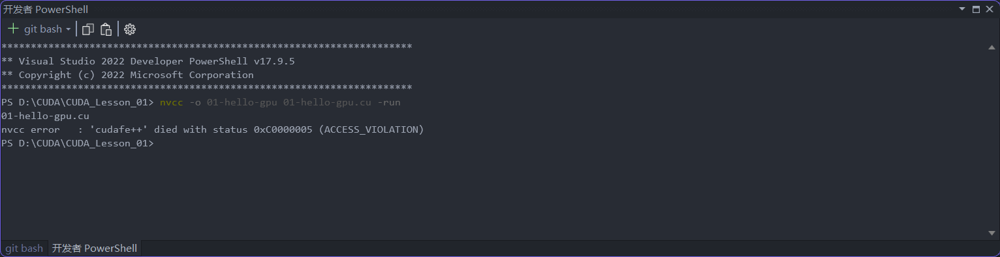  

该错误难以解决，网上也没有找到什么好的解决办法。所以我直接使用了git bash ，效果不错。对于报错 `nvcc fatal : Cannot find compiler 'cl.exe' in PATH` ，可以参考 [CSDN](https://blog.csdn.net/weixin_43997331/article/details/104764873)。  

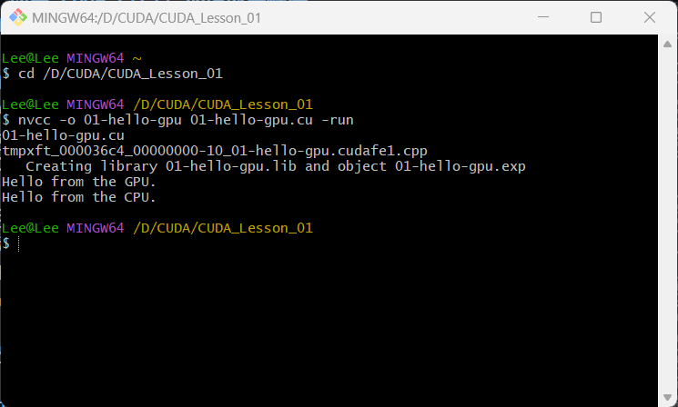  

当然其实不一定要用命令行编译运行，在 VS 中可以直接 build 和 run without debugging 。

#### CUDA的线程层次结构  
GPU 在线程中执行工作，多个线程并行运行。线程的集合称为**块**。与给定核函数启动相关的块的集合称为**网格**。GPU 函数称为**核函数**，核函数通过执行配置启动，执行配置定义了网格中的块数以及每个块中的线程数。网格中的每个块均包含相同数量的线程。  

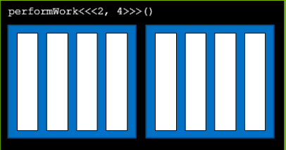  

#### 启动并行运行的核函数  
执行配置可以指定线程组（称为**线程块**或简称为**块**）数量以及其希望每个线程块所包含的线程数量。执行配置的语法如下：
```c
<<< NUMBER_OF_BLOCKS, NUMBER_OF_THREADS_PER_BLOCK>>>
```
**启动核函数时，核函数代码由每个已配置的线程块中的每个线程执行**。  

#### CUDA 提供的线程层次结构变量  
在核函数定义中，CUDA 提供的变量描述了它所执行的线程、块和网络。  

`gridDim.x` 是网格中的块数。  
`blockIdx.x` 是网格中当前块的索引。  
`threadIdx.x` 描述了块中所包含线程的索引

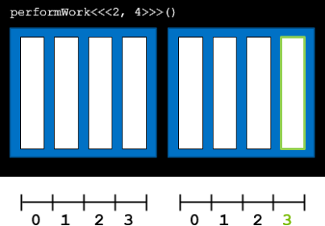  

#### 线程和块的索引  
每个线程在其线程块内部均会被分配一个索引，从 `0` 开始。此外，每个线程块也会被分配一个索引，并从 `0` 开始。正如线程组成线程块，线程块又会组成网格，而**网格是 CUDA 线程层次结构中级别最高的实体**。简言之，CUDA 核函数在由一个或多个线程块组成的网格中执行，且每个线程块中均包含相同数量的一个或多个线程。  

##### 练习：使用特定的线程和块索引  
`01-thread-and-block-inx.cu`  

#### 加速 for 循环  
对于一个最普通的 `for` 循环  
```c  
int N = 2<<20;
for (int i = 0; i < N; ++i)
{
  printf("%d\n", i);
}
```
如要并行此循环，必须执行以下 2 个步骤：
- 必须编写完成**循环的单次迭代工作**的核函数。
- 由于核函数与其他正在运行的核函数无关，因此执行配置必须使核函数执行正确的次数，例如循环迭代的次数。  

##### 练习：使用单个线程加速 for 循环  
`01-single-block-loop.cu`  

