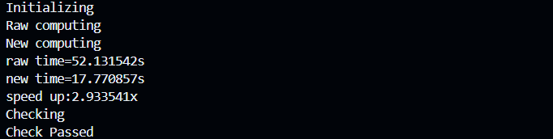
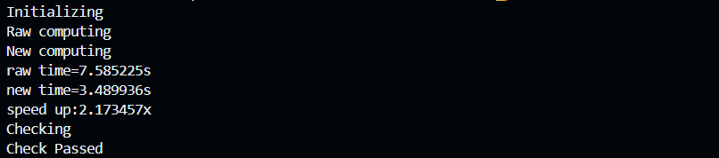
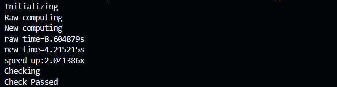
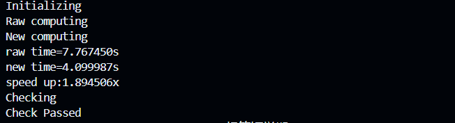

# Lab2.5 Report  

- [x] 完成以上代码的手写 SIMD 向量化  
- [x] 测试实现的正确性和加速比  

---  

## 1. 实验原理  

现代处理器一般都支持向量化指令，x86 架构下 Intel 和 AMD 两家的处理器都提供了诸如SSE，**AVX** 等 SIMD 指令集，一条指令可以同时操作多个数据进行运算，大大提高了现代处理器的数据吞吐量。  

实验的 `baseline` 简单来说就是进行MAXN次 D~4*4~=A~4*12~$\times$B~12∗4~ 的矩阵乘法。  

## 2. 实验步骤  

`baseline` 矩阵乘法的实现  
```c  
for (int n = 0; n < MAXN; n++){
    {
        /* 可以修改的代码区域 */
        // -----------------------------------
        for (int k = 0; k < 4; k++)
        {
            for (int i = 0; i < 4; i++)
            {
                for (int j = 0; j < 12; j++)
                {
                    *(d + n * 16 + i * 4 + k) += *(a + n * 48 + i * 12 + j) * \*(b + n * 48 + j * 4 + k);
                }
            }
        }
        // -----------------------------------
    }
}  
```  

我们需要优化中间SGEMM部分。  

在 `baseline` 中，每次内循环执行的是a矩阵中一个数乘以b矩阵中一个数并累加，每次只能确定结果矩阵中的一个数，这样效率很低。  

由于b矩阵用一维数组存储，每个数据都相邻，所以借助 `_mm256_loadu_pd` 指令我们可以一次load四个Double类型的数据到寄存器中。此时从a矩阵取出一个数据，并广播为1$\times$4的block就可以借助 `_mm256_fmadd_pd` 与b矩阵中的block进行向量乘加，**相当于每次确定了结果矩阵中的一个1$\times$4的block**。  

更进一步，对于结果矩阵中的每个block，操作方法是一样的；结果矩阵中的每个4$\times$4block需要的b矩阵中的数据是一样的。因此，我们可以每次从a矩阵中取出同一列的四个数据，同时并行四组运算，**相当于每次确定了结果矩阵中的一个4$\times$4的block**。  

实现代码如下  

```c
for (int n = 0; n < MAXN; n++)
    {
        double *a_ptr = a + n * 48, *b_ptr = b + n * 48;
        double *d_ptr = d + n * 16;
        int k;
        double *a_ptr_0,*a_ptr_1,*a_ptr_2,*a_ptr_3;
        a_ptr_0=&a_ptr[0*12+0];
        a_ptr_1=&a_ptr[1*12+0];
        a_ptr_2=&a_ptr[2*12+0];
        a_ptr_3=&a_ptr[3*12+0];

        __m256d c_sum_0 = _mm256_setzero_pd();  
        __m256d c_sum_1 = _mm256_setzero_pd();  
        __m256d c_sum_2 = _mm256_setzero_pd();  
        __m256d c_sum_3 = _mm256_setzero_pd(); 

        double a_reg_0,a_reg_1,a_reg_2,a_reg_3;

        for (k = 0; k < 12;k++){
            a_reg_0 = *(a_ptr_0++);
            a_reg_1 = *(a_ptr_1++);
            a_reg_2 = *(a_ptr_2++);
            a_reg_3 = *(a_ptr_3++);

            __m256d b_reg = _mm256_loadu_pd(&b_ptr[k * 4 + 0]);

            __m256d a_vec_0 = _mm256_set1_pd(a_reg_0);
            c_sum_0 = _mm256_fmadd_pd(a_vec_0, b_reg,c_sum_0);
            __m256d a_vec_1 = _mm256_set1_pd(a_reg_1);
            c_sum_1 = _mm256_fmadd_pd(a_vec_1, b_reg,c_sum_1);
            __m256d a_vec_2 = _mm256_set1_pd(a_reg_2);
            c_sum_2 = _mm256_fmadd_pd(a_vec_2, b_reg,c_sum_2);
            __m256d a_vec_3 = _mm256_set1_pd(a_reg_3);
            c_sum_3 = _mm256_fmadd_pd(a_vec_3, b_reg,c_sum_3);

        }

        _mm256_storeu_pd(d_ptr, c_sum_0);
        _mm256_storeu_pd(d_ptr+4, c_sum_1);
        _mm256_storeu_pd(d_ptr+8, c_sum_2);
        _mm256_storeu_pd(d_ptr+12, c_sum_3);
    }
```  

对于一般的SGEMM，还需要考虑行数和列数不能被4整除的情况，也就是处理**boundary case**。但这里比较特殊，a和b矩阵的规模都是固定的，行数和列数都能被4整除。  

对于一般的SGEMM，可以发现从a矩阵中取数据的时候还是纵向一个一个取的，在与b矩阵中block相乘的时候也是一个一个运算的。进一步优化可以对a矩阵中取出的数据做**packing**：第一次从a矩阵中取数据时将它们存在连续的内存中，之后再取用就可以直接load。  

但在这里，由于结果矩阵本身就是4$\times$4的规模，也就意味着a矩阵的block就是4$\times$12，b矩阵的block就是12$\times$4，都只需要扫描读取一次，因此没有packing的必要。虽然packing可以节约纵向取数据的时间，但也要增加将数据存入数组和从数组load数据的时间。  

## 3. 实验结果  

在不使用编译器优化选项的情况下，首次编译运行的结果如下  

```bash  
g++ multi_pro.cpp -mavx2 -mfma -o multi_pro  
./multi_pro.exe  

```  

  

多次运行后加速比基本稳定在2x上下  

  

  

  

## 4. 汇编代码分析  

godbolt 是一款基于 web 的研究不同编译器编译产生汇编代码的工具，借助它我们可以从汇编代码中获得更多信息。 

这个在线工具其实就是把代码转换成汇编语言（然而汇编是完全不会的）。  

使用编译：`x86-64 gcc 14.1`   编译选项：`-mavx2 -mfma`  

`for` 循环实现的汇编代码（部分）

```assembly  
        mov     DWORD PTR [rbp-24], 0  //将立即数（immediate value）0移动到（mov）一个由rbp（基指针寄存器）减去28个字节所指向的内存位置。这里的DWORD PTR表示操作的是双字（Double Word）大小的数据，即32位（4字节）的整数。因此，这行代码的作用是将栈上的一个局部变量的值设置为0，这个局部变量相对于rbp的偏移量是-28
        jmp     .L11  //无条件跳转（jmp）到标签.L12所标记的代码位置(.L12判断这个变量的值是不是小于等于9999999)
.L18:
        mov     DWORD PTR [rbp-28], 0  //一个Double需要4个字节，所以内存位置差4
        jmp     .L12
.L17:
        mov     DWORD PTR [rbp-32], 0
        jmp     .L13
.L16:
        mov     DWORD PTR [rbp-36], 0
        jmp     .L14
.L15:
        mov     rax, QWORD PTR c[rip]  //从rip（指令指针寄存器）相对偏移处加载一个64位（QWORD）指针到rax，这个指针指向一个数组c的基地址
        mov     edx, DWORD PTR [rbp-24]  //从栈上（相对于rbp的偏移）读取三个32位（DWORD）整数，分别存储在rbp-24、rbp-32、rbp-28
        //这些整数进行位移（左移，相当于乘以2的幂）和累加操作，以计算出一个索引
        sal     edx, 4  //位移
        movsx   rcx, edx  //带符号扩展
        mov     edx, DWORD PTR [rbp-32]
        sal     edx, 2
        movsx   rdx, edx
        add     rcx, rdx  //累加
        mov     edx, DWORD PTR [rbp-28]
        movsx   rdx, edx
        add     rdx, rcx
        sal     rdx, 3
        add     rax, rdx
        vmovsd  xmm1, QWORD PTR [rax]  //使用这个索引加上rax中的基地址，计算出最终的内存地址，并从该地址加载一个双精度浮点数（64位，QWORD）到xmm1  

        ...  
        
        cdqe  //将32位寄存器（如eax）的值符号扩展到64位寄存器（如rax）
        lea     rdx, [rsi+rax]  //计算rsi和rax两个寄存器值的和，并将结果存储在rdx寄存器中
        
        ...

        vmovsd  xmm2, QWORD PTR [rax]

        ...

        vmovsd  xmm0, QWORD PTR [rax]
        vmulsd  xmm0, xmm2, xmm0  //执行一个双精度浮点数的乘法操作。它将xmm2寄存器和xmm0寄存器中的双精度浮点数相乘，并将结果存储回xmm0寄存器中  

        ...  

        vaddsd  xmm0, xmm1, xmm0
        vmovsd  QWORD PTR [rax], xmm0
        add     DWORD PTR [rbp-36], 1  //循环变量累加
.L14:
        cmp     DWORD PTR [rbp-36], 11  //判断循环是否结束
        jle     .L15
        add     DWORD PTR [rbp-32], 1
.L13:
        cmp     DWORD PTR [rbp-32], 3
        jle     .L16
        add     DWORD PTR [rbp-28], 1
.L12:
        cmp     DWORD PTR [rbp-28], 3
        jle     .L17
        add     DWORD PTR [rbp-24], 1
.L11:
        cmp     DWORD PTR [rbp-24], 9999999
        jle     .L18
```  

AVX指令集实现的汇编代码  

```assembly  
        mov     DWORD PTR [rbp-40], 0
        jmp     .L19
.L35:
        ...

        vxorpd  xmm0, xmm0, xmm0  //对双精度浮点数执行按位异或（XOR）操作。不过，在这个特定的例子中，由于源操作数和目标操作数都是同一个寄存器（xmm0），这条指令的效果实际上是将xmm0寄存器中的所有位都设置为0。
        vmovapd YMMWORD PTR [rbp-112], ymm0  //将ymm0寄存器中存储的256位（32个双精度浮点数）双精度浮点数数据移动到由rbp-112指定的内存地址处
        vxorpd  xmm0, xmm0, xmm0
        vmovapd YMMWORD PTR [rbp-144], ymm0
        vxorpd  xmm0, xmm0, xmm0
        vmovapd YMMWORD PTR [rbp-176], ymm0
        vxorpd  xmm0, xmm0, xmm0
        vmovapd YMMWORD PTR [rbp-208], ymm0
        mov     DWORD PTR [rbp-44], 0
        jmp     .L24
.L34:
        mov     rax, QWORD PTR [rbp-56]
        lea     rdx, [rax+8]
        mov     QWORD PTR [rbp-56], rdx
        vmovsd  xmm0, QWORD PTR [rax]
        vmovsd  QWORD PTR [rbp-264], xmm0
        
        ...

        vmovupd ymm0, YMMWORD PTR [rax]  //从rax指向的地址加载256位（32字节）的未对齐双精度浮点数数据到ymm0寄存器。
        vmovapd YMMWORD PTR [rbp-336], ymm0  //将ymm0寄存器中的256位双精度浮点数数据存储到栈上的rbp-336位置
        vmovsd  xmm0, QWORD PTR [rbp-264]  //从栈上的rbp-264位置加载一个64位（8字节）的双精度浮点数到xmm0寄存器的低64位。
        vmovsd  QWORD PTR [rbp-952], xmm0  //将xmm0寄存器中的64位双精度浮点数数据存储到栈上的rbp-952位置
        vbroadcastsd    ymm0, QWORD PTR [rbp-952]
        vmovapd YMMWORD PTR [rbp-368], ymm0
        vmovapd ymm0, YMMWORD PTR [rbp-368]

        ...

        vmovapd ymm0, YMMWORD PTR [rbp-944]
        vfmadd231pd     ymm0, ymm1, YMMWORD PTR [rbp-880]  //执行一个三操作数的浮点乘法加法操作。具体来说，它将ymm1寄存器中的每个双精度浮点数与rbp-880地址处的相应双精度浮点数相乘，然后将乘积加到ymm0寄存器中对应位置的双精度浮点数上
        nop
        vmovapd YMMWORD PTR [rbp-112], ymm0  
        vmovsd  xmm0, QWORD PTR [rbp-272]

        ...

        vfmadd231pd     ymm0, ymm1, YMMWORD PTR [rbp-496]
        nop
        vmovapd YMMWORD PTR [rbp-208], ymm0
        add     DWORD PTR [rbp-44], 1
.L24:
        cmp     DWORD PTR [rbp-44], 11
        jle     .L34
        mov     rax, QWORD PTR [rbp-256]
        mov     QWORD PTR [rbp-1144], rax
        vmovapd ymm0, YMMWORD PTR [rbp-112]
        vmovapd YMMWORD PTR [rbp-1200], ymm0
        vmovapd ymm0, YMMWORD PTR [rbp-1200]
        mov     rax, QWORD PTR [rbp-1144]
        vmovupd YMMWORD PTR [rax], ymm0
        nop
        mov     rax, QWORD PTR [rbp-256]
        add     rax, 32
        
        ...

.L19:
        cmp     DWORD PTR [rbp-40], 9999999
        jle     .L35
```  

其实我也看不出什么东西来。`for` 循环的实现中  
```c  
*(c + n * 16 + i * 4 + k) += *(a + n * 48 + i * 12 + j) * *(b + n * 48 + j * 4 + k);
```  
汇编代码会很复杂，先把n,i,j,k取出来，移位，算索引，取数据，相乘，累加； AVX的实现中将原来的四个 `for` 循环减少到了两个，使用AVX指令集后向量运算也比较简洁，但是向量运算前后的load和重新写入内存的开销明显更多，对内存的读写应该是可以进一步优化的。  

## 5. 附件  
- 优化后的c++代码：multi_pro.cpp  
- multi_pro.cpp通过godbolt生成的汇编代码：multi_pro.asm  

<script type="text/javascript" src="http://cdn.mathjax.org/mathjax/latest/MathJax.js?config=TeX-AMS-MML_HTMLorMML"></script>
<script type="text/x-mathjax-config">
  MathJax.Hub.Config({ tex2jax: {inlineMath: [['$', '$']]}, messageStyle: "none" });
</script>
