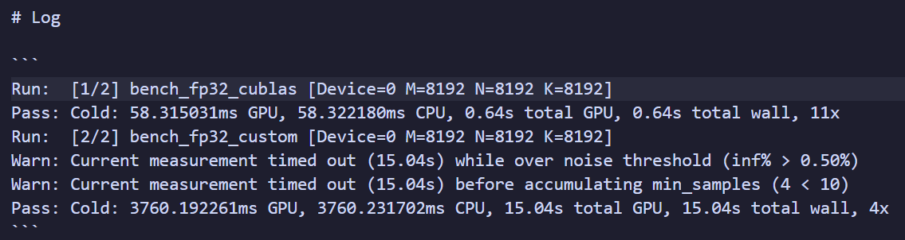
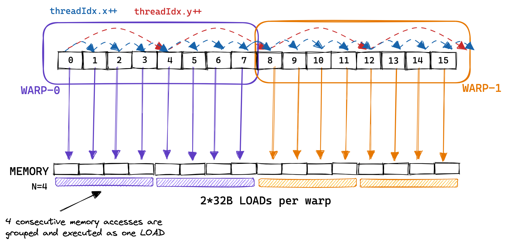
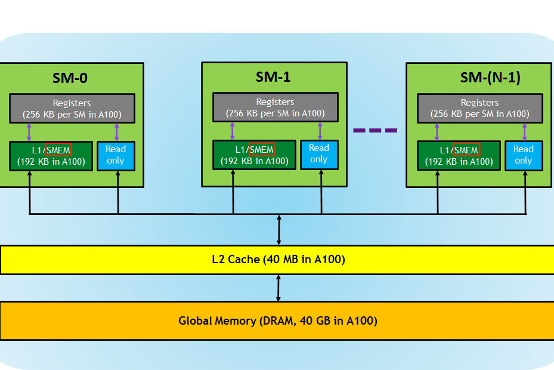
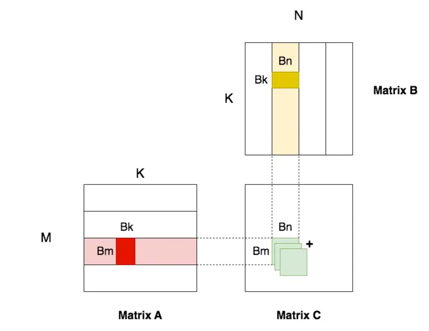
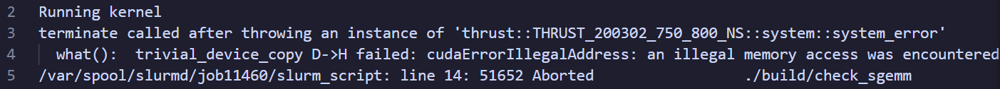
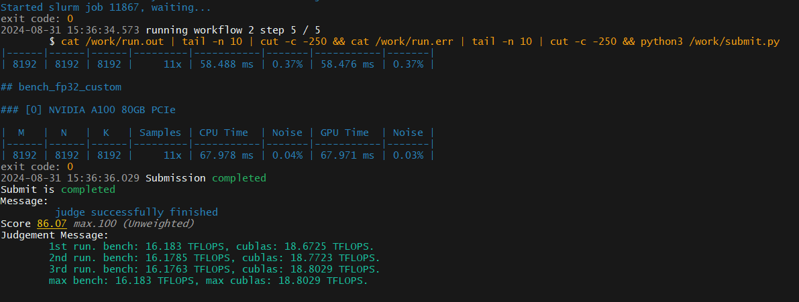

# Lab3 Report

## 1. 实验简介

通用矩阵乘法（General matrix multiply, GEMM）是 BLAS (Basic Linear Algebra Subprograms，基础线性代数程序集) 中经典的子程序之一。作为当今科学计算最常见的计算任务之一，GEMM 需要实现一个非常高效的矩阵乘法。

实验需要使用 CUDA 完成一个**高性能单精度浮点数 GEMM 实现 (sgemm)**，并使用自己的程序和 [cuBLAS](https://docs.nvidia.com/cuda/cublas/) 的程序在相同的输入下进行测试，使用相对性能作为评测标准。

## 2. 实验环境  

有两张 A100 40G，一张 A100 80G 和两张 2080Ti 显卡供使用。由于集群排队严重，限制程序在某一节点执行可能需要很长的等待时间，因此在优化过程中没有限制使用的显卡类型。oj 最高分的测试使用的是 M603 节点的 NVIDIA A100 80GB 显卡。

## 3. 实验步骤

### 3.1 问题描述

输入矩阵 A B ，计算矩阵乘积 `C = AB` 。其中 A 的大小为 `M × K` ， B 的大小为 `K × N` ，C 的大小为 `M × N` 为了方便起见，baseline 对矩阵的存储顺序做了一些调整。其中，A 矩阵为行优先存储，B 矩阵为列优先存储，C 矩阵为列优先存储。

值的一提的是 CUDA 是针对单个线程编程的，我们编写的程序约束的是某个线程的行为，并且对每个线程都是通用的，这一点十分重要。这一想法也可以从 baseline 的 `sgemm_kernel` 中看出：

```c
__global__ void sgemm_kernel(const float* __restrict__ A,
        const float* __restrict__ B, float* __restrict__ C,
        const int m, const int n, const int k) {
    int row = blockIdx.y * blockDim.y + threadIdx.y;
    int col = blockIdx.x * blockDim.x + threadIdx.x;

    if (row < m && col < n) {
        float sum = 0.0f;
        for (int i = 0; i < k; i++) {
        // 每个 thread 计算 C 矩阵中的一个值
        sum += A[row * k + i] * B[i + col * k];  // 每个 thread 遍历 A 中的一行和 B 中的一列
        }
        C[row + col * m] = sum;
    }
}
```

另外需要关注 block 和 grid 的配置，比如 baseline 中：

```c
dim3 block(32, 32);
	dim3 grid((n + block.x - 1) / block.x, (m + block.y - 1) / block.y);
	sgemm_kernel<<<grid, block>>>(d_A.data().get(), d_B.data().get(), d_C.data().get(), m, n, k);
```

对于 CUDA 的三级层次编程模型，可以直观地从这张图中看出：


baseline 的程序会因为噪音过大(?)在第四个 sample 结束：



### 3.2 优化

#### 3.2.1 Step 1

##### SMEM

首先尝试 Global Memory Coalescing 。在 CUDA 中，一个 block 中线程被分组为 Warp ，由 32 个线程组成，是 GPU 执行的最小硬件单元。

属于同一 Warp 的线程顺序内存访问可以分组并作为一个操作，这称为全局内存合并(global memory coalescing)，这样可以获得更快的更快的内存访问。以 `warpsize = 8` 为例(实际是 32)，比较合理的内存访问方式应当是这样：



但是由于我并不是十分理解这样的访存模式，所以我第一次优化出来的程序将 block 设置为了 `(32 * 32, 1, 1)` ，让这个细长的 block 沿着 C 矩阵的 y 方向排布。这样做虽然结果检测通过，但时间过长，被我手动杀掉了。另外，将 A 改为行主序存储似乎已经一定程度实现了这部分优化(?)

#### 3.2.2 Step 2

GPU 中有一块共享内存(Shared Memory)被同一线程块中的线程共享，在存储层级中，Shared Memory 与 L1 Cache 同级，利用 Shared Memory 将线程块的密集访存加速能够获得极低的访存延迟且大大节省内存带宽。



在做 GEMM 时，很多内存需要重复读取，比如计算 C 中某一行数据时，所需的 A 中的数据都是同一行，但每个线程都要独自从 A 中(也就是 Global Memory 中)读取这一行数据，造成该行数据重复读取 N 次。

若我们将 A 中这一行数据预先存进 SMEM 中，重复读取就发生在 SMEM ，由于带宽的增大，访存速度就会极大增快。

但是 SMEM 的容量是有限的，远不能将整个 A 矩阵存入其中，因此需要对 A 分块，这种技术称为 Tiling 。对于 C 中每个分块矩阵 BM $\times$ BN ，我们需要计算 BM $\times$ K 与 K $\times$ BN 的矩阵乘积。Tiling 的好处是将访存和计算操作分离，提高了指令级并行度(ILP)，从而提高了性能。

考虑到矩阵是 8192 $\times$ 8192 的规模，我们需要继续对BM $\times$ K 与 K $\times$ BN 的矩阵分块，将小分块 BM $\times$ BK 与 BK $\times$ BN 存入 SMEM，并遍历大分块。



与最初使用一个线程计算 C 矩阵中的一个值不同，此时我们的每个线程计算的是 C 中的一个 TM $\times$ TN 的矩阵，其中 TM 和 TN 的值可以由以下公式确定：

```py
TM = BM / blockDim.x
TN = BN / blockDim.y
```

至此，可以归纳一下分块使用到的相关参数：

```C
小分块          ：BM * BK  BK * BN
大分块          ：BM * K   K  * BN
C 矩阵分块      ：BM * BN
每个 thread 计算：TM * TN
```

每个线程每轮循环需要做的操作：
```txt
1. 从 A B 中加载一定数量数据到 SMEM
2. 从 SMEM 中取出对应值相乘并累加，循环算出 TM * TN 个值
```

##### 代码实现

第一个版本设定的参数大小：

```c
const int BM = 128;
const int BN = 128;
const int BK = 8;

const int TM = 4;
const int TN = 4;
```

这样对应每个线程需要从 A B 中分别取出一个数存入 SMEM ，计算 C 中 4 * 4 的分块。

在这里遇到了困扰我整整一天的报错：



由于调试信息极其有限，虽然使用了 compute-sanitizer ，但是给出的地址信息过于原始。最后想到直接带入最后一个线程模拟访存，发现是设置 grid 的时候没有考虑每个线程计算的是 TM * TN 的分块，导致定义的 block 过多，多出的线程访问 A B 矩阵之外的内存引起错误。

>oj 得分 62.99 ，使用 NVIDIA A100-PCIE-40GB
```c
#include "gemm.cuh"

__global__ void sgemm_kernel(const float* __restrict__ A,
							 const float* __restrict__ B, float* __restrict__ C,
							 const int m, const int n, const int k) {
	// 设置小 block 参数，也是开辟的 shared memory 空间大小
	const int BM = 128;
    const int BN = 128;
	const int BK = 8;

	// 每个 thread 处理结果矩阵中 4 * 4 的数据
	const int TM = 4;
	const int TN = 4;

	const int tid = threadIdx.y * blockDim.x + threadIdx.x; // thread 在对应 block 中的 id
	
	__shared__ float sub_a[BM][BK];
	__shared__ float sub_b[BK][BN];

	float r_c[TM][TN] = {0.0};

	int a_smem_row = tid / 8 ;
	int a_smem_col = tid % 8;
	int b_smem_row = tid % 8;
	int b_smem_col = tid / 8;

	int a_gmem_row = blockIdx.y * BM + a_smem_row;
	int b_gmem_col = blockIdx.x * BN + b_smem_col;

	for (int bk = 0; bk < k / BK; bk++){
		int a_gmem_col = bk * BK + a_smem_col;
		int b_gmem_row = bk * BK + b_smem_row;

		sub_a[a_smem_row][a_smem_col] = A[a_gmem_row * k + a_gmem_col];
		sub_b[b_smem_row][b_smem_col] = B[b_gmem_col * k + b_gmem_row];

		__syncthreads();

		#pragma unroll
		for (int K = 0; K < BK; K++){
			#pragma unroll
			for(int M = 0; M < TM; M++){
				#pragma unroll
				for(int N = 0; N < TN; N++){
					r_c[M][N] += sub_a[threadIdx.y * TM + M][K] * sub_b[K][threadIdx.x * TN + N];
				}
			}
		}
		__syncthreads();
	}

	#pragma unroll
	for(int j = 0; j < TN; j++){
		int c_gmem_col = blockIdx.x * BN + threadIdx.x * TN + j;
		#pragma unroll
		for(int i = 0; i < TM; i++){
			int c_gmem_row = blockIdx.y * BM + threadIdx.y * TN + i;
			C[c_gmem_row + c_gmem_col * m] = r_c[i][j];
		}
	}
}

template <>
void run_custom<float>(thrust::device_vector<float>& d_A,
					   thrust::device_vector<float>& d_B,
					   thrust::device_vector<float>& d_C, const int m,
					   const int n, const int k) {
	
	dim3 block(32 , 32);
	dim3 grid((n + block.x - 1) / (block.x * 4), (m + block.y - 1) / (block.y * 4));
	sgemm_kernel<<<grid, block>>>(d_A.data().get(),
								  d_B.data().get(),
								  d_C.data().get(), m, n, k);
}
```

#### 3.2.3 Step 3

每个线程只从 A B 中各加载 1 个数据到 SMEM 是很浪费的，得益于对 A 矩阵的转置，可以想到应该尝试让每个线程像 AVX 指令一样同时加载多个连续的数据，通过修改参数设定，我们可以让每个线程加载 4 个数据到 SMEM ，并手动进行向量化展开。

>oj 得分 75.36，使用 NVIDIA A100-PCIE-40GB

```c
#include "gemm.cuh"

__global__ void sgemm_kernel(const float* __restrict__ A,
							 const float* __restrict__ B, float* __restrict__ C,
							 const int m, const int n, const int k) {
	// 设置小 block 参数，也是开辟的 shared memory 空间
	const int BM = 128;
    const int BN = 128;
	const int BK = 8;

	// 每个 thread 处理结果矩阵中 8 * 8 的数据
	const int TM = 8;
	const int TN = 8;

	const int tid = threadIdx.y * blockDim.x + threadIdx.x; // thread 在对应 block 中的 id

	__shared__ float sub_a[BM][BK];
	__shared__ float sub_b[BK][BN];

	float r_c[TM][TN] = {0.0};

	int a_smem_row = tid >> 1;
	int a_smem_col = (tid & 1) << 2;
	int b_smem_row = (tid & 1) << 2;
	int b_smem_col = tid >> 1;

	int a_gmem_row = blockIdx.y * BM + a_smem_row;
	int b_gmem_col = blockIdx.x * BN + b_smem_col;

	for (int bk = 0; bk < (k + BK - 1) / BK; bk++){
		int a_gmem_col = bk * BK + a_smem_col;
		int b_gmem_row = bk * BK + b_smem_row;

        // 手动向量化展开访问
		sub_a[a_smem_row][a_smem_col] = A[a_gmem_row * k + a_gmem_col];
		sub_a[a_smem_row][a_smem_col + 1] = A[a_gmem_row * k + a_gmem_col + 1];
		sub_a[a_smem_row][a_smem_col + 2] = A[a_gmem_row * k + a_gmem_col + 2];
		sub_a[a_smem_row][a_smem_col + 3] = A[a_gmem_row * k + a_gmem_col + 3];

		sub_b[b_smem_row][b_smem_col] = B[b_gmem_col * k + b_gmem_row];
		sub_b[b_smem_row + 1][b_smem_col] = B[b_gmem_col * k + b_gmem_row + 1];
		sub_b[b_smem_row + 2][b_smem_col] = B[b_gmem_col * k + b_gmem_row + 2];
		sub_b[b_smem_row + 3][b_smem_col] = B[b_gmem_col * k + b_gmem_row + 3];

		__syncthreads();

		#pragma unroll
		for (int K = 0; K < BK; K++){
			#pragma unroll
			for(int M = 0; M < TM; M++){
				#pragma unroll
				for(int N = 0; N < TN; N++){
					r_c[M][N] += sub_a[threadIdx.y * TM + M][K] * sub_b[K][threadIdx.x * TN + N];
				}
			}
		}
		__syncthreads();
	}

	#pragma unroll
	for(int j = 0; j < TN; j++){
		int c_gmem_col = blockIdx.x * BN + threadIdx.x * TN + j;
		#pragma unroll
		for(int i = 0; i < TM; i+= 4){
			int c_gmem_row = blockIdx.y * BM + threadIdx.y * TM + i;

			C[c_gmem_row + c_gmem_col * m] = r_c[i][j];
			C[c_gmem_row + c_gmem_col * m + 1] = r_c[i + 1][j];
			C[c_gmem_row + c_gmem_col * m + 2] = r_c[i + 2][j];
			C[c_gmem_row + c_gmem_col * m + 3] = r_c[i + 3][j];
		}
	}
}

template <>
void run_custom<float>(thrust::device_vector<float>& d_A,
					   thrust::device_vector<float>& d_B,
					   thrust::device_vector<float>& d_C, const int m,
					   const int n, const int k) {
	
	dim3 block(16, 16);
	dim3 grid((n + block.x - 1) / (block.x * 8), (m + block.y - 1) / (block.y * 8));
	sgemm_kernel<<<grid, block>>>(d_A.data().get(),
								  d_B.data().get(),
								  d_C.data().get(), m, n, k);
}
```

基于这一版本，我还尝试了其他参数设定：

>oj 得分 73.62，使用 NVIDIA A100-PCIE-40GB

```c
const int BM = 128;
const int BN = 128;
const int BK = 32;

const int TM = 4;
const int TN = 4;

dim3 block(32, 32);
dim3 grid((n + block.x - 1) / (block.x * 4), (m + block.y - 1) / (block.y * 4));
```

更进一步，既然已经手动向量化展开了，可以使用 CUDA 中的 `float4` 数据类型。

>oj 得分 86.07，使用 NVIDIA A100 80GB PCIe

```c
float4 tmpA = *reinterpret_cast<float4 *>(&A[a_gmem_row * k + a_gmem_col]);
sub_a[a_smem_row][a_smem_col] = tmpA.x;
sub_a[a_smem_row][a_smem_col + 1] = tmpA.y;
sub_a[a_smem_row][a_smem_col + 2] = tmpA.z;
sub_a[a_smem_row][a_smem_col + 3] = tmpA.w;

// 或直接 *reinterpret_cast<float4*>(&sub_a[a_smem_row][a_smem_col]) = *reinterpret_cast<float4 *>(&A[a_gmem_row * k + a_gmem_col])
// 二者在性能上没有明显差距

float4 tmpB = *reinterpret_cast<float4 *>(&B[b_gmem_col * k + b_gmem_row]);
sub_b[b_smem_row][b_smem_col] = tmpB.x;
sub_b[b_smem_row + 1][b_smem_col] = tmpB.y;
sub_b[b_smem_row + 2][b_smem_col] = tmpB.z;
sub_b[b_smem_row + 3][b_smem_col] = tmpB.w;

float4* C_float4 = reinterpret_cast<float4*>(&C[c_gmem_row + c_gmem_col * m]);
float4 r_c_vec = make_float4(r_c[i][j], r_c[i + 1][j], r_c[i + 2][j], r_c[i + 3][j]);
C_float4[0] = r_c_vec;
```

基于这一版本，我还尝试了其他参数设定：

>oj 得分 85.95，使用 NVIDIA A100-PCIE-40GB

```c
const int BM = 64;
const int BN = 64;
const int BK = 16;

const int TM = 4;
const int TN = 4;

dim3 block(32, 32);
dim3 grid((n + block.x - 1) / (block.x * 4), (m + block.y - 1) / (block.y * 4));
```

由于时间有限，我的优化告一段落。最好的 oj 得分为：



## 4. 思考题

```
1. 如何计算 GEMM 的 Flops 数？你的实现和 cublas 的实现的 Flops 分别是多少？

可以先计算浮点运算次数 FLOPS = 2 * M * N * K ，再除以计算时间 t

max bench: 16.183 TFLOPS, max cublas: 18.8029 TFLOPS.
```

```
2. sgemm 在 2080Ti 和 A100-80G 上的理论性能上限是多少（即 2080Ti 和 A100-80G 的 FP32 算力是多少）？你可以在 [13] [14] 中找到答案。

2080Ti 是 14.2 TFLOPS1
A100-80G 是 19.5 TFLOPS1
```

```
3. 转置其中一个矩阵的操作对提高访存性能有什么帮助（或者你觉得有没有什么更好方法）？提示：考虑 L2 Cache 和 Memory Coalescing。

转置后从 A 读取一行数据的地址是连续的，可以提高存储的空间局部性，从而更大程度地利用 L2 Cache，减少 cache miss。
对于我的代码，A 的转置有助于我实现向量化的访存。
在 Step 1 中提到的 Global Memory Coalescing ，能让属于同一 Warp 的线程顺序访问内存。
```

```
4. Tiling 在优化 GEMM 中的作用是什么？为什么会提高性能？

Tiling 可以缩小需要一次存入 Shared Memory 中的数据量，避免 Shared Memory 不足。同时将访存和计算操作分离，提高了指令级并行度(ILP)
```

```
5. 你选择了怎样的 Tiling 配置？

const int BM = 128;
const int BN = 128;
const int BK = 8;
const int TM = 8;
const int TN = 8;
```

```
6. 你的代码对 Global Memory 的访存量是多大？

M * N * K * (1 / BM + 1 / BN) 约等于 8600000000
```

```
7. 通过 Nsight Compute 工具，查看 Baseline 代码在 M=N=K=1024 下的 Global Memory 的访存量，比较它们和 cublas 代码的访存量差异。回顾上面 Tiling 一节中所讲，不做 Tiling 的 Baseline 是否真的存在 Global Memory 访存上的冗余？为什么没有这种冗余？

根据 lab 文档中的解释：访存和计算操作交替执行造成的数据依赖使得指令级并行度 (ILP) 很差，严重影响性能，而 Tiling 技术将访存和计算操作分离，提高了 ILP，从而提高了性能。
```

```
8. FP32 的矩阵乘 (sgemm) 能否用 Tensor Core 加速？为什么？

不能，因为 Tensor Core 是用于混合精度的，在底层硬件算子层面，使用半精度（FP16）作为输入和输出，使用全精度（FP32）进行中间结果计算从而不损失过多精度的技术，而不是网络层面既有 FP16 又有 FP32。对于 CUDA Runtime API 的接口，wmma 接口限制了矩阵的形状都是 16×16，以及输入数据都是 half 半精度类型。（网上查到的资料，但具体并不了解qwq）
```

## 5. 参考资料

[How to Optimize a CUDA Matmul Kernel for cuBLAS-like Performance: a Worklog](https://siboehm.com/articles/22/CUDA-MMM)

[从啥也不会到CUDA GEMM优化](https://zhuanlan.zhihu.com/p/703256080)