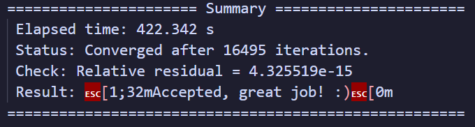
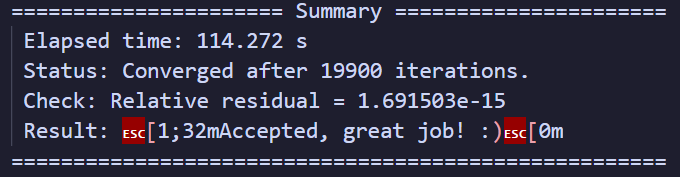
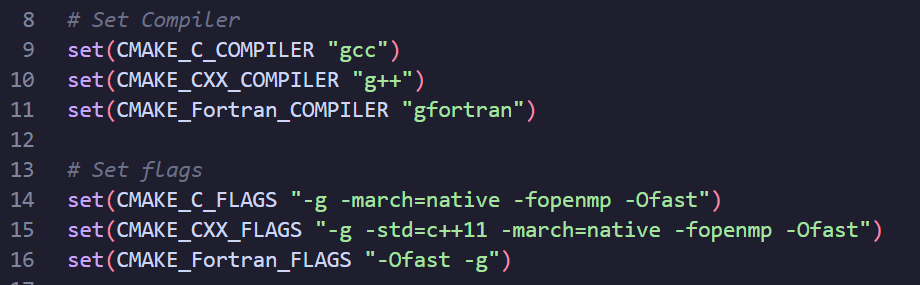
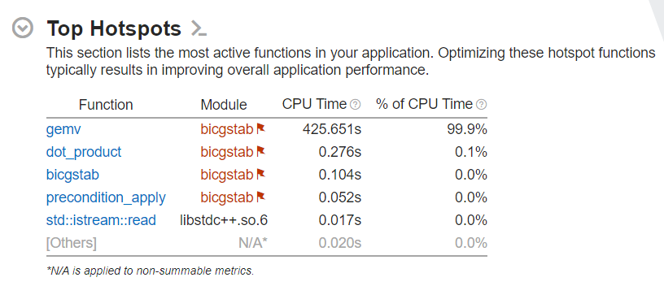
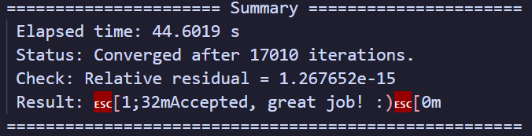
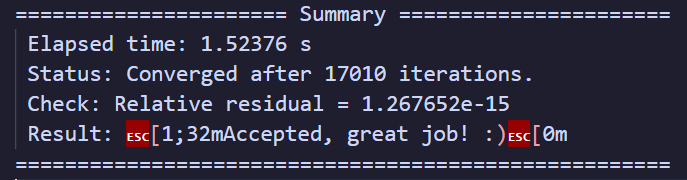
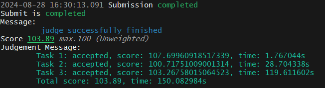
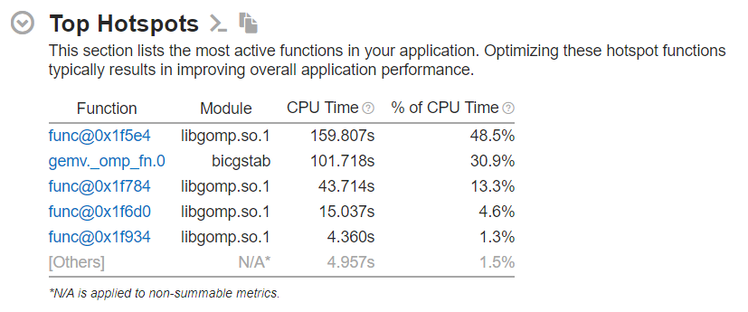
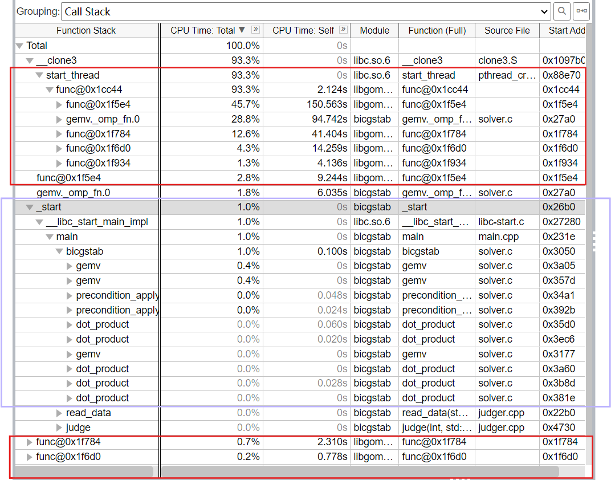
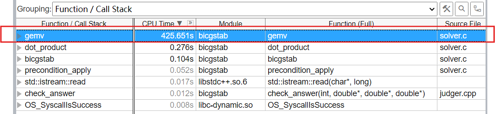

# Lab4 Report

## 1. 实验介绍

BiCGSTAB (Biconjugate gradient stabilized method, 稳定双共轭梯度法) 正是一种迭代求解非对称线性系统的方法。它是 BiCG (Biconjuagate gradient method, 双共轭梯度法) 的变种，有着更快速平缓的收敛表现。

我们需要对 baseline 中的 `solver.c` 进行优化，并在使用 MPI 时在 `main.c` 中添加必要的代码。

data 部分给出了三组测试数据，数据规模分别为 2001 $\times$ 2001， 4001 $\times$ 4001，6001 $\times$ 6001。

硬件环境是 Slurm 上的 Solver 分区，将提供 3 个节点 (M602-M604），每个节点最多使用 52 个物理核心 (2 × Intel(R) Xeon(R) Gold 5320 CPU @ 2.20GHz)，以及 503 GiB 内存。

## 2. 实验步骤

首先测试下 baseline 的运行情况。为了缩短程序运行时间，在优化阶段我先只使用了 `case_2001.bin` 这一组数据。



### 2.1 Step 1

先做编译器优化。我继续沿用了 `GCC` 编译器，并添加 `-std=c++11 -Ofast` 的编译优化选项，性能有了明显提升：



以 `gemv` 函数为例，用 [Compiler Explorer](https://gcc.godbolt.org/) 分析编译器优化前后的汇编语言。添加编译优化选项前：  

```
gemv(double*, double*, double*, int):
        push    rbp
        mov     rbp, rsp
        mov     QWORD PTR [rbp-24], rdi
        mov     QWORD PTR [rbp-32], rsi
        mov     QWORD PTR [rbp-40], rdx
        mov     DWORD PTR [rbp-44], ecx
        mov     DWORD PTR [rbp-4], 0
        jmp     .L2
.L5:
        mov     eax, DWORD PTR [rbp-4]
        cdqe
        lea     rdx, [0+rax*8]
        mov     rax, QWORD PTR [rbp-24]
        add     rax, rdx
        pxor    xmm0, xmm0
        movsd   QWORD PTR [rax], xmm0
        mov     DWORD PTR [rbp-8], 0
        jmp     .L3
.L4:
        mov     eax, DWORD PTR [rbp-4]
        cdqe
        lea     rdx, [0+rax*8]
        mov     rax, QWORD PTR [rbp-24]
        add     rax, rdx
        movsd   xmm1, QWORD PTR [rax]
        mov     eax, DWORD PTR [rbp-4]
        imul    eax, DWORD PTR [rbp-44]
        mov     edx, eax
        mov     eax, DWORD PTR [rbp-8]
        add     eax, edx
        cdqe
        lea     rdx, [0+rax*8]
        mov     rax, QWORD PTR [rbp-32]
        add     rax, rdx
        movsd   xmm2, QWORD PTR [rax]
        mov     eax, DWORD PTR [rbp-8]
        cdqe
        lea     rdx, [0+rax*8]
        mov     rax, QWORD PTR [rbp-40]
        add     rax, rdx
        movsd   xmm0, QWORD PTR [rax]
        mulsd   xmm0, xmm2
        mov     eax, DWORD PTR [rbp-4]
        cdqe
        lea     rdx, [0+rax*8]
        mov     rax, QWORD PTR [rbp-24]
        add     rax, rdx
        addsd   xmm0, xmm1
        movsd   QWORD PTR [rax], xmm0
        add     DWORD PTR [rbp-8], 1
.L3:
        mov     eax, DWORD PTR [rbp-8]
        cmp     eax, DWORD PTR [rbp-44]
        jl      .L4
        add     DWORD PTR [rbp-4], 1
.L2:
        mov     eax, DWORD PTR [rbp-4]
        cmp     eax, DWORD PTR [rbp-44]
        jl      .L5
        nop
        nop
        pop     rbp
        ret
```

添加编译优化选项后：

```
gemv(double*, double*, double*, int):
        test    ecx, ecx
        jle     .L1
        movsx   rcx, ecx
        sal     rcx, 3
        lea     r8, [rdi+rcx]
.L4:
        mov     QWORD PTR [rdi], 0x000000000
        xor     eax, eax
        pxor    xmm1, xmm1
.L3:
        movsd   xmm0, QWORD PTR [rsi+rax]
        mulsd   xmm0, QWORD PTR [rdx+rax]
        add     rax, 8
        addsd   xmm1, xmm0
        movsd   QWORD PTR [rdi], xmm1
        cmp     rcx, rax
        jne     .L3
        add     rdi, 8
        add     rsi, rcx
        cmp     r8, rdi
        jne     .L4 
.L1:
        ret
```

原始代码频繁地在栈上保存和加载变量，优化后的代码更多地依赖寄存器来存储，将循环结构简化，以减少不必要的计算和跳转；优化后的代码利用了 `rcx` 和 `r8` 寄存器来跟踪循环计数和内存地址，避免了在每次迭代中重复计算偏移量。

但是也可以看出，编译器优化后使用的依然是 `xmm` 寄存器，没有启用`ymm` / `zmm` 系列的向量化寄存器。这是因为编译器并不知道硬件是不是支持 `AVX` 。这时我们可以让编译器自己检测当前硬件支持的指令集，只需要添加编译器优化指令 `-march=native` 即可。

效果是非常明显的，速度在原来的基础上又快了一倍：


所以最终我们的编译器设置为：



### 2.2 Step 2

由于对 BICGSTAB 算法没有了解，所以根据 Lab 文档的建议，我们关注 `solver.c` 代码本身。在 `run.sh` 中通过 `source /opt/intel/oneapi/setvars.sh` 启用性能分析工具 Vtune 进行 profile 。我尝试了直接在 VS Code 上通过 X11 转发启动图形化界面，但似乎有些问题一直无法成功；又尝试了 MobaXterm ，但反应延迟非常高，并且没法正常启动分析；最后是将生成的报告下载到本地查看。

```bash
source /opt/intel/oneapi/setvars.sh

VTUNE_OUTPUT_DIR=vtune_results
mkdir -p $VTUNE_OUTPUT_DIR

vtune -collect hotspots -result-dir $VTUNE_OUTPUT_DIR -quiet ./build/bicgstab ./data/case_2001.bin
vtune -finalize -result-dir $VTUNE_OUTPUT_DIR
```

这里我主要关注了 `hotspot` 的信息：



`Summary` 中给出了 `Top Hotspots` 的汇总，可以明显看到 `gemv` 函数占据了绝大部分 CPU Time 。所以接下了优化重心放在 `gemv` 上。

>P.S 实际上 Vtune 的功能十分强大，但现在属实还不太会用，光让它生成出一份正常的报告就花了很多时间，所以实际优化的时候 Vtune并没有帮到我什么忙qwq，希望之后有机会详细学一下

### 2.3 Step 3

对于 `gemv` 的优化，首先我尝试了访存优化，利用程序的空间局部性，对矩阵和向量进行分块：

```c
void gemv(double* y, double* A, double* x, int N) {
    const int B = 560;  // 分块大小

    for (int i = 0; i < N; i++) {
        y[i] = 0.0;
    }

    for (int i = 0; i < N; i += B) {
        for (int j = 0; j < N; j += B) {
            int i_max = (i + B > N) ? N : i + B;
            int j_max = (j + B > N) ? N : j + B;
            for (int ii = i; ii < i_max; ii++)
                for (int jj = j; jj < j_max; jj++)   
                    y[ii] += A[ii * N + jj] * x[jj];
        }
    }
}
```

我将矩阵分成了 560 $\times$ 560 的块，将向量分成了 1 $\times$ 560 的块。选取 560 是因为节点的 L1d cache 的大小为 2.4 MiB ，能存储约 560 $\times$ 560 个 double 数。

在内循环中，随着 `jj` 累加，对 A 和对 x 的内存访问是连续进行的，这样可以通过数据预取机制提前将数据加载到缓存中，减少 cache miss 。

但是这种做法的效果并不好，在时间上几乎没有任何提升，加上后面我始终没想明白怎么把分块和 SIMD 结合在一起，所以在最终代码中并没有体现任何分块，这只是一次对访存优化不成功的尝试。

### 2.4 Step 4

接下来尝试 SIMD 指令级并行。我们直接使用 `AVX-512` 指令集，同时取出 8 个 double 类型的数据同时运算。具体优化类似 Lab2.5 手写 SIMD 向量化。

我对 `gemv` `dot-product` `precondition` `precondition_apply` 四个函数使用了指令级并行优化，但真正对运行时间起到决定性作用的是 `gemv` 函数：

```c
void gemv(double* y, double* A, double* x, int N) {
    for (int i = 0; i < N; i++) {
        __m512d y_reg = _mm512_setzero_pd();

        int j;
        for (j = 0; j <= N - 8; j += 8) {
            __m512d A_reg = _mm512_loadu_pd(A + i * N + j);  // 内存未对齐
            __m512d x_reg = _mm512_loadu_pd(x + j);          
            __m512d mul_reg = _mm512_mul_pd(A_reg, x_reg);
            y_reg = _mm512_add_pd(y_reg, mul_reg);              
        }

        y[i] = _mm512_reduce_add_pd(y_reg);

        // 剩余边界
        for (; j < N; j++) {
            y[i] += A[i * N + j] * x[j];
        }
    }
}
```

由于 A，x 的读取不在 `solver.c` 中，所以没法将内存对齐。总体思路就是每次从 A，x 中读取 8 个 double 数据，并行地做向量的逐位乘法，再做向量累加，最后将 8 位数据相加得到对应结果向量第 i 位的值。

SIMD 指令级优化后，时间减少了约 10s ：



### 2.5 Step 5

在单节点上，我们往往使用多线程来进行并行化。OpenMP 是一种简单易用的多线程并行编程模型。

由于 OpenMP 本身在线程创建、调度、销毁上就有开销，所以我只对 `gemv` 函数使用了 OpenMP 。具体使用其实只是在外层 `for` 循环外加一句

```c
#pragma omp parallel for
```

用于启动多线程并行执行这个 `for` 循环，需要在 run.sh 中声明变量

```bash
export OMP_NUM_THREADS=52
```

由于实验环境每个节点最多使用 52 个物理核心 (2 × Intel(R) Xeon(R) Gold 5320 CPU @ 2.20GHz)，所以我直接声明了 52 个线程。由于时间有限，我没有详细测试最优的线程数，只测试了应用超线程后 104 个线程和 52 个线程的效果差不多。

添加 OpenMP 后的代码如下：

```c
void gemv(double* y, double* A, double* x, int N) {
    #pragma omp parallel for
    for (int i = 0; i < N; i++) {
        __m512d y_reg = _mm512_setzero_pd();

        int j;
        for (j = 0; j <= N - 8; j += 8) {
            __m512d A_reg = _mm512_loadu_pd(A + i * N + j);  // 内存未对齐
            __m512d x_reg = _mm512_loadu_pd(x + j);          
            __m512d mul_reg = _mm512_mul_pd(A_reg, x_reg);
            y_reg = _mm512_add_pd(y_reg, mul_reg);              
        }

        y[i] = _mm512_reduce_add_pd(y_reg);

        // 剩余边界
        for (; j < N; j++) {
            y[i] += A[i * N + j] * x[j];
        }
    }
}
```

值的一提的是，从寄存器累加到 `y[i]` 前面是不需要限定 `# pragma omp critical` 的，因为每个线程并行处理时都对应单独的 `i` ，写入时 `y[i]` 是不存在冲突的，增加 `critical` 的限定反而会造成性能下降。

可以在 `for` 后添加 `schedule(kind[, chunk_size])` 指定调度方式和粒度。我尝试了 `static` 和 `dynamic` 两种模式以及一些参数，但似乎都没有优化效果，加上时间有限，没有细致测试合适的参数，所以最后没有设置 `schedule` 。

但是第一次开启 OpenMP 后发现时间反而变慢了。起初我以为是 OpenMP 有巨大开销，测试的矩阵规模不够大，或是编译器优化已经优化到了这种程度。但都没有道理，这似乎是既增加了 OpenMP 的开销，又没有启用线程级并行的结果。

最后发现问题出在 run.sh 文件，我依旧沿用了初始 `#SBATCH - cpus-per-task=1` 的设置，这相当于重新限制了只能使用一个 CPU 核心。在设定了每个 task 分配的 CPU 核心数并简单设定绑核策略为 close 后

```bash
#SBATCH --cpus-per-task=104

export OMP_PROC_BIND=close
```

运算速度有了巨大提升：



### 2.6 优化效果测试

至此，优化已经有较好的成效，在 oj 平台进行测试 取得 103.89 分：



并用 Vtune 测试性能进行对比：



可以看到 hotspot 已经发生了很大变化，似乎 CPU 时间不再集中在 `gemv` 函数上，而在计时区内运行 BICGSTAB 的时间很短，对于整个程序，更多的时间是用在 OpenMP 相关的额外开销上，比如 libomp.so 是用于实现 OpenMP 并行变成的库，而 gemv._omp_fn.0 应该是自动生成线程处理的函数，负责执行如 `#pragma omp for` 指令中的代码块。

在这两张图中显示的更详细：整个程序的主要时间是用在前后红色框中 OpenMP 带来的开销，中间紫色框的部分所占用的时间是极少的；与之相反，在 baseline 的测试结果中，`gemv` 函数的耗时是集中且极高的。





### 2.7 MPI

MPI 是一种非共享内存的进程级并行编程模型，因此在使用 MPI 进行并行化时，需要手动进行进程间的通信来实现数据在进程间的传输。 MPI 可以让我们突破单个节点的硬件限制，在多节点上实现并行化。

简单来说， OpenMP 让我们在单一节点上实现多线程并行，而 MPI 让我们在可以实现多节点并行。

因为是多节点并行，所以显然需要分配计算任务，具体来说就是将输入进来的矩阵进行切割，并通过进程间的通信来分配给各个进程，每个进程分别计算出结果再合并输出。根据这个思路，我尝试由一个进程读取数据，将数据分配给其他进程的模式。

但我的第一次尝试把问题想得太简单了，我直接在根进程读取完数据后就对矩阵进行了分割，给每个函数都加上 `start` 和 `end` ，试图让后面每个进程的操作都针对分割后的一块矩阵单独进行，最后把结果拼接成要求的向量。

```c
// bad version

void gemv(double* y, double* A, double* x, int N, int start, int end);

double dot_product(double* x, double* y, int N, int start, int end);

...

int chunk = N / size;
int remainder = N % size;
int start, end;

if (rank < remainder) {
    start = rank * (chunk + 1);
    end = start + chunk;
} else {
    start = rank * chunk + remainder;
    end = start + chunk - 1;
}
```

这显然是不合理的，结果也是显而易见的，虽然可以跑通，但答案错误。

发现问题后只能退而求其次，只对 `gemv` 部分使用 MPI 。但我仍然沿用了上个版本的思路，只由根进程读取数据再传输到各个子进程；每个进程在其他部分都各自执行，只在 `gemv` 时拆分成每个进程算一部分，合并后又各自执行。

由于对 MPI 太不熟悉，想出的这个路径显然是一种及其低效的思路。不但会因为根进程向子进程传输大矩阵而增加巨量开销，而且这样做相当于在 `gemv` 部分之外每个进程在进行着相同且重复的工作。

关于 MPI 的各种函数的接口定义，可以查看 [Microsoft MPI Reference](https://learn.microsoft.com/zh-cn/message-passing-interface/mpi-reference) 。

```c
// bad version, too!

void gemv(double* y, double* A, double* x, int N, int start, int end);

...

int rank, size;
// 获取当前进程的相关信息
MPI_Comm_rank(MPI_COMM_WORLD, &rank);
MPI_Comm_size(MPI_COMM_WORLD, &size);

int *recvcounts = (int*)malloc(size * sizeof(int));
int *displs = (int*)malloc(size * sizeof(int));

int chunk = N / size; 
int remainder = N % size; 

int offset = 0;
for (int i = 0; i < size; i++) {
    // 每个进程的接收数据量
    recvcounts[i] = chunk + (i < remainder ? 1 : 0);
    displs[i] = offset;
    offset += recvcounts[i];
}

// 计算当前进程的起始位置和结束位置
int start = displs[rank];
int end = start + recvcounts[rank];

...

int bicgstab(int N, double* A, double* b, double* x, int max_iter, double tol, MPI_Comm comm);

...

// 1. r0 = b - A * x0
gemv(r, A, x, N, start, end);
MPI_Barrier(comm); 
if(rank == 0)
    MPI_Gatherv(MPI_IN_PLACE, 0 , MPI_DOUBLE, r, recvcounts, displs, MPI_DOUBLE, 0, comm);
else
    MPI_Gatherv(r + start, end - start , MPI_DOUBLE, r, recvcounts, displs, MPI_DOUBLE, 0, comm);
MPI_Barrier(comm);
MPI_Bcast(r , N , MPI_DOUBLE , 0 ,comm);

for (int i = 0; i < N; i++) {
    r[i] = b[i] - r[i];
}
```

数据读取模式：

```c
// Read data from file
if (world_rank == 0) {
    read_data(filename, &N, &A, &b, &x);
}

// 对各个进程广播 N 的值
MPI_Bcast(&N, 1, MPI_INT, 0, MPI_COMM_WORLD);

// 只有主进程读取数据，其他进程的数据由主进程分配
if (world_rank != 0) {
    A = (double*)malloc(N * N * sizeof(double));
    b = (double*)malloc(N * sizeof(double));
    x = (double*)malloc(N * sizeof(double));
}

// 向各个进程广播 A，b，x 的值
MPI_Bcast(A, N * N, MPI_DOUBLE, 0, MPI_COMM_WORLD);
MPI_Bcast(b, N, MPI_DOUBLE, 0, MPI_COMM_WORLD);
MPI_Bcast(x, N, MPI_DOUBLE, 0, MPI_COMM_WORLD);
```

但即使是这种极其 naive 的 MPI 实现，我也遇到了直到最后都没有解决的问题：迭代没有收敛，始终是 -nan 

```
Iteration 1000, residul = -nan
Iteration 1000, residul = -nan
Iteration 1000, residul = -nan
Iteration 2000, residul = -nan
Iteration 2000, residul = -nan
Iteration 2000, residul = -nan
Iteration 3000, residul = -nan
Iteration 3000, residul = -nan
Iteration 3000, residul = -nan
Iteration 4000, residul = -nan
Iteration 4000, residul = -nan
Iteration 4000, residul = -nan
Iteration 5000, residul = -nan
Iteration 5000, residul = -nan
Iteration 5000, residul = -nan
```

迫于对于 MPI 有限的知识和调试手段，这个问题直到报告提交都没有解决qwq

## 3. 结语

这是本次 HPC101 超算短学期的最后一个实验报告。回顾 Lab4 ，虽然通过 SIMD 指令级并行和 OpenMP 已经实现了 oj 较为不错的分数，但是没有实现 MPI 还是十分遗憾的。

而回顾整个短学期课程，觉得当初选择这门课程实在是明智的选择。早在报名之初就有队内同学让我"做好付出整个暑假的准备"。如今暑假悄然过去，顿感不虚此行，获益良多。从最初对 linux 一无所知挣扎着配置出集群运行 HPL ，到 Lab5 艰难的构建 Transformer ；从 Lab2 简单的向量化计算到后面的 OpenMP 和 MPI ，仿佛一段旅程，路途艰险但风景灿烂。希望短学期的课程只是我与超算缘分的开始。也感谢老师、助教和学长们对课程辛苦的付出！