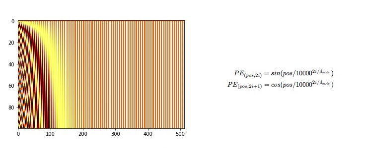

# Lab5 Report

## 1. 实验环境

在集群上有配置好的实验环境 `hpc101-2024-lab5` 。在 VS Code 中登录集群并创建新的 Python 环境，根据提示即可选择已经存在的环境。由于后期 TensorBoard 进行可视化的时候缺少 `torch-tb-profiler` ，于是自行创建了新环境并在[浙大源](https://mirrors.zju.edu.cn/pypi/web/simple)下载了 `requirements.txt` 中列举的 Python 包。

## 2. 实验基础知识

### 2.1 网络模型

开始做这个 lab 时以为整个 Transformer 架构都需要自己编写，所以最初一直在学习 Transformer 的完整架构。这里就只简单列举 `nn.Transformer` 模块之外需要自己实现的部分。

#### 2.1.1 Model Architecture


`nn.Transformer` 已经集成了 `Encoder` 和 `Decoder` ，但是缺少 `InputEmbedding` `PositionalEncoding` `Linear` 这几层。

由于 `torch.nn` 和 `transformer` 包中已经为我们实现了很多模块，所以回头来看我们构建 Transformer 部分主要是拼接各个模块。

#### 2.1.2 Embedding & Softmax

在得到预处理后的 Inputs 和 Outputs 后，Embeddings 会将分词后的每个 token 映射为一个 d~model~ 维的向量。这个对应关系是提前训练好的，具体向量值的确定与词义有相当的关系，具体可以参考 [3Blue1Brown](https://www.bilibili.com/video/BV13z421U7cs/?spm_id_from=333.999.0.0&vd_source=5742e02a7566918d65a441adce5bc163) 的视频。

而在 `nn.Transformer` 处理后，decoder outputs 会经过 Linear 和 Softmax 两层转变为下一个词的概率。根据原论文，embedding layer 后得到的权重会被乘以 $\sqrt{d~model~}$ 。


#### 2.1.3 Positional Encoding

给模型输入的是一整句话，如果切割成 tokens 后对每个 tokens 的处理是等价的，这样就丢失了每个 token 的位置信息，因此需要 Positional Encoding 来提取这些信息。通过特定数学方式求出的 Positional Encoding 同样具有 d~model~ 维，需要与 embedding 相加。原论文采用的数学公式如下：



#### 2.1.4 Attention

注意力机制是原论文的关键机制，对此我只有很简单的理解，希望之后参考[原论文](http://arxiv-org-s.webvpn.zju.edu.cn:8001/pdf/1706.03762)和 [The Annotated Transformer](https://nlp.seas.harvard.edu/annotated-transformer/#synthetic-data) 做跟深入的理解。这里只贴出关键公式和结构图：

##### Scaled Dot-Product Attention


##### Multi-head Attention


### 2.2 数据集
lab 使用 WMT (Workshop on Statistical Machine Translation) 2019 数据集中的 zh-en 的部分文件。使用以下语句加载原始数据：

```python
dataset_dir = "/river/hpc101/2024/minidataset"

dataset_raw = load_dataset(path=dataset_dir)
print("Data loaded.")
```

简单测试可以得到原始数据集的构造。整个数据集分为 "train" (599644)， "validation" (3981) 两部分，每部分都有 "translation" 键。取出一条数据结构如下：

```python
{'translation': {'en': 'Last week, the broadcast of period drama "Beauty Private Kitchen" was temporarily halted, and accidentally triggered heated debate about faked ratings of locally produced dramas.', 'zh': '上周，古装剧《美人私房菜》临时停播，意外引发了关于国产剧收视率造假的热烈讨论。'}}
```

## 3. 实验步骤

### 3.1 程序编写  

这部分将根据代码顺序排布。但实际编写过程远没有这么流畅，个人认为的正确的逻辑顺序也并非如此。

#### 3.1.1 数据预处理

对于加载后的数据，需要切割为一个个的 tokens ，在 lab 中我们使用的 Tokenizer 是 AutoTokenizer ，使用的 pre-trained model 是 bert-base-uncased 。其中 bert-base-uncased 在程序运行时下载可能无法连接外网，所以我在[镜像网站](https://hf-mirror.com/)提前下载并将文件夹保存在了本地。

```python
# Load tokenizer
bert_base_uncased = "/home/24hpc101/h3230102778/Lab5_Environment/bert-base-uncased"
tokenizer = AutoTokenizer.from_pretrained(bert_base_uncased)
print("Tokenizer loaded.")
```

从 Transformer 的结构图可以看出来，我们需要将 "zh" 和 "en" 句子分别输入 `encoder` 和 `decoder` 。因而我们需要拆分 "zh" 和 "en"、分词后的 `enc-inputs` 和 `dec_inputs` 。

AutoTokenizer 会在分词后根据 tokenizer.vocab 词典将每个 token 变为对应的id。在这里我只使用了处理后的 ["input_ids"] 部分。

```python
# Rebuild Dataset class
# We need tokenized enc_inputs and dec_inputs
def rebuild_data(dataset):
    zh_raw, en_raw = [], []
    for sample in dataset:
        zh_raw.append(sample["translation"]["zh"])
        en_raw.append(sample["translation"]["en"])

    enc_inputs = tokenizer(
            zh_raw,
            padding="max_length", 
            max_length=max_input_length,
            truncation=True,
            return_tensors="pt"
        )["input_ids"]

    dec_inputs = tokenizer(
            en_raw,
            padding="max_length", 
            max_length=max_target_length,
            truncation=True,
            return_tensors="pt"
        )["input_ids"]
    
    return enc_inputs, dec_inputs
```

在将数据加载到 Dataloader 之前，我构建了自己的 dataset 类 Data ：

```python
class Data(Dataset):
        
    def __init__(self, enc_inputs, dec_inputs):
        super(Data, self).__init__()
        self.enc_inputs = enc_inputs
        self.dec_inputs = dec_inputs
        
    def __len__(self):
        return self.enc_inputs.shape[0]
    
    def __getitem__(self, index):
        return self.enc_inputs[index], self.dec_inputs[index]
```

这样构建其实是在编写完 PositionalEncoding 和 TransformerModel 后回推需要的数据结构，然后根据结构构建数据的。

#### 3.1.2 Positional Encoding

`PositionalEncoding` 模块大量参考网上资料。网上的实现基本雷同，核心是翻译原论文中给出的计算公式。

```python
# PositionalEncoding
class PositionalEncoding(nn.Module):

    def __init__(self, d_model, dropout=0.1, max_len=5000):
        # max_len determines how far the position can have an effect on a token
        super(PositionalEncoding, self).__init__()
        self.dropout = nn.Dropout(p=dropout)

        # Compute the positional encodings once in log space
        pe = torch.zeros(max_len, d_model)
        position = torch.arange(0, max_len, dtype=torch.float).unsqueeze(1)
        div_term = torch.exp(torch.arange(0, d_model, 2).float() * (-math.log(10000.0) / d_model))

        # PE(pos, 2i) = sin(pos/1000^(2i/dim_model))
        pe[:, 0::2] = torch.sin(position * div_term)
        # PE(pos, 2i + 1) = cos(pos/1000^(2i/dim_model))
        pe[:, 1::2] = torch.cos(position * div_term)
        # Saving buffer (same as parameter without gradients needed)
        pe = pe.unsqueeze(0).transpose(0, 1)
        self.register_buffer("pe", pe)

    def forward(self, x):
        # Residual connection + pos encoding
        x = x + self.pe[:x.size(0), :]
        return self.dropout(x)
```

其中 `transpose(0, 1)` 是因为在默认下 `nn.Transformer` 的输入格式是 `<src_len, batch_size, d_model>` 。

#### 3.1.3 Transformer Model
`TransformerModel` 实际构建了整个 Transformer 模型，将各个模块组装在一起。在纯手工构建 Transformer 中也有这个组装的过程，只不过这里因为使用了 `nn.Transformer` ，用于组装的模块简化了。

在这里的组装过程中，我们已经有了 `PositionalEncoding` 。`Embedding` 层和 `Linear` 层都可以从 `torch.nn` 。

关于 Transformer 中用到的各种 mask ，我还没有完全理解。 mask 的作用是掩盖部分信息，使之不会参与后面的计算。`src_mask` 和 `tgt_mask` 的目的是掩盖当前位置后面的信息，因为处理当前信息时是不知道未来的信息的，也因此是上三角形。`src_key_padding_mask` 和 `tgt_key_padding_mask` 是为了掩盖用于 padding 的填充字符。具体的实现参考了网上资料。

`Softmax` 由于 `CrossEntropyLoss` 中有包含，所以不用实现。

```python
# TransformerModel
class TransformerModel(nn.Module):

    def __init__(self, src_vocab_size, tgt_vocab_size):
        super(TransformerModel, self).__init__()

        #LAYERS
        self.transformer = nn.Transformer(d_model=d_model, nhead=n_heads, num_encoder_layers=n_layers, num_decoder_layers=n_layers, dim_feedforward=d_ff)
        
        self.src_emb = nn.Embedding(num_embeddings=src_vocab_size, embedding_dim=d_model)
        self.pos_emb = PositionalEncoding(d_model=d_model)
        self.tgt_emb = nn.Embedding(num_embeddings=tgt_vocab_size, embedding_dim=d_model)
        self.linear = nn.Linear(in_features=d_model, out_features=tgt_vocab_size, bias=False).to(device)

    def forward(self, enc_inputs, dec_inputs):
        """
        enc_inputs: <batch_size, src_len>
        dec_inputs: <batch_size, tgt_len>
        """
        batch_size, src_len = enc_inputs.shape[0], enc_inputs.shape[1]
        batch_size, tgt_len = dec_inputs.shape[0], dec_inputs.shape[1]

        # The current position cannot attend to positions after it
        src_mask = self.transformer.generate_square_subsequent_mask(src_len).to(device)
        tgt_mask = self.transformer.generate_square_subsequent_mask(tgt_len).to(device)
        # Generate bool tensors with size of <batch_size, len>, "True" is masked
        # To mark the padded position
        src_key_padding_mask = enc_inputs.data.eq(0).to(device)
        tgt_key_padding_mask = dec_inputs.data.eq(0).to(device)
        memory_key_padding_mask = src_key_padding_mask
        memory_mask = None

        enc_embed_outputs = self.src_emb(enc_inputs)
        enc_pos_outputs = self.pos_emb(enc_embed_outputs.transpose(0, 1)).to(device)
        dec_embed_outputs = self.tgt_emb(dec_inputs)
        dec_pos_outputs = self.pos_emb(dec_embed_outputs.transpose(0, 1)).to(device)

        # Using nn.Transformer model
        dec_outputs = self.transformer(src=enc_pos_outputs, tgt=dec_pos_outputs, src_mask=src_mask, tgt_mask=tgt_mask, memory_mask=None, src_key_padding_mask=src_key_padding_mask, tgt_key_padding_mask=tgt_key_padding_mask, memory_key_padding_mask=memory_key_padding_mask)

        # Linear layer
        dec_logits = self.linear(dec_outputs.transpose(0, 1)).to(device)

        return dec_logits.view(-1, dec_logits.size(-1))

```

#### 3.1.4 Train Loop

对于编写好的模型，我们需要喂数据来训练它。前面已经完成了 `data_loader` 的构建，训练的过程就是不断从其中抽取 `enc_inputs` 和 `dec_inputs` 输入模型，将得到的 `outputs` 与 `dec_inputs` 做对比计算 `loss` ，利用 `loss.backward()` 计算反向传播的梯度，以此来更新模型，调整模型参数使之更符合翻译任务的需求。具体的原理解释也可以看 [3Blue1Brown](https://www.bilibili.com/video/BV13z421U7cs/?spm_id_from=333.999.0.0&vd_source=5742e02a7566918d65a441adce5bc163) 。

```python
def train_loop(data_loader, model, optimizer, lr_scheduler, epoch):

    total_loss = 0

    for enc_inputs, dec_inputs in data_loader:
        """
        enc_inputs: <batch_size, max_input_length>
        dec_inputs: <batch_size, max_target_length>
        """
        enc_inputs, dec_inputs = enc_inputs.to(device), dec_inputs.to(device)
        dec_outputs = dec_inputs.to(device)
        """
        outputs: <batch_size * tgt_len, tgt_vocab_size>
        """
        outputs = model(enc_inputs, dec_inputs)
        loss = criterion(outputs, dec_outputs.view(-1))
        total_loss += loss
        print("Epoch:", "%04d" % (epoch + 1), "loss =", "{:.6f}".format(loss))

        optimizer.zero_grad()
        loss.backward()
        optimizer.step()
        lr_scheduler.step()        
    
    return total_loss
```

#### 3.1.5 损失函数 & 优化器

计算 `loss` 时需要损失函数 `criterion` ；优化器 `optimizer` 用于基于计算得到的梯度对模型进行参数更新；`lr_scheduler` 是学习率调度器，用于动态更新参数更新(梯度下降)时的步长，其中 `num_warmup_steps` 是预热步骤的数量，在预热阶段，学习率会逐渐从初始值增加到预设的最大值或者仅仅是稳定在某个初始值上，有助于模型在训练初期更加稳定。

```python
# Criterion
criterion = nn.CrossEntropyLoss(ignore_index=0)
# Optimizer
optimizer = optim.SGD(model.parameters(), lr=1e-3, momentum=0.99)
# scheduler
lr_scheduler = get_scheduler(
    "linear",
    optimizer=optimizer,
    num_warmup_steps=100,
    num_training_steps=1000,
)
```

#### 3.1.6 Valid Loop

每个 epoch 结束后会在测试集上测试。这个过程是好理解的，我们将测试集中 "zh" 句子输入模型中，翻译出来的句子与 "en" 句子做比较来评价模型性能。评价的标准为 BLEU(bilingual evaluation understudy) 具体来说需要用到 `torch.argmax` 取出预测中概率最大的词的 id ，用 `tokenizer.batch_decode` 将 id 转化为对应的词，用 `nltk.translate.bleu_score.corpus_bleu` 计算 BLEU 值。

但使用起来相当麻烦，`corpus_bleu` 严格要求 `references` 和 `hypotheses` 序列长度相同； `enc_inputs` 经过 model 处理后形状会改变为 `<batch_size * max_inputs_len, tokeinzer.vocab_size>` ，再经过 `torch.argmax` 处理后变为 `<batch_size * max_inputs_len>` ，这意味着在进行 `tokenizer.batch_decode` 之前需要将 `valid_outputs` 也变成相同的形状。

理论上还需要考虑 mask 的影响，但我实在想不出怎么把 mask 也放进去。

为了让 `corpus_bleu` 能正常运行，我几乎是将两个输入硬凑出来的，所以 BLEU 值也可以想见的惨不忍睹。

```python
def valid_loop(dataloader, model):
    model.eval()

    references = []
    hypotheses = []

    with torch.no_grad():
        for valid_inputs, valid_outputs in dataloader:
            valid_inputs, valid_outputs = valid_inputs.to(device), valid_outputs.to(device)
            
            dec_outputs = model(valid_inputs, valid_outputs)

            dec_outputs = torch.argmax(dec_outputs, dim=-1)
            valid_outputs = valid_outputs.view(-1)

            # print(dec_outputs.shape)
            # print(valid_outputs.shape)
        
            decoded_preds = tokenizer.batch_decode(dec_outputs)
            decoded_labels = tokenizer.batch_decode(valid_outputs)

            hypotheses += [pred.strip() for pred in decoded_preds]
            references += [label.strip() for label in decoded_labels]

    bleu_score = corpus_bleu(hypotheses, references)
    print(f'BLEU score: {bleu_score * 10}')
    return bleu_score
```

### 3.2 模型测试 & 实验结果

#### 3.2.1 loss 值
总体来说模型测试的结果是非常糟糕的。

在编写完 `Train Loop` 后进行了全数据的测试。如果使用实验文档给出的`lr=1e-8, momentum=0.9` 在我的模型中会导致 `loss` 值不能正常下降，会一直在高位(`loss` = 7 左右，详见 test_1.log )徘徊：


因此我将值改为了 `lr=1e-3, momentum=0.99` 。

另一方面，我的模型在一个小时内连 1 个 epoch 都跑不完，能显示出来的最多是 149755 条 loss 数据，此时 loss 值已经收敛到了相当低的水平，详见 test_2.log 。


考虑到 `lr` 的含义，推测是训练的次数不够导致 `lr=1e-8` 的时候还没有很好的收敛就结束了。

为了能单纯的模拟功能的实现，我不得不仅从数据集中取出 50000 条用于训练，epoch_num = 10 。这样 loss 值就只能收敛到 4 左右，详见 test_final.log 。

#### 3.2.2 Tensorboard 模型的损失曲线

Tensorboard 直接参照 [Pytorch官方文档](http://pytorch-org-s.webvpn.zju.edu.cn:8001/tutorials/recipes/recipes/tensorboard_with_pytorch.html) 配置。


尽管除了第一个 epoch 与后面的 epoch 之间有断崖式的下架，后面几个 epoch 的 loss 值都差不多，但从图中能看出 10 个 epoch 的 loss 值经过拟合后呈现速率逐渐降低的递减趋势。在这里我用于统计的是每个 epoch 的平均 `mean_loss` 。

#### 3.2.3 BLEU 值

可以预见，这个模型是没有任何实际应用价值的。加上我的训练数据量缩小了，epoch 也减少了，BLEU 值必然很低。但确实很难想象 BLEU 值能低到这个程度：


#### 3.2.4 GPU 占用率

在使用 slurm 提交作业后可以直接通过 ssh 进入该节点。`nvidia-smi` 可以查看显卡占用情况。


## 4. 一些思考

lab5 相对发布的早一些，加上本来就感兴趣，所以提交了 PAC 后就开始做 lab5 ，但是没想到做了这么久。一方面，一开始没看到是用 nn.Trnasformer 实现，所以一直在学细化的各个模块；另一方面，也确实遇到了很多困难，整个过程像是到处化缘，每个部分都要花很长时间、查很多资料才能实现，缺少一条主线，变成了被动处理一个个报错。

如今功能上基本实现了，但整个模型还是千疮百孔。在做的时候有个很大问题，没有抓住张量 shape 的变化，做到后面连自己都不是很清楚某一层之后的 tensor 是什么形状的。再加上本身对 Python 就不熟练，很多时候遇到报错都不能针对性的快速解决，尤其是涉及 tensor 的报错，比如 BLEU 值的计算上花了很长时间才让 `references` 和 `hypotheses` 序列长度相同。

但是总的来说还是很感激这个 lab ，让我获益良多。日后也希望抽时间跟着 [The Annotated Transformer](https://nlp.seas.harvard.edu/annotated-transformer/#synthetic-data) 完整的复现一次。这份实验报告也算实验结束后的一个复盘，在编写过程中厘清思路，也让整个 Transformer 的架构更加清晰，为日后的完整复现打下基础。

## 5. 参考资料 & 附件

### 5.1 参考资料

Transformer 架构的理解：[原论文](http://arxiv-org-s.webvpn.zju.edu.cn:8001/pdf/1706.03762) 、[3Blue1Brown](https://www.bilibili.com/video/BV13z421U7cs/?spm_id_from=333.999.0.0&vd_source=5742e02a7566918d65a441adce5bc163) 、[The Illustrated Transformer](https://jalammar.github.io/illustrated-transformer/) 、[深度学习 Transformer 架构详解：代码 + 图示](https://www.vectorexplore.com/tech/transformer-explain/#%E5%8F%82%E8%80%83%E4%BB%A3%E7%A0%81)

Transformer 完整代码讲解：[The Annotated Transformer](https://nlp.seas.harvard.edu/annotated-transformer/#synthetic-data) 、[YouTube--Coding a Transformer from scratch on PyTorch, with full explanation, training and inference.](https://www.youtube.com/watch?v=ISNdQcPhsts&t=9633s) 、[Github](https://github.com/hyunwoongko/transformer?tab=readme-ov-file)

nn.Transformer 模块的理解：[Pytorch官方文档](https://pytorch.org/docs/stable/generated/torch.nn.Transformer.html) 、[Transformer 的 PyTorch 实现](https://wmathor.com/index.php/archives/1455/) 、[A detailed guide to PyTorch’s nn.Transformer() module.](https://medium.com/towards-data-science/a-detailed-guide-to-pytorchs-nn-transformer-module-c80afbc9ffb1)

数据预处理：[Transformers 快速入门--第十章：翻译任务](https://transformers.run/c3/2022-03-24-transformers-note-7/)

Mask 的设定：[CSDN--借助nn.Transformer实现一个简单的机器翻译任务](https://blog.csdn.net/wulele2/article/details/123684431) 

使用 nn.Transformer 的整体架构：[Github](https://github.com/wulele2/nn.Transformer/blob/main/Transformer_demo.py)

TensorBoard 入门：[Pytorch官方文档](http://pytorch-org-s.webvpn.zju.edu.cn:8001/tutorials/recipes/recipes/tensorboard_with_pytorch.html) 、[CSDN--TensorBoard快速入门(Pytorch使用TensorBoard)](https://blog.csdn.net/zhaohongfei_358/article/details/125576863?ops_request_misc=%257B%2522request%255Fid%2522%253A%2522172438895316800186589456%2522%252C%2522scm%2522%253A%252220140713.130102334..%2522%257D&request_id=172438895316800186589456&biz_id=0&utm_medium=distribute.pc_search_result.none-task-blog-2~all~top_positive~default-1-125576863-null-null.142^v100^pc_search_result_base8&utm_term=tensorboard&spm=1018.2226.3001.4187)

BLEU：[官方文档](http://www-nltk-org-s.webvpn.zju.edu.cn:8001/_modules/nltk/translate/bleu_score.html)

### 5.2 附件

完整代码：Lab5_final.py

三份日志：test_1.log 、test_2.log 、test_final.log

保存下来的模型：epoch_1_valid_bleu_8.270643360434647e-231_model_weights.bin

TensorBoard 文件：events.out.tfevents.1724505064.M604.562468.0