# HPC101超算短学期  

谈谈如何让自己看上去、闻上去都像一个CS人  
https://www.cc98.org/topic/5370849  
Stack Overflow  
https://stackoverflow.com  
电子书  
http://libgen.is/  
https://z-epub.com/  
MIT missing semester  
https://missing.csail.mit.edu/2020/  
CS自学指南
https://csdiy.wiki/  
Dev on Windows with WSL  
https://dowww.spencerwoo.com/  
ZJUSCT OpenDocs  
https://zjusct.pages.zjusct.io/ops/opendocs/

<!-- ## 登录集群  
### 配置密钥登录    
step1：配置ZJU Git中的SSH密钥（在SSH一节中有讲）  
step2：登录集群时，使用 ssh 账户名+节点名@clusters.zju.edu.cn 登录。如果你的 SSH 密钥配置正确，你将登录到集群登录节点。  
***ssh h3230102778+hpc101@clusters.zju.edu.cn***  
连接正常会看到  
 
### 集群资源&常见问题  
参考https://zjusct.pages.zjusct.io/ops/opendocs/guide/   -->

## Lab0：Linux Crash Course  
参考的文档  
https://zjusct.pages.zjusct.io/summer_hpc101_2024/hpc-101-labs-2024/Lab0-LinuxCrashCourse/  
https://101.lug.ustc.edu.cn/#contact-us

>Obtain a Linux Virtual Machine
- [x] Install a hypervisor on your computer
- [x] Create a new virtual machine in the hypervisor
- [x] Install a Linux distribution in the virtual machine
>Linux Basics
- [x] Command Line Interface (CLI)
- [x] Linux File System
- [x] Package Management
>Remote Access
- [x] Network Basics
- [x] SSH
>More on Linux
- [x] Users and Permissions
- [x] Environment Variables
>Git
- [x] Register a ZJU Git account
- [x] Configure Public Key
- [x] Clone a Repository  
---
### 0.1 创建虚拟机&安装配置Linux环境  
一脸懵逼，选择了在 VMware Workstation 中安装 Ubuntu，其中VMwar Workstation Pro是一个虚拟机管理软件（虚拟化软件），Ubuntu是我要给这个虚拟化软件中的虚拟机加装的系统。当然，还可以直接在电脑上加装Linux，用WSL+vscode就不用虚拟机了，据说体验很好，之后可能会用到。安装过程参考  
https://ibug.io/cn/2019/02/setup-ubuntu-in-vmware/  
>安装VMware Workstation有个该死的跳转到博通的网站，这里参考  
https://blog.csdn.net/Python_paipai/article/details/139409629?ops_request_misc=&request_id=&biz_id=102&utm_term=VMware%20Workstation%20Pro&utm_medium=distribute.pc_search_result.none-task-blog-2~all~sobaiduweb~default-2-139409629.142^v100^pc_search_result_base8&spm=1018.2226.3001.4187  
从这里进： support.broadcom.com  
原来lab文件里提供了一个yutube教学视频qwq

Linux有很多的发型版：  
>Slackware：历史最悠久的发行版  
>Debian：历史第二悠久的发行版  
>Arch Linux：可高度自定义的发行版  
>Ubuntu：基于 Debian，最广泛使用的发行版  
>Deepin：基于 Debian 的国产操作系统

lab文档里推荐的是用Debian，第一次尝试的时候也是用的Debian，但它给我一种很原始的感觉，界面也很丑，所以想选择ubuntu。后续可能需要不止一台虚拟机来形成集群，那时候会缩减虚拟机内存而不加桌面，但第一台虚拟机为了体验就安装桌面版的ubuntu。中科大的文档中有轻量化xubuntu的镜像 https://101.lug.ustc.edu.cn/Ch01/#get-vm-softwares

从THU的镜像站 https://mirrors.tuna.tsinghua.edu.cn/ubuntu-releases/bionic/ 下载桌面版的ubuntu-18.04.6-desktop-amd64.iso，添加到VMware新建的虚拟机中，后面就按文档一步步做就好


于是就成功做出了第一台虚拟机  

接下来尝试把zsh作为默认的shell，并加入oh-my-zsh，参考 https://note.tonycrane.cc/cs/tools/shell/ 和 https://www.haoyep.com/posts/zsh-config-oh-my-zsh/  

  
oh my zsh！  

之后可以设置powerlevel 10k主题和安装插件（暂时没安装插件）

---
### 0.2 Shell&Linux Basics  
---

自学文档  
https://slides.tonycrane.cc/PracticalSkillsTutorial/2023-fall-ckc/lec1/#/2/8  
b站视频  
https://www.bilibili.com/video/BV1ry4y1A7qo/?vd_source=5742e02a7566918d65a441adce5bc163  

---
  
#### 0.2.1 Command Line Interface(CLI)  
lab文档要求看 https://ubuntu.com/tutorials/command-line-for-beginners#1-overview （The Linux command line for beginners - Ubuntu.）Section1-5

##### 0.2.1.1The Linux command line for beginners - Ubuntu  
这里是直接看竺院辅学的视频来学的 https://www.bilibili.com/video/BV1ry4y1A7qo/?vd_source=5742e02a7566918d65a441adce5bc163  
>prompt 命令提示符，用来等待输入并给出一些信息 

>最重要的是工作路径，也就是shell所处的位置，路径相关命令有：  
>>pwd(print working directory)获取当前的位置（~代表的就是当前用户的“home”目录）  
>>cd path(change directory):切换路径  
>>>path可以是相对路径或绝对路径  
>>>path中~代表home，.代表当前路径，..代表上一级路径  
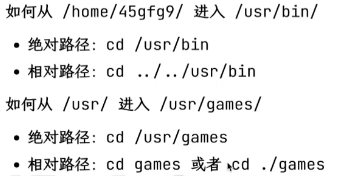  

>**文件/目录操作命令**
>>ls：列出当前路径下的文件和目录（-a列出所有文件和目录，包括隐藏文件；-l列出详细信息）  
>>touch file：创建一个文件  
>>mkdir dir：创建一个目录  
>>cp src dst：复制文件或目录（-r递归复制目录）  
>>mv src dst：移动文件或目录(重命名)dst如果是文件夹，就有  
>>rm files..：删除文件（-r递归删除目录；-f强制删除）  
>>find path -name pattern：在path下查找文件名匹配pattern的文件  

>**文件内容查看命令**  
>>cat files ...：输出与拼接文件（-n：带符号输出）  
>>head files：输出file前10行（-n lines：输出前lines行）  
>>tail files：输出file后10行（-n lines：输出后lines行）  
>>more/less file：分页输出file内容  

这里留个坑，关于shell的语法之后再补

---  
#### 0.2.2 Linux File System 
(待)  

---
#### 0.2.3The Advanced Packaging Tool(APT)  
(待)  
 
---
### 0.3 Access the Virtual Machine using SSH  
---  
#### 0.3.1 basic concepts
- [x] IP address
- [x] MAC address
- [x] Subnet mask
- [x] Gateway
- [ ] Port
- [ ] Port forwarding  

https://www.bilibili.com/video/BV1CQ4y1d728/?vd_source=5742e02a7566918d65a441adce5bc163  

https://www.bilibili.com/video/BV1DD4y127r4/?vd_source=5742e02a7566918d65a441adce5bc163  

---
#### 0.3.2 Network in Virtual Machines  
- [x] Ping the virtual machine  

step1:Check if the network mode of the virtual machine is set to *NAT*.    
  
step2:Use the ***ip addr*** command to find the IP address of the virtual machine.  
  
From the screenshot, the virtual machine has two network interfaces: ens33 and lo. The latter is the loopback interface, and the former is the network interface used to connect to the network. We can see that the IP address of the virtual machine is 192.168.75.128.  
Open a terminal on your host machine and ping the virtual machine.  
*ping 192.168.75.128*  
The ouput is like:  
  

---
#### 0.3.3 SSH  
Secure Shell (SSH) is a cryptographic network protocol for operating network services securely over an unsecured network. The best-known example application is for remote login to computer systems by users.  
More about the Asymmetric Encryption:https://www.youtube.com/watch?v=AQDCe585Lnc  
  

- [x] Connect to the virtual machine using SSH  

step1:我选择在虚拟机上操作，一般Linux和macOS上已经预装了SSH client，如果要在windows上装，可以参考：https://learn.microsoft.com/en-us/windows-server/administration/openssh/openssh_install_firstusetabs=gui#install-openssh-for-windows  
step2:You also need to install an SSH server on the virtual machine.  
***sudo apt update***  
***sudo apt install openssh-server***  

step3:After installing the SSH server, you can use the ssh command to connect to the virtual machine:  
***ssh username@IP_ADDRESS***  
Replace username with your username on the virtual machine and IP_ADDRESS with the IP address of the virtual machine.  
  
Now you can copy and paste commands to this terminal. You can also use the scp command to copy files between your computer and the virtual machine. You can also connect your VSCode to the virtual machine using the Remote-SSH extension, but don't rely on it too much.  

---
### 0.4 More on Linux  
---
#### 0.4.1 User and Permissions  
lab文档给的自学视频是youtube上的 https://www.youtube.com/watch?v=19WOD84JFxA 和 https://www.youtube.com/watch?v=LnKoncbQBsM 两个全英文无字幕视频，为了赶时间我就用中科大文档里的 https://101.lug.ustc.edu.cn/Ch05/#users-and-groups 平替了（还得是中科大）  
##### 0.4.1.1 Users and Groups  
我们可以通过查看 ***/etc/passwd*** 文件，来得到系统中用户的配置信息  
  
这里除了很后面的lee用户（没截进去）之外，还有一个特殊的root用户 
>**根用户**  
之前加上的sudo可以让我们以根用户的身份安装软件（apt安装软件安装在系统目录下，必须要以root用户的身份去安装），/root用户在Linux系统中拥有最高的权限  

>**系统用户**  
除了lee，root之外，还有很多剩下的用户，它们是由系统或相关程序创建，用于执行服务等系统任务。不要随意删除这些用户，以免系统运行出现问题  

>**普通用户**  
普通用户可以登录系统，并对自己的家目录下的文件进行操作。所有普通用户的家目录都在/home/下，位于/home/username/的位置，其中username是用户名  
普通用户无法直接修改系统配置，也无法为系统环境安装或卸载软件  

>**切换用户**  
sudo命令可以让你以另一个用户的身份执行指定的命令。当然，它最常见的用途，就是能让普通用户以root的身份执行命令：不加入其他参数，sudo 后面直接加命令；若要以其他用户的身份执行，只要加上“-u 用户名”就行了  

关于su和sudo有一小段有趣的解释，具体可以看中科大文档  

>**用户组**  
用户组是用户的集合。通过用户组机制，可以为一批用户设置权限。可以使用 groups 命令，查看自己所属的用户组  
  
可以看到，lee属于多个用户组。一般在用户创建时，都会创建与其名字相同的用户组  

>**文件权限**  
在 Linux 中，每个文件和目录都有自己的权限。可以使用 ls -l 查看当前目录中文件的详细信息  
  
第一列的字符串从左到右意义分别是：文件类型（一位）、文件所属用户的权限（三位）、文件所属用户组的权限（三位）、其他人的权限（三位）。对于每个权限，第一位 r 代表读取 (Read)，第二位 w 代表写入 (Write)，第三位 x 代表执行 (Execute)，- 代表没有对应的权限。
第三、四列为文件所属用户和用户组。

>**文件系统层次结构**  
Linux 下文件系统的结构和 Windows 的很不一样。在 Windows 中，分区以盘符的形式来标识（如「C 盘」、「D 盘」），各个分区的分界线是很明确的。在系统所在的分区（一般为 C 盘）中，存储着程序文件 (Program Files)，系统运行需要的文件 (Windows)，用户文件 (Users) 等。这种组织形式源于 DOS 和早期的 Windows，并一直传承下来。  
而 UNIX 系列采用了一种不一样的思路组织文件：整个系统的文件都从 /（根目录）开始，像一棵树一样，类似于下图。  
  
其他的分区以挂载 (mount) 的形式「挂」在了这棵树上，如图中的/mnt/windows_disk/  
部分关于文件系统层次结构的文档可以在中科大文档中查看  

---
##### 0.4.1.2 Environment Variables  
参考文档：https://linuxize.com/post/how-to-set-and-list-environment-variables-in-linux/  

---
### 0.5 Git  
---  
这里就是注册一个ZJU Git账号和添加一个SSH Key  
好巧不巧，之前正好弄过一个SSH Key，就刚好拿来用了，添加好之后测试一下连接成功  
  

---
### 0.6 Lab0 Tasks  
>Task1.1  
hush result

>Task2.1  
nano在中科大文档中有简单介绍：Nano 是在很多机器上自带的命令行文本编辑器，相比于 vim 和 emacs 来说，对新手更加友好，不需要提前记忆复杂的键位  
***$ nano file.txt  # 使用 nano 编辑 file.txt 文件（如果没有则创建）***  
Nano 启动后，用户可以直接开始输入需要的内容，使用方向键移动光标。在终端最下方是 nano 的快捷键，^ 代表需要按下 Ctrl 键（例如，^X 就是需要同时按下 Ctrl + X）。在编辑完成后，按下 Ctrl + X，确认是否保存后即可。  


>Task3.2  
  

>Task5.2  
  


## Lab1:简单集群搭建  
这是第一次接触到计算机集群的概念：）  
本次实验，我们将使用四台虚拟机搭建一个简易的集群，并对该集群进行性能测试，最后提交测试结果和实验报告。  
>软件安装  
- [x] 下载OpenMPI、BLAS和HPL的源代码并编译安装  
>集群搭建  
- [x] 克隆虚拟机
- [x] 配置虚拟机互联
- [x] 测试节点间通信
>性能测试  
- [x] 在虚拟机集群上使用openMPI运行HPL性能测试，记录测试结果  
>Bonus（选做）  
- [ ] 配置NFS并复现实验
- [ ] 使用Docker复现实验
- [ ] 使用Spack复现实验  

---
### 1.1 从源码构建Linux应用-以Angband为例  
在 Linux 生态中，源代码是最通用的软件分发形式。  
#### 1.1.1 软件包源码的组织方式  
进入 Angband 的网站，点击 Source Code，下载最新的*源代码*压缩包并解压。
***wget https://github.com/angband/angband/releases/download/4.2.5/Angband-4.2.5.tar.gz
tar xvf Angband-4.2.5.tar.gz
cd Angband-4.2.5
ls***  
>开源软件包源码的目录结构
.
├── bin：存放软件包的可执行文件（binary）。
├── src：存放软件包的源代码文件（source）。
├── lib：存放软件包的库文件（libraries）。
├── docs：存放软件包的文档文件，可能包括用户手册、API文档等。
└── README.md：包含软件包的说明文档，通常包括软件包的简要介绍、安装指南和使用说明。  

在README.md文件中，维护者描述了如何编译代码，在compile it yourself->Lnux->Native builds中可以找到构建Angband的命令：  
***./configure --with-no-install
make***  
  
运行后，遇到了错误：  
  
这说明我们的虚拟机上没有安装C编译器。这里安装了gcc作为C编译器  
***sudo apt update  
sudo apt install gcc***  
之后检查一下gcc的位置看有没有安装成功  
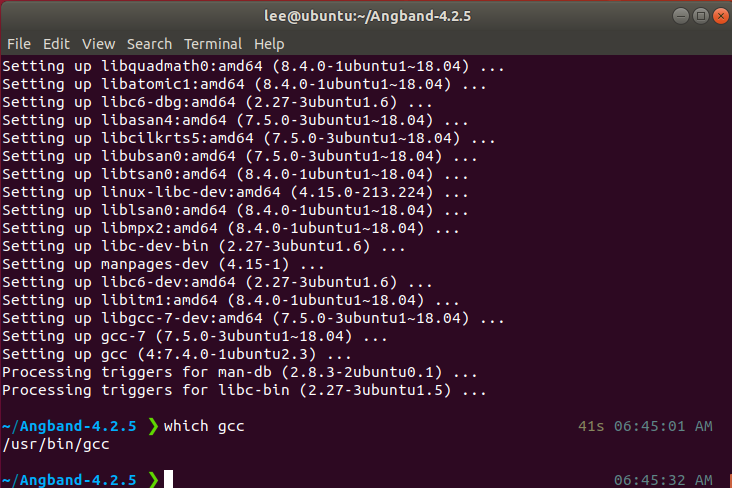  
再次运行，还是有问题  
  
意思是我们还缺了一个用于自动化编译和构建程序的make工具，我们再安装一个build-seeential软件包，其中包含了全面的编译器和构建工具  
***sudo apt update
sudo apt install build-essential***  
  
这时候make就可以被正常找到了  
我们再尝试  
***./configure --with-no-install 
make***  
  
正确执行后，会在src目录下找到angband可执行文件。我们可以尝试运行：  
  
P.S 这里其实还出现了找不到src/angband的问题，但重新下载一次居然就好了  

#### 1.1.2 令人头疼的依赖关系与数据库  
工程开发是多文件编程：编译器将每个代码文件分别编译后，还需要将它们合在一起变成一个软件，**合在一起的过程称为链接的过程**。具体可以参看wk老师的智云 https://classroom.zju.edu.cn/livingroom？course_id=53613&sub_id=1028201&tenant_code=112  
链接分为静态链接和动态链接。静态链接是指在编译时将库文件的代码和程序代码合并在一起，生成一个完全独立的可执行文件。动态链接是指在程序运行时，加载库文件，从而节省存储空间，提高程序的复用性和灵活性。  
>**静态链接**
如果你的程序与静态库链接，那么链接器会将静态库中的代码复制到你的程序中。这样，你的程序就不再依赖静态库了，可以在任何地方运行。但是，如果静态库中的代码发生了变化，你的程序并不会自动更新，你需要重新编译你的程序。  
在 Linux 系统上，静态库的文件名以 .a 结尾，比如 libm.a。在 Window 上，静态库的文件名以 .lib 结尾，比如 libm.lib。静态库可以使用 ar （archive program）工具创建。

>**动态链接**  
当你的程序与动态库链接时，程序中创建了一个表。在程序运行前，操作系统将需要的外部函数的机器码加载到内存中，这就是动态链接过程。  
与静态链接相比，动态链接使程序文件更小，因为一个动态库可以被多个程序共享，节省磁盘空间。部分操作系统还允许动态库代码在内存中的共享，还能够节省内存。动态库升级时，也不需要重写编译你的程序。  
在 Linux 系统上，动态库的文件名以 .so 结尾，比如 libm.so。在 Window 上，动态库的文件名以 .dll 结尾，比如 libm.dll。  

链接相关的问题可能出现在链接时（静态链接）、程序运行前和运行中（动态链接）。比如：未定义的应用、缺失.dll（缺少动态链接库）、缺失.so（Linux上的动态库）

---
由于虚拟机之前没有安装过相关软件包，所以src/angband运行后没有出现游戏界面，而是直接退出了。同时，在./configure中也给出了warning  
  
往上翻还会发现missing libraries  
  
Angband 使用了 ncurses 库来实现游戏界面。但这个库不会被包含在 Angband 的源代码中，也没有默认包含在系统中，因此我们需要手动安装。 
通过网络搜索，我们得知 ncurses 库包含在 libncurses5-dev 软件包中，我们可以通过下面的命令安装它：  
***sudo apt install libncurses5-dev***  
之后再次运行./configure就能识别到ncurses库了  

P.S 这里同样遇到了一些阻碍，刚下载完后运行./configure还是不能识别到ncurses库，关掉terminal重走一遍流程后又好了  
  

至此我们解决了一个简单的依赖问题：Angband->ncurses。在HPC应用中，实际的依赖关系极其复杂，这时我们就将使用自动化工具和包管理器解决部分问题。  

#### 1.1.3 不怎么自动的自动化构建工具  
./configure和make工具用于构建软件包，就是GNU Autotools构建系统中的一部分。关于自动化构建工具（Automated Build Tools）的简介可直接看lab文档，其主要功能包括  
>编译和链接
依赖管理
代码检查
单元测试
打包和部署  

有趣的是Autotools往往能带来一堆问题，但又不得不用它提高效率  
  
 
---  
lab文档中介绍了两种构建工具的使用方法  
##### 1.1.3.1 GNU Autotools  
GNU Autotools的工作流程一般是：首先使用Autoconf生成configure脚本，然后用configure脚本生成Makefile文件，最后使用Makefile文件编译和链接源代码，生成可执行文件或库文件。写成命令就是：  
***./configure
make
make install***  
流程中每个环节都可以定制，如图：  
  
要如何修改这些文件，要阅读README和INSTALL等文件，有时也可以通过为这些命令添加参数来修改行为。  
##### 1.1.3.2 CMake  
CMake 是一个更加现代化的开源的跨平台的构建工具。它使用一种类似于脚本的语言来描述构建过程，然后根据这个描述生成相应的构建文件。与 GNU Autotools 相比，它提供了更多的功能，与更多的现代软件如 IDE 实现了集成，因此在一些项目中取代了 Autotools。但编写 CMakeLists.txt 也比 Makefile 更为抽象，理解和使用难度也更大。它的首要优势是*跨平台*。  
  
CMake 的另一大优势是*缓存*。CMake 会在第一次运行时生成一些缓存文件，这个文件记录了所有的配置信息，包括编译器、编译选项、依赖库等。这样，当你修改了源代码后，只需要重新运行 CMake，它就会根据缓存文件重新生成构建文件，而不需要重新进行检查、配置和生成。对于大型项目的增量开发和构建来说，这极大地节约了时间。  
CMake 的工作流程一般是：首先编写 CMakeLists.txt 文件，描述项目的目录结构、源代码文件、依赖库等信息，然后使用 CMake 工具生成构建文件，最后使用构建工具（如 make、ninja 等）编译和链接源代码，生成可执行文件或库文件。对应的命令如下：
***cmake -B build
cmake --build build***
### 1.2 任务一：从源码构建OpenMPI和HPL
对于过程中需要修改Makefile的步骤，需要了解基本的Makefile语法，参考https://www.bilibili.com/video/BV188411L7d2/  

#### 1.2.1 Makefile基本语法  
有这样几个文件，要将它们综合起来工作，可以有以下几种办法：  
  
>version 0  

直接在terminal中编译  
***g++ main.cpp factorial.cpp printfhello.cpp -o main***  
运行  
***./main***  
上述行为也可以拆成三个步骤：
***g++ main.cpp -c***
***g++ factorial.cpp -c***
***g++ printfhello.cpp -c*** 
生成三个.o文件  
***g++ *.o -o mian***  
把三个文件链在一起生成一个.0文件  
这样做可以单独编译发生变化的文件，缩短编译时间  

>version 1  

***hello:main.cpp printfhello.cpp factorial.cpp  
    g++ -o hello main.cpp printfhello.cpp factorial.cpp***  
目标是生成一个名叫hello的可执行程序，hello的生成是依赖于后面三个文件的；使用g++这个命令去实现这个目标  
这句话被写在Makefile文件中，当执行make (-f Makefile) 时，就会去找Makefile文件，然后执行  

>version 2  

***CXX=g++
TARGET=hello
OBJ=main.o prinfhello.o factorial.o***  

***$(TARGET):$(OBJ)  
    $(CXX) -o $(TARGET) $(OBJ)***  

***main.o:main.cpp  
    $(CXX) -c main.cpp***  

 
***prinfhello.o:printfhello.cpp
    $(CXX) -c printfhello.cpp***    

***fctorial.o:factorial.cpp
    $(CXX) -c  
    factorial.cpp***  
P.S 这里的格式有问题,具体直接看视频  
实际就是把version 1中的语言变得更正式  

>version 3  

在version 2基础上加一个***CXXFLAGS = -c -Wall***  
简化成：  
***%.o:%.cpp  
    $(CXX) $(CXXFLAGS) $< -o %@***  
实际就是更加抽象化了，具体还是看视频  

>version 4  

再加一个***SRC=%(wildcard * .cpp)***  
就不用再列出cpp文件了，直接把当前目录下所有cpp文件拉进来了

#### 1.2.2 Tasks  
这几个项目的依赖关系：  
  

---
>构建并安装OpenMPI  

step1：前往OpenMPI官网下载最新版本源码  
***wget "https://download.open-mpi.org/release/open-mpi/v5.0/openmpi-5.0.3.tar.gz"
tar xvf openmpi-5.0.3.tar.gz
cd openmpi-5.0.3*** 
  
step2：解压源码  
***./configure #不带参数，将默认安装到/usr/local/下，此时不需要修改PATH和LD_LIBRARAY_PATH等***  

step3：构建并安装OpenMPI
***make
sudo make install #安装到系统目录 /usr/local 需要root权限***  
这里出现了一个很尴尬的事情：报错说内存满了  
  
检查一下报错的/tmp中的内存使用  
***df -h /tmp***  
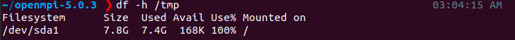  
确实是满了  
思考了一下，由于正好是Lab1，加上之前用ubuntu的时候就打算先试一试（The very beginning），所以就重新开一个VM   

---
这一次我们从ZJU Mirrors上下载Debian ISO，然后正好补一下之前lab0中Task1的坑  
ZJU Mirror(极其简陋):
https://mirrors.zju.edu.cn/debian-cd/  
Your guide to Debian iso downloads:
https://github.com/slowpeek/debian-iso-guide  
这里我选择的是  
  
给的硬件配置  
  
选择的是英文。在lab文档中有一句明确的提示： 
**Don't set a root password. Read the text on the screen carefully.** 
>If you leave this empty, the root account will be disabled and the system's initial user will be given the power to become root using the sudo command  

**So, if you set a root password, you will need to add yourself to the sudo group later manually.**  
所以没有设置root passward  
按照lab文档做  
  

虽然lab文档的意思好像只要SSH server and standard system utilities，但我根本没有这个选项，最后装出来的还是有桌面的虚拟机，时间紧迫，先凑合着用吧  

---
重新下载一下build-essential，重复上面安装OpenMPI的流程  

等了大概几百年之后make完了  
  
至此回到之前的步骤 
step4：  
***sudo ldconfig # 更新动态链接库缓存***  
至于为什么要加这一步，可以参考https://lists.nongnu.org/archive/html/libtool/2014-05/msg00021.html  
step5：最后确认一下安装信息  
***ompi_info --all # 查看安装信息***

安装完成

>构建并安装BLAS  
 
***wget "http://www.netlib.org/blas/blas-3.12.0.tgz"
tar xvf blas-3.12.0.tgz
cd BLAS-3.12.0
make***  
前三句话没有问题，但make的时候会报错：  
  
提示缺少了gfortran，需要下载  
***sudo apt install gfortran***  
之后就可以执行make了  
  

>构建并安装HPL  

step1
***wget "https://netlib.org/benchmark/hpl/hpl-2.3.tar.gz"
tar xvf hpl-2.3.tar.gz
cd hpl-2.3***

step2
***cp setup/Make.Linux_PII_FBLAS .***  
这一指令把Make Linux_PII_FBLAS文件复制到执行命令时所在的目录  
>**Make.Linux_PII_FBLAS文件**是一个Makefile模板文件，主要用于在Linux系统下，针对特定硬件平台（如PII处理器）和线性代数库（如FBLAS，即Fortran版本的BLAS）配置HPL（High-Performance Linpack）的编译过程。这个文件包含了编译HPL所需的一系列配置指令和变量定义，如编译器选项、库文件路径、头文件路径等。  

step3  
**vim Make.Linux_PII_FBLAS # 修改 Makefile**  
没有vim就装一个  
Vim 是一种高度可配置的文本编辑器，用于有效地创建和更改任何类型的文本。  
  
这里我们要对Makefile文件做一些修改，向下移动光标可以找到需要修改的部分  
  
左边是修改后，右边是修改前  
这里用vim修改有特定的方式，具体如下：  
  
  
***make arch=Linux_PII_FBLAS***  
在Makefile中指定arch=Linux_PII_FBLAS这样的目标架构  
这里报两个错：  
  
经过了长时间的调试，始终没有解决这个该死的error，尝试别的途径。。。  
发现其他实验者用的都是CBLAS，应该CBLAS中有可以替代该死的libmpich.so的库，试试吧  

>构建并安装CBLAS  

***wget http://www.netlib.org/blas/blast-forum/cblas.tgz  
tar -zxvf cblas.tgz***  

太痛苦了  

---  

上面都是非常痛苦的尝试，最后我决定重装一台ubuntu   
  
之后交叉参考了三篇文章  
https://www.cnblogs.com/Vocanda/p/17436434.html  
https://github.com/ForeverHYX/hpl101-su24/blob/master/Report/HPC_Lab1_Report.pdf  
https://rzm0572.github.io/Computer-Science/HPC/HPC101-Lab1-Report/
>BLAS&CBLAS part  

***wget "http://www.netlib.org/blas/blas-3.12.0.tgz"  
tar xvf blas-3.12.0.tgz  
cd BLAS-3.12.0   
make***  
最后将刚下载到的库文件复制到系统库文件
***cp blas_LINUX.a /usr/local/lib/libblas.a***  
(这里报了permission denied所以最后使用sudo的)  
  
  
接着安装CBLAS  
***wget http://www.netlib.org/blas/blast-forum/cblas.tgz
tar -xvf cblas.tgz***  
接下来我们要编译CBLAS文件，得到cblas_LINUX.a  
打开Makefile.in，可以看到  
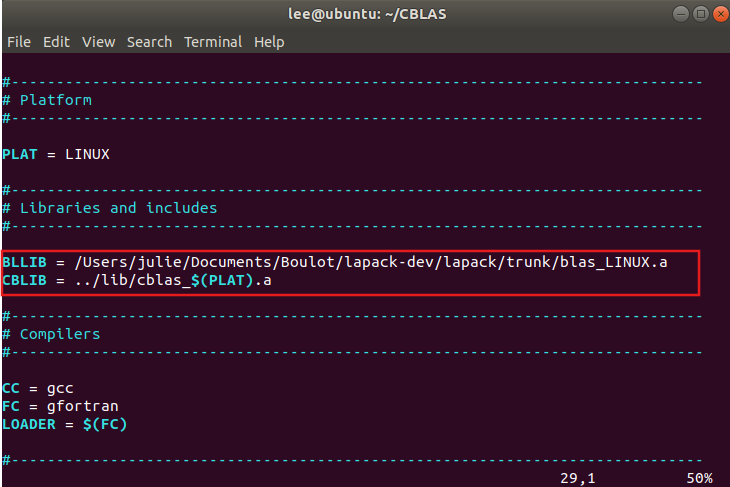  
我们需要指定BLAS库的路径，刚刚我们已经把blas_LINUX.a复制到了系统库文件，修改路径如下  
  
接着去make  
  
中间有几条warning，但没有error  
  
成功在 /CBLAS/lib中生成了cblas_LINUX.a  
把它也复制到/usr/local/lib/libcblas.a  
~~***sudo cp cblas_LINUX.a /usr/local/lib/libblas.a***~~  
sudo cp cblas_LINUX.a /usr/local/lib/libcblas.a
至此，BLAS也配置好了

>OpenMPI part  

值得一提的是，OpenMPI居然是有官方文档的，而我居然全程没找到过。。。  
https://docs.open-mpi.org/en/main/index.html

***wget "https://download.open-mpi.org/release/open-mpi/v5.0/openmpi-5.0.3.tar.gz"
tar xvf openmpi-5.0.3.tar.gz
cd openmpi-5.0.3***  
  
下载好后把它安装在特定路径  
***./configure --prefix=/usr/local/openMPI***  
***make
sudo make install***  
漫长的等待后安装完成，之后需要修改PATH和LD_LIBRARY_PATH(之后讲MPI的时候会提到)，我使用nano打开修改的  
***nano ~/.bashrc***  
  
在 .bashrc的最上面配置环境变量  
  
最后运行一下使修改生效  
***source ~/.bashrc***  
至此，OpenMPI配置完成  

>HPL part  

***wget https://netlib.org/benchmark/hpl/hpl-2.3.tar.gz
tar -xvf hpl-2.3.tar.gz
cd hpl-2.3***  
为HPL构建提供一个合适的Makefile文件  
***cp setup/Make.Linux_PII_CBLAS ./Make.Linux_PII***  
对这个Make.Linuc_PII文件进行修改  
修改如下：  
ARCH         = Linux_PII_CBLAS -> Linux_PII  

TOPdir       = $(HOME)/hpl-2.3 -> /home/lee/hpl-2.3  

MPdir        = /usr/local/mpi -> /usr/local/openmpi  

MPinc        = -I$(MPdir)/include

MPlib        = $(MPdir)/lib/libmpich.a -> $(MPdir)/lib/libmpi.so  

LAdir        = $(HOME)/netlib/ARCHIVES/Linux_PII -> /home/lee/CBLAS  

LAinc        =

LAlib        = $(LAdir)/libcblas.a $(LAdir)/libatlas.a -> /usr/local/lib/libcblas.a /usr/local/lib/libblas.a -lgfortran

CC           = /usr/bin/gcc -> /usr/local/openMPI/bin/mpicc

LINKER       = $(CC)


修改完成后，根据刚才修改的Makefile去make  
***make arch=Linux_PII***  
这里报了error，发现一个巨大的错误，之前  
  
应该生成libcblas的，结果把原来的libblas.a给覆盖掉了。。。  
紧急返工，把原来的给重命名成libcblas.a，再复制一次libblas.a  
  
希望这次可以！  
  
找到了/hpl-2.3/bin/Linux_PII目录下的可执行文件xhpl，我承认这一刻我是有点激动的qwq  
至此，软件安装部分完成  

---  
### 1.3 集群环境搭建与配置  
#### 1.3.1 集群节点间的连接与互访  
##### 1.3.1.1 网络基础
在Lab0中我们已经了解过了关于MAC地址、IP地址和ARP协议的知识，这里再借助gpt回顾一下  
>**IP地址**  
IP地址（Internet Protocol Address）是互联网协议地址，用于在互联网上唯一标识一个设备。它采用一种分层次的地址结构，由网络号和主机号两部分组成。IPv4是目前广泛使用的版本，它由32位二进制数组成，通常以点分十进制（如192.168.1.1）的形式表示。由于IPv4地址空间有限，已经逐渐被IPv6所取代，IPv6使用128位二进制数表示地址，极大地扩展了地址空间。  

>**MAC地址**  
MAC地址（Media Access Control Address）是媒体访问控制地址，也称为物理地址或硬件地址。它用于在网络中唯一标识一个网络接口控制器（NIC），即网络适配器或网络接口卡（NIC）的硬件地址。MAC地址通常被固化在网卡的ROM中，是网络设备出厂时就分配好的，全球唯一。MAC地址的长度为48位（6字节），通常表示为12个十六进制数，如00-1A-2B-3C-4D-5E。  

>**ARP协议**  
ARP（Address Resolution Protocol）地址解析协议是一种网络层协议，用于将网络层（IP层）地址解析为链路层（数据链路层）地址，即IP地址到MAC地址的映射。在网络通信中，数据链路层协议（如以太网）通过MAC地址来识别网络上的设备，而网络层协议（如IP）则通过IP地址来识别设备。因此，当一台设备想要向另一台设备发送数据时，它必须知道对方的MAC地址。ARP协议就是用来完成这一映射过程的。
ARP协议的工作流程大致如下：
1、请求过程：当一台设备想要发送数据给另一台设备时，它首先检查自己的ARP缓存表中是否有目标IP地址对应的MAC地址。如果没有，该设备会广播一个ARP请求，询问哪台设备拥有该IP地址。
2、响应过程：拥有该IP地址的设备会收到ARP请求，并发送一个ARP响应，其中包含自己的MAC地址。
3、更新缓存：请求设备收到ARP响应后，会将目标IP地址和对应的MAC地址存入自己的ARP缓存表中，并使用这个MAC地址发送数据。
通过这种方式，ARP协议实现了IP地址到MAC地址的动态映射，确保了数据在网络中的正确传输。  
##### 1.3.1.2 计算机集群概念
**计算机集群(Cluster)** 是连接在一起、协同工作的一组计算机，集群中的每个计算机都是一个节点。在集群中，由软件将不同的计算任务（task）分配（schedule）到相应的一个或一群节点（node）上。通常会有一个节点作为主节点（master/root node），其他节点作为从节点（slave node）。主节点负责调度任务（当然也可能负责执行部分任务），从节点负责执行任务。此外，也通常会有一个共享的文件系统，用于存储任务数据和结果。  
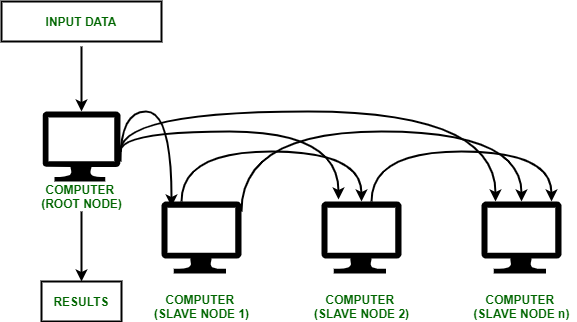    
##### 1.3.1.3 SSH的密钥认证  
在Lab0中，我们已经学习了如何通过 SSH 使用密码访问虚拟机。在集群中，节点之间的互访往往也通过 SSH 完成，但要求无交互（non-interactive），这就需要使用 SSH 的密钥认证（key-based authentication）。  
>SSH密钥的认证原理  

SSH 密钥认证基于密码学中的非对称加密算法。在 SSH 密钥认证中，用户有两个密钥：私钥（private key）和公钥（public key），它们一一配对。私钥只有用户自己知道，公钥可以公开。私钥能够加密数据，公钥能够解密数据。用户可以将公钥放在服务器上，当用户连接服务器时，服务器会用公钥加密一个随机数发送给用户，用户用私钥加密这个随机数，然后用这个随机数加密数据发送给服务器，服务器用公钥解密数据。如果用户能够成功加密，说明用户拥有私钥，连接成功。简单了解非对称加密算法可以看这个视频  
https://www.bilibili.com/video/BV1XP4y1A7Ui/?spm_id_from=333.337.search-card.all.click&vd_source=5742e02a7566918d65a441adce5bc163  
  
所谓配置 SSH 密钥认证，就是让服务器信任该公钥，允许持有该私钥的用户连接。在集群中，我们需要在主节点中生成密钥对，将主节点的公钥放在从节点上，这样主节点就能够通过 SSH 密钥认证连接到从节点。  
可以阅读How To Configure SSH Key-Based Authentication on a Linux Server - DigitalOcean https://www.digitalocean.com/community/tutorials/how-to-configure-ssh-key-based-authentication-on-a-linux-server 了解如何配置 SSH 密钥认证。  
基本操作是  
***ssh-keygen -t ed25519 # 生成密钥对，使用 ed25519 算法
ssh-copy-id user@hostname # 将公钥放在服务器上***  
其实课上连接zju clusters就是类似的操作  
  
需要注意的是，认证基于用户。不是说主节点可以连接到从节点，而应当说主节点上的某个用户可以连接到从节点上的某个用户。如果在主节点上为 root 用户生成密钥对，却在从节点上将公钥放置进 test 用户的 .ssh/authorized_keys 文件中，那么显然无法以密钥认证的方式登录到从节点的 root 用户。  

---
#### 1.3.2 MPI的运行方式  
OpenMPI 是一个开源的 Message Passing Interface 实现。MPI 是一套标准化、可移植的消息传递标准，它被设计用于支持并行计算系统的架构，使得开发者能够方便地开发可移植的消息传递程序。  
***mpirun***是 OpenMPI 提供的 MPI 启动程序，负责在指定的节点上启动 MPI 程序，此后程序间的通信由 MPI 库负责。可以为 mpirun 指定参数，比如启动的进程数、启动的节点等。关于mpirun参考 https://docs.open-mpi.org/en/main/launching-apps/quickstart.html 和 https://docs.open-mpi.org/en/main/launching-apps/ssh.html ,这里只记录最关键部分  
##### 1.3.2.1 Quick start: Launching MPI applications  
>Launching on a single host  
 
In such simple “single program, multiple data (SPMD)” cases, use ***mpirun*** and specify how many MPI processes you want to launch via the -n option:  
在/openmpi-5.0.3/examples中执行***mpirun -n 2 hello_c***  
实际上，可能是因为虚拟机设置的时候只设置了2核，这里只能有2个MPI processes，再增加会报错  
  
只用两个是可以的  
  

这一点其实在 https://github.com/ForeverHYX/hpl101-su24/blob/master/Report/HPC_Lab1_Report.pdf 的OpenMPI检验中体现了

>Launching in a non-scheduled environments (via **ssh**)  

In general, Open MPI requires the following to launch and run MPI applications:
1、You must be able to login to remote nodes non-interactively (e.g., without entering a password or passphrase).通过SSH来实现  
2、Open MPI’s executables must be findable (e.g., in your PATH).  
3、Open MPI’s libraries must be findable (e.g., in your LD_LIBRARY_PATH).

mpirun accepts a --hostfile option (and its synonym, the --machinefile option) to specify a hostfile containing one hostname per line:
***shell$ cat my-hostfile.txt
node1.example.com
node2.example.com
node3.example.com slots=2
node4.example.com slots=10***  

***mpirun***接受一个 **--hostfile** 选项。这个选项允许用户指定一个文件，该文件列出了运行MPI作业所需的各个主机（或节点）的名称和每个主机上可用的进程数（即slots或cores）。这对于在分布式计算环境中管理MPI作业特别有用，因为它允许用户精确控制作业在哪个主机上运行以及在这些主机上分配多少资源。

**--hostfile** 选项后面跟随的是包含主机信息的文件的路径。这个文件通常包含每行一个条目的列表，每个条目指定了一个主机名和可选的slots数（如果不指定，则使用默认值）

这一点其实在 https://rzm0572.github.io/Computer-Science/HPC/HPC101-Lab1-Report/ 中体现了，用于检验OpenMPI能否正常工作  

The optional slots attribute tells Open MPI the maximum number of processes that can be allocated to that node. If slots is not provided, Open MPI — by default — uses the number of processor cores (not hyperthreads) on that node.  

所以在刚才的例子中，输出应该是：  
***shell$ mpirun --hostfile my-hostfile.txt mpi-hello-world
Hello world, I am 0 of 44 (running on node1.example.com)
Hello world, I am 1 of 44 (running on node1.example.com)
...
Hello world, I am 15 of 44 (running on node1.example.com)
Hello world, I am 16 of 44 (running on node2.example.com)
Hello world, I am 17 of 44 (running on node2.example.com)
...
Hello world, I am 31 of 44 (running on node2.example.com)
Hello world, I am 32 of 44 (running on node3.example.com)
Hello world, I am 33 of 44 (running on node3.example.com)
Hello world, I am 34 of 44 (running on node4.example.com)
...
Hello world, I am 43 of 44 (running on node4.example.com)***  
各个node使用情况应该是：
node1: 16, because no slots was specified
node2: 16, because no slots was specified
node3: 2, because slots=2 was specified
node2: 10, because slots=10 was specified

>Launching in scheduled environments  
（略）  

>Using the scheduler to “direct launch” (without mpirun(1))
（略）  

##### 1.3.2.2 Launching with SSH  
When launching Open MPI jobs in a non-scheduled environment, ssh is typically used to launch commands on remote nodes.   
其要求就是Launching in a non-scheduled environments (via ssh)中列出的要求  

There are three mechanisms for specifying the hosts that an MPI job will run on：  
1、The **--hostfile** option to mpirun.  
2、The **--host** option to mpirun.  
3、Running in a scheduled environment.  
>The specification of hosts using any of the above methods has nothing to do with the network interfaces that are used for MPI traffic. The list of hosts is only used for specifying which hosts on which to launch MPI processes.  

If you have a shared $HOME filesystem between your nodes, you can setup a single SSH key that is used to login to all nodes.  

>Non-interactive ssh logins  

SSH keys must be setup such that the following can be executed without being prompted for password or passphrase  
简单来说文档里让你自己去搜。。。  

>Finding Open MPI executables and libraries  

Once Open MPI is able to use ssh to invoke executables on a remote node, it must be able to find its helper executables and shared libraries on that remote node.

If Open MPI is installed in a system-level folder (e.g., in /usr/bin), Open MPI will likely be able to find its executables and libraries on the remote node with no additional assistance.

If, however, Open MPI is installed into a path that is not searched by default, you will need to **provide assistance so that Open MPI can find its executables and libraries**.  

For simplicity, it is strongly recommended that you install Open MPI in the same location on all nodes in your job.   

**Use “prefix” behavior**  
When “prefix” behavior is enabled, Open MPI will automatically set the $PATH and $LD_LIBRARY_PATH on remote nodes before executing remote commands.(这里格式有问题)  
文档里介绍了三种enable perfix的办法  

**Set the PATH and LD_LIBRARY_PATH in your shell startup files**  
讲道理没咋看懂，详见文档 https://docs.open-mpi.org/en/main/launching-apps/ssh.html  

总结一下：使用 mpirun 在集群中运行 MPI 程序，可以指定节点、进程数和工作路径等。

---
#### 1.3.3 性能测试Benchmark  
**HPL（high performance Linpack）** 是评测计算系统性能的程序，是早期 Linpack 评测程序的并行版本，支持大规模并行超级计算系统。其报告的每秒浮点运算次数（floating-point operations per second，简称 FLOPS）是世界超级计算机 Top500 列表排名的依据。  
**BLAS** 是 Basic Linear Algebra Subprograms 的缩写，是一组用于实现基本线性代数运算的函数库。HPL 使用 BLAS 库来实现矩阵运算，因此需要 BLAS 库的支持。  

文档里有关于HPL的数学原理，云里雾里的浏览了一下，过了  

总结起来就是：HPL 通过求解线性系统来评估计算机集群的浮点性能  

---  
### 1.4 使用 HPL 测试虚拟机集群的性能  
#### 1.4.1 连接与互访  
- [x] 克隆虚拟机并将他们连接互访
  
>用VMware Workstation克隆虚拟机，命名为node01，node02，node03，node04。  

**选择完整克隆**  

**注意，不只是在 Hypervisor 中修改名字，还需要在虚拟机中修改 /etc/hostname**  
我们可以用
***sudo nano /etc/hostname***来修改名称  
之后重启
***reboot***  

>查看各台虚拟机的ip地址：  
***ip addr***  
node01：192.168.75.133  
node02：192.168.75.137  
node03：192.168.75.138  
node04：192.168.75.139  

>获取之后在node01（The One）中修改 /etc/hosts 文件，添加其他节点的IP地址。  

***sudo vim /etc/hosts***  
这里不是太清楚怎么修改hosts，文档讲的也不太清楚，先做一个尝试  
  

>在 node01 中生成密钥对，将公钥放在其他节点上。  

***ssh-keygen # 注意不需要为密钥设置密码，全程回车即可***  
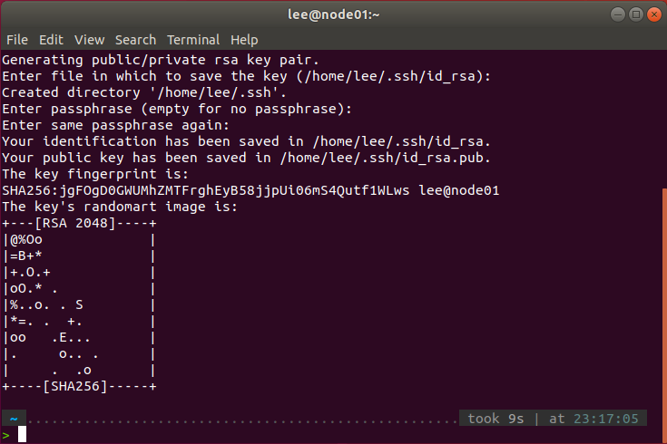  
>将公钥放在其他节点上  

***ssh-copy-id user@hostname # 这其实与之前登录ZJU m600时把公钥copy到authorized中是等价的操作***  
这里尝试的时候报了一个小错误  
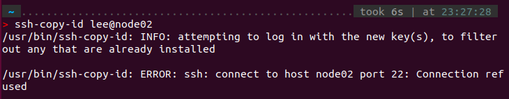  
尴尬的是由于是重装的一台ubuntu，没有下载openssh-server  
注意要在每一台VM上装openssh-server  
***sudo apt update
sudo apt install openssh-server***  
之后再尝试就可以了  
    
根据文档 https://www.cnblogs.com/Vocanda/p/17436434.html ，我还安装了openssh-client

>验证 SSH 密钥认证是否成功  

***ssh user@hostname***  
  
连接成功，注意看红框部分，说明我以lee的身份连接到了名为node02的远程主机，并进入了node02的shell环境  
同样的步骤对剩下两台执行  
P.S. exit命令可以退出连接；连接时必须得开机    
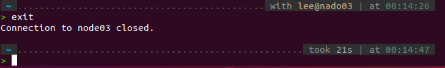  

---
#### 1.4.2 测试MPI正常运行  
- [x] MPI通过测试可以正常运行
>在node01上写一个hostfile，指定节点和进程数  

直接新建就好，这里我建在了/home/Documents中  
***vim /home/Documents/hostfile***  
当初的core设置的太少了，分配的slot如下  
  
不知道为什么保存到了home里面，cp了一下  

>使用该 hostfile 执行 mpirun，在所有节点上运行 uptime 或 cat /etc/hostname  

***mpirun --hostfile hostfile cat /etc/hostname***  
  
P.S. 想到自己电脑上运行着一个集群，虽然菜鸡，也是有些兴奋的~  

#### 1.4.3 运行HPL  
- [x] 成功运行HPL跑出结果
终于到了激动人心的部分  
>使用 mpirun 在所有节点上运行 xhpl，查看运行结果  

**切换工作目录到 HPL 所在目录，xhpl 需要在工作目录下找到 HPL.dat**  
***cd /hpc-2.3/bin/Linux_PII***  
切换路径到之前找到xphl可执行文件的地方，运行  
***mpirun --hostfile /home/lee/Documents/hostfile ./xhpl***  
  
铛铛！金色传说！  
  
**至此算是结束了lab1的大部分工作**  

---  
由于我的进度其实大大落后于别人，而技术杂谈这部分内容在lab文档也没有详细阐述，所以只打一个框架在这里，等待之后填坑
### 1.5 技术杂谈  
#### 1.5.1 包管理器  
#### 1.5.2 Docker
#### 1.5.3 NFS  

---  
P.S. 之前都没有用程序块（主要是markdown还不太熟），之后会用der

最后贴几个lab文档中提到的资料，还是要感激cs真的是一门很推崇开源的学科  
https://linux.cn/article-14033-1.html  
https://www.lrde.epita.fr/~adl/autotools.html  
https://elinux.org/images/4/43/Petazzoni.pdf  
https://kns.cnki.net/kcms2/article/abstract?v=qwZretP9BaHvUBwZiPjDpzt_KPtU2PXJSK0YVwCUYeCUQFlgxSAJKvStsXKUQgi7vp0dzvK1lhS5OYFXUgXXdKGZL9ljRGRsbRhmjx411BBN35dOaoxrEhTaj2fwikpGLUS9jtc7unQ=&uniplatform=NZKPT&language=CHS  


## Lab2:向量化计算  
- [x] 完成双线性插值的向量化版本  
- [x] 测试向量化实现的正确性和加速比  

从此的lab文档格式更像是实验报告的格式  
### 2.1 实验介绍  
**NumPy**是Python中科学计算的基础包。它是一个Python库，提供**多维数组对象**，各种派生对象（如掩码数组和矩阵），以及用于数组快速操作的各种 API，有包括数学、逻辑、形状操作、排序、选择、输入输出、离散傅立叶变换、基本线性代数，基本统计运算和随机模拟等等。  
Numpy代码一般采用**向量化（矢量化）描述**，这使得代码中<u>没有任何显式的循环，索引</u>等，这样的代码有以下好处：  
>1、向量化代码更简洁，更易于阅读
>2、更少的代码行通常意味着更少的错误
>3、代码更接近于标准的数学符号  

另外，向量化的代码能够<u>规避掉 Python 中缓慢的迭代循环</u>，被底层的实现更好的调度，如接入 BLAS 矩阵运算库，从而实现更高的性能。  
双线性插值是计算机视觉图像处理中的常用算法，他在计算机图形学中也可以用于材质贴图的重采样。  
本次实验我们将借助 NumPy 实现一个<u>支持批量处理的向量化的双线性插值</u>，来让大家熟悉 NumPy 的向量化编程模式。      

### 2.2 实验环境  
直接在vscode上配置一个python环境就好了  
>import Numpy  

Terminal->New Terminal  
```bash
pip install numpy
```

### 2.3 实验基础知识  
#### 2.3.1 Numpy  
lab文档里并没有关于Numpy本身的介绍，但我觉得这部分基础还是相当重要的，所以简单补一下，也会更偏应用层面  
大致框架可以直接看HPC101的ppt `Numpy 101`
学习内容完全基于[NumPy Illustrated: The Visual Guide to NumPy](https://betterprogramming.pub/numpy-illustrated-the-visual-guide-to-numpy-3b1d4976de1d)

The beauty of it is that most operations look just the same, no matter how many dimensions an array has. But 1D and 2D cases are a bit special.   
>1.the 1D Arrays
>2.the 2D Arrays  
>3.the 3D and above  

##### Numpy Array vs Python List  
  
  
在课上提到，`python list`的存储方式是每个位置存储指向对应元素的指针，所以可以支撑存储不同类型的元素；而`numpy array`是直接存元素的，所以基本都是相同的元素，也因此`NumPy`对向量化后的元素处理更快，"more compact,espacially when there's more than one dimension"  
##### Vectors,the 1D Arrays  

>Vector initialization

One way to create a NumPy array is to convert a Python list. The type will be auto-deduced from the list element types:  
  
由于`NumPy`不方便直接在后面增加元素，所以一般会preallocate the necessary sapce with `np.zeros` or `np.empty`:

It is often necessary to create an empty array which matches the existing one by shape and elements type:  
  

  


创建递增数列对`floats`也可以使用，但`arrange`在处理`floats`时可能出现问题（这涉及到二进制存储小数和四舍五入）：  
  

随机数生成  

Vector indexing  
  
关于切片`copy`和插入等操作与`python list`有些不同，具体原理看文档  

Also, such assignments must not change the size of the array, so tricks like  
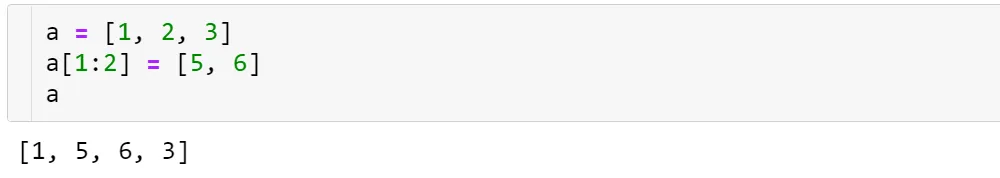  
won’t work in `NumPy` — use `np.insert`,`np.append`, etc. instead (described in the “2D” section below).  

boolean indexing,ternary comparisons,`np.where`,`np.clip`,`np.minimun`,`np.maximun` 见文档  

>Vector operations  

Arithmetic is one of the places where NumPy speed shines most. Vector operators are shifted to the c++ level and allow us to avoid the costs of slow Python loops.  
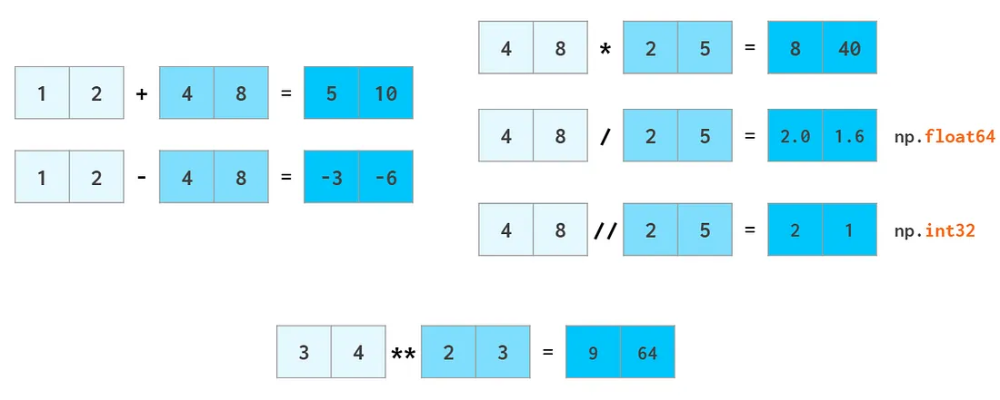  
The same way ints are promoted to floats when adding or subtracting, scalars are promoted (aka **broadcasted**) to arrays:
  
  
  
  
  
  
  

>Searching for an element in a vector  

A faster way to do it is via accelerating next((i[0] for i, v in `np.ndenumerate(a) if v==x), -1)` with `Numba` (otherwise it’s way slower in the worst case than where).  看不太懂，过吧  

>Comparing floats  

  
There is no silver bullet!  

##### Matrices,the 2D Arrays  

>Matrix initialization  

  
  
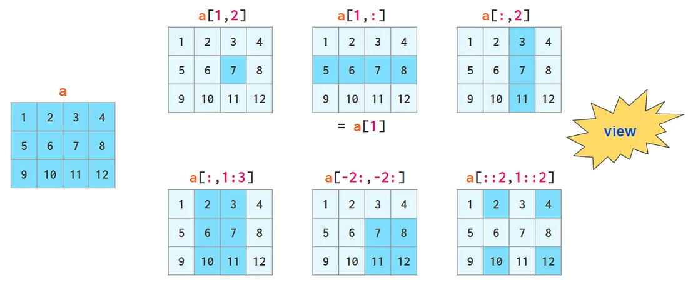   

>The axis argument  

The value of the `axis` argument is, as a matter of fact, the number of the index in question: The first index is `axis=0`, the second one is `axis=1`, and so on. So in 2D `axis=0` is column-wise and `axis=1` means row-wise.
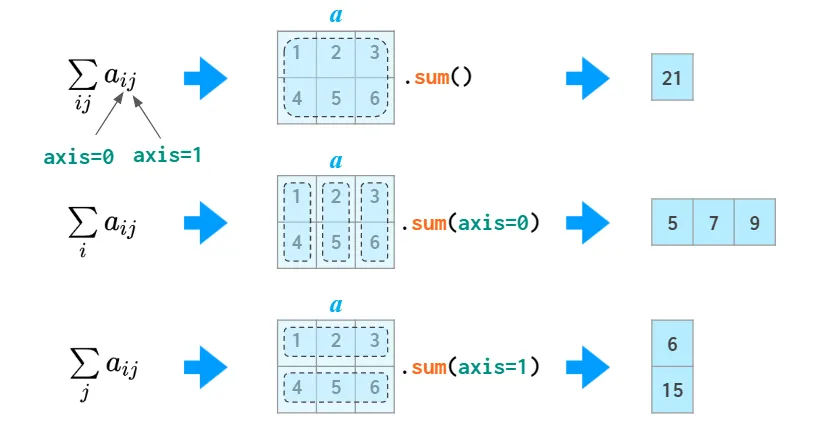  
The 2D case is somewhat counter-intuitive: you need to specify the dimension to **be eliminated**, instead of the remaining one you would normally think about. In higher dimensional cases this is more natural, though: it’d be a burden to enumerate all the remaining dimensions if you only need to sum over a single one.  

>Matrix arithmetic  

In addition to ordinary operators (like +,-,*,/,// and **) which work element-wise, there’s a `@` operator that calculates a matrix product:  
  
  
  

>Row vectors and column vectors  

转置这里好像有些特殊机制，但没太看懂  
  
`reshape`命令个人认为意义不大，总之1D arrays,2D row vectors,2D column vectors之间是可以互相转换的  
  

>Matrix manipulations  

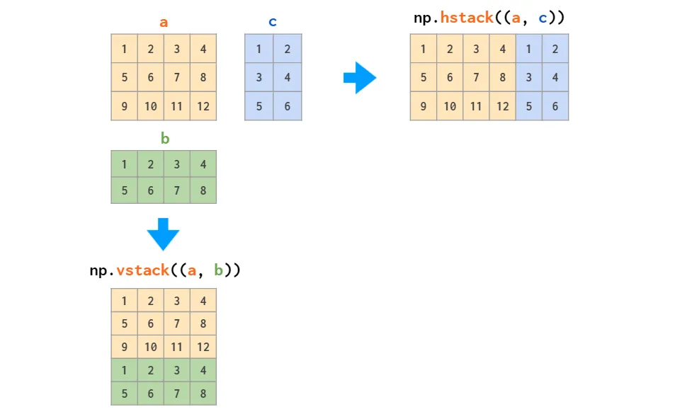  
对于1D arrays似乎有所不同，这与其存储方式有关
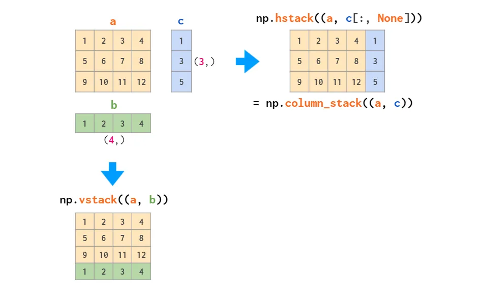  
The inverse of stacking is splitting:  
  
  
Matrix replication can be done in two ways: `tile` acts like copy-pasting and `repeat` like collated printing:
  
`delete`  
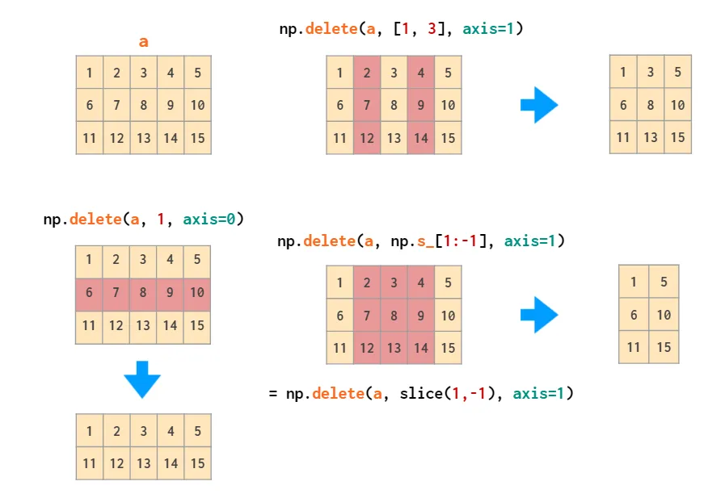  
`insert`
  
`append`(is also unable to automatically transpose 1D arrays)
  
`pad`其实很像在卷积中的一些外延操作  
  

>Mehgrids
(略)  

>Matrix statistics  

  
  


>Matrix sorting  

  
  
```py  
a = a[a[:,2].argsort()]
a = a[a[:,1].argsort(kind='stable')]
a = a[a[:,0].argsort(kind='stable')]
```  
  

##### 3D and Above  
When you create a 3D array by reshaping a 1D vector or converting a nested Python list, the meaning of the indices is (z,y,x). The first index is the number of the plane, then the coordinates go in that plane:
  
But this index order is not universal. When working with RGB images, the (y,x,z) order is usually used  
  
  
If your data is laid out differently, it is more convenient to stack images using the `concatenate` command, feeding it the explicit index number in an axis argument:
  
3D矩阵的转换之类的看也不想看，但愿这辈子都用不到，过吧  

[“稍微硬核一点的numpy教程”](https://www.labri.fr/perso/nrougier/from-python-to-numpy/)
如果还要知道的更细致，就直接看[numpy](https://numpy.org/doc/stable/)文档  

---  
#### 2.3.2 双线性插值算法  
关于双线性插值算法，lab文档里介绍的还是比较清楚的  

双线性插值的算法其实非常简单，概括来说就是先在 x 轴上进行一次插值，再在 y 轴上进行一次插值。  
  

以在灰度图上进行插值为例，我们已知外围的四个点 (14,20),(15,20),(14,21),(15,21) 灰度值分别为 91, 210, 162 和 95，然后希望通过插值得到 (14.5,20.2) 处的灰度值。

接下来我们先在 x 方向上通过线性插值计算出 (14.5,20),(14.5,21) 两个点的灰度值 150.5, 128.5，然后再使用这两个值在 y 方向上再次进行线性插值，得到 (14.5,20.2) 坐标处的灰度值 146.1。

注意这里是一个单通道的例子，对于实际的情况，我们往往有很多个通道，如彩色图片拥有 RGB 三个通道，一些图片可能还有 α 透明度通道，或是深度通道。**对于多通道的情况，我们需要对每个通道进行分别插值**。  

lab文档参照wikipedia给出了形式化的定义  

假如我们想得到未知函数 f 在点 P=(x,y) 的值，假设我们已知函数 f 在 Q11=(x1,y1), Q12=(x1,y2), Q21=(x2,y1) 及 Q22=(x2,y2) 四个点的值。  
  
首先在 x 方向进行线性插值，得到

<math xmlns="http://www.w3.org/1998/Math/MathML" display="block">
  <mrow data-mjx-texclass="ORD">
    <mstyle displaystyle="true" scriptlevel="0">
      <mrow data-mjx-texclass="ORD">
        <mtable displaystyle="true" columnalign="right left" columnspacing="0em" rowspacing="3pt">
          <mtr>
            <mtd>
              <mi>f</mi>
              <mo stretchy="false">(</mo>
              <mi>x</mi>
              <mo>,</mo>
              <msub>
                <mi>y</mi>
                <mrow data-mjx-texclass="ORD">
                  <mn>1</mn>
                </mrow>
              </msub>
              <mo stretchy="false">)</mo>
            </mtd>
            <mtd>
              <mi></mi>
              <mo>&#x2248;</mo>
              <mrow data-mjx-texclass="ORD">
                <mfrac>
                  <mrow>
                    <msub>
                      <mi>x</mi>
                      <mrow data-mjx-texclass="ORD">
                        <mn>2</mn>
                      </mrow>
                    </msub>
                    <mo>&#x2212;</mo>
                    <mi>x</mi>
                  </mrow>
                  <mrow>
                    <msub>
                      <mi>x</mi>
                      <mrow data-mjx-texclass="ORD">
                        <mn>2</mn>
                      </mrow>
                    </msub>
                    <mo>&#x2212;</mo>
                    <msub>
                      <mi>x</mi>
                      <mrow data-mjx-texclass="ORD">
                        <mn>1</mn>
                      </mrow>
                    </msub>
                  </mrow>
                </mfrac>
              </mrow>
              <mi>f</mi>
              <mo stretchy="false">(</mo>
              <msub>
                <mi>Q</mi>
                <mrow data-mjx-texclass="ORD">
                  <mn>11</mn>
                </mrow>
              </msub>
              <mo stretchy="false">)</mo>
              <mo>+</mo>
              <mrow data-mjx-texclass="ORD">
                <mfrac>
                  <mrow>
                    <mi>x</mi>
                    <mo>&#x2212;</mo>
                    <msub>
                      <mi>x</mi>
                      <mrow data-mjx-texclass="ORD">
                        <mn>1</mn>
                      </mrow>
                    </msub>
                  </mrow>
                  <mrow>
                    <msub>
                      <mi>x</mi>
                      <mrow data-mjx-texclass="ORD">
                        <mn>2</mn>
                      </mrow>
                    </msub>
                    <mo>&#x2212;</mo>
                    <msub>
                      <mi>x</mi>
                      <mrow data-mjx-texclass="ORD">
                        <mn>1</mn>
                      </mrow>
                    </msub>
                  </mrow>
                </mfrac>
              </mrow>
              <mi>f</mi>
              <mo stretchy="false">(</mo>
              <msub>
                <mi>Q</mi>
                <mrow data-mjx-texclass="ORD">
                  <mn>21</mn>
                </mrow>
              </msub>
              <mo stretchy="false">)</mo>
              <mo>,</mo>
            </mtd>
          </mtr>
          <mtr>
            <mtd></mtd>
          </mtr>
          <mtr>
            <mtd>
              <mi>f</mi>
              <mo stretchy="false">(</mo>
              <mi>x</mi>
              <mo>,</mo>
              <msub>
                <mi>y</mi>
                <mrow data-mjx-texclass="ORD">
                  <mn>2</mn>
                </mrow>
              </msub>
              <mo stretchy="false">)</mo>
            </mtd>
            <mtd>
              <mi></mi>
              <mo>&#x2248;</mo>
              <mrow data-mjx-texclass="ORD">
                <mfrac>
                  <mrow>
                    <msub>
                      <mi>x</mi>
                      <mrow data-mjx-texclass="ORD">
                        <mn>2</mn>
                      </mrow>
                    </msub>
                    <mo>&#x2212;</mo>
                    <mi>x</mi>
                  </mrow>
                  <mrow>
                    <msub>
                      <mi>x</mi>
                      <mrow data-mjx-texclass="ORD">
                        <mn>2</mn>
                      </mrow>
                    </msub>
                    <mo>&#x2212;</mo>
                    <msub>
                      <mi>x</mi>
                      <mrow data-mjx-texclass="ORD">
                        <mn>1</mn>
                      </mrow>
                    </msub>
                  </mrow>
                </mfrac>
              </mrow>
              <mi>f</mi>
              <mo stretchy="false">(</mo>
              <msub>
                <mi>Q</mi>
                <mrow data-mjx-texclass="ORD">
                  <mn>12</mn>
                </mrow>
              </msub>
              <mo stretchy="false">)</mo>
              <mo>+</mo>
              <mrow data-mjx-texclass="ORD">
                <mfrac>
                  <mrow>
                    <mi>x</mi>
                    <mo>&#x2212;</mo>
                    <msub>
                      <mi>x</mi>
                      <mrow data-mjx-texclass="ORD">
                        <mn>1</mn>
                      </mrow>
                    </msub>
                  </mrow>
                  <mrow>
                    <msub>
                      <mi>x</mi>
                      <mrow data-mjx-texclass="ORD">
                        <mn>2</mn>
                      </mrow>
                    </msub>
                    <mo>&#x2212;</mo>
                    <msub>
                      <mi>x</mi>
                      <mrow data-mjx-texclass="ORD">
                        <mn>1</mn>
                      </mrow>
                    </msub>
                  </mrow>
                </mfrac>
              </mrow>
              <mi>f</mi>
              <mo stretchy="false">(</mo>
              <msub>
                <mi>Q</mi>
                <mrow data-mjx-texclass="ORD">
                  <mn>22</mn>
                </mrow>
              </msub>
              <mo stretchy="false">)</mo>
              <mo>.</mo>
            </mtd>
          </mtr>
        </mtable>
      </mrow>
    </mstyle>
  </mrow>
</math>  

然后在 y 方向进行线性插值，得到  

<math xmlns="http://www.w3.org/1998/Math/MathML" display="block">
  <mrow data-mjx-texclass="ORD">
    <mstyle displaystyle="true" scriptlevel="0">
      <mrow data-mjx-texclass="ORD">
        <mtable displaystyle="true" columnalign="right left right left" columnspacing="0em 2em 0em" rowspacing="3pt">
          <mtr>
            <mtd>
              <mi>f</mi>
              <mo stretchy="false">(</mo>
              <mi>x</mi>
              <mo>,</mo>
              <mi>y</mi>
              <mo stretchy="false">)</mo>
            </mtd>
            <mtd>
              <mi></mi>
              <mo>&#x2248;</mo>
            </mtd>
            <mtd></mtd>
            <mtd>
              <mrow data-mjx-texclass="ORD">
                <mfrac>
                  <mrow>
                    <msub>
                      <mi>y</mi>
                      <mrow data-mjx-texclass="ORD">
                        <mn>2</mn>
                      </mrow>
                    </msub>
                    <mo>&#x2212;</mo>
                    <mi>y</mi>
                  </mrow>
                  <mrow>
                    <msub>
                      <mi>y</mi>
                      <mrow data-mjx-texclass="ORD">
                        <mn>2</mn>
                      </mrow>
                    </msub>
                    <mo>&#x2212;</mo>
                    <msub>
                      <mi>y</mi>
                      <mrow data-mjx-texclass="ORD">
                        <mn>1</mn>
                      </mrow>
                    </msub>
                  </mrow>
                </mfrac>
              </mrow>
              <mi>f</mi>
              <mo stretchy="false">(</mo>
              <mi>x</mi>
              <mo>,</mo>
              <msub>
                <mi>y</mi>
                <mrow data-mjx-texclass="ORD">
                  <mn>1</mn>
                </mrow>
              </msub>
              <mo stretchy="false">)</mo>
              <mo>+</mo>
              <mrow data-mjx-texclass="ORD">
                <mfrac>
                  <mrow>
                    <mi>y</mi>
                    <mo>&#x2212;</mo>
                    <msub>
                      <mi>y</mi>
                      <mrow data-mjx-texclass="ORD">
                        <mn>1</mn>
                      </mrow>
                    </msub>
                  </mrow>
                  <mrow>
                    <msub>
                      <mi>y</mi>
                      <mrow data-mjx-texclass="ORD">
                        <mn>2</mn>
                      </mrow>
                    </msub>
                    <mo>&#x2212;</mo>
                    <msub>
                      <mi>y</mi>
                      <mrow data-mjx-texclass="ORD">
                        <mn>1</mn>
                      </mrow>
                    </msub>
                  </mrow>
                </mfrac>
              </mrow>
              <mi>f</mi>
              <mo stretchy="false">(</mo>
              <mi>x</mi>
              <mo>,</mo>
              <msub>
                <mi>y</mi>
                <mrow data-mjx-texclass="ORD">
                  <mn>2</mn>
                </mrow>
              </msub>
              <mo stretchy="false">)</mo>
            </mtd>
          </mtr>
          <mtr>
            <mtd></mtd>
          </mtr>
          <mtr>
            <mtd></mtd>
            <mtd>
              <mi></mi>
              <mo>=</mo>
            </mtd>
            <mtd></mtd>
            <mtd>
              <mrow data-mjx-texclass="ORD">
                <mfrac>
                  <mrow>
                    <msub>
                      <mi>y</mi>
                      <mrow data-mjx-texclass="ORD">
                        <mn>2</mn>
                      </mrow>
                    </msub>
                    <mo>&#x2212;</mo>
                    <mi>y</mi>
                  </mrow>
                  <mrow>
                    <msub>
                      <mi>y</mi>
                      <mrow data-mjx-texclass="ORD">
                        <mn>2</mn>
                      </mrow>
                    </msub>
                    <mo>&#x2212;</mo>
                    <msub>
                      <mi>y</mi>
                      <mrow data-mjx-texclass="ORD">
                        <mn>1</mn>
                      </mrow>
                    </msub>
                  </mrow>
                </mfrac>
              </mrow>
              <mrow data-mjx-texclass="INNER">
                <mo data-mjx-texclass="OPEN">(</mo>
                <mrow data-mjx-texclass="ORD">
                  <mfrac>
                    <mrow>
                      <msub>
                        <mi>x</mi>
                        <mrow data-mjx-texclass="ORD">
                          <mn>2</mn>
                        </mrow>
                      </msub>
                      <mo>&#x2212;</mo>
                      <mi>x</mi>
                    </mrow>
                    <mrow>
                      <msub>
                        <mi>x</mi>
                        <mrow data-mjx-texclass="ORD">
                          <mn>2</mn>
                        </mrow>
                      </msub>
                      <mo>&#x2212;</mo>
                      <msub>
                        <mi>x</mi>
                        <mrow data-mjx-texclass="ORD">
                          <mn>1</mn>
                        </mrow>
                      </msub>
                    </mrow>
                  </mfrac>
                </mrow>
                <mi>f</mi>
                <mo stretchy="false">(</mo>
                <msub>
                  <mi>Q</mi>
                  <mrow data-mjx-texclass="ORD">
                    <mn>11</mn>
                  </mrow>
                </msub>
                <mo stretchy="false">)</mo>
                <mo>+</mo>
                <mrow data-mjx-texclass="ORD">
                  <mfrac>
                    <mrow>
                      <mi>x</mi>
                      <mo>&#x2212;</mo>
                      <msub>
                        <mi>x</mi>
                        <mrow data-mjx-texclass="ORD">
                          <mn>1</mn>
                        </mrow>
                      </msub>
                    </mrow>
                    <mrow>
                      <msub>
                        <mi>x</mi>
                        <mrow data-mjx-texclass="ORD">
                          <mn>2</mn>
                        </mrow>
                      </msub>
                      <mo>&#x2212;</mo>
                      <msub>
                        <mi>x</mi>
                        <mrow data-mjx-texclass="ORD">
                          <mn>1</mn>
                        </mrow>
                      </msub>
                    </mrow>
                  </mfrac>
                </mrow>
                <mi>f</mi>
                <mo stretchy="false">(</mo>
                <msub>
                  <mi>Q</mi>
                  <mrow data-mjx-texclass="ORD">
                    <mn>21</mn>
                  </mrow>
                </msub>
                <mo stretchy="false">)</mo>
                <mo data-mjx-texclass="CLOSE">)</mo>
              </mrow>
            </mtd>
          </mtr>
          <mtr>
            <mtd></mtd>
          </mtr>
          <mtr>
            <mtd></mtd>
            <mtd></mtd>
            <mtd></mtd>
            <mtd>
              <mi></mi>
              <mo>+</mo>
              <mrow data-mjx-texclass="ORD">
                <mfrac>
                  <mrow>
                    <mi>y</mi>
                    <mo>&#x2212;</mo>
                    <msub>
                      <mi>y</mi>
                      <mrow data-mjx-texclass="ORD">
                        <mn>1</mn>
                      </mrow>
                    </msub>
                  </mrow>
                  <mrow>
                    <msub>
                      <mi>y</mi>
                      <mrow data-mjx-texclass="ORD">
                        <mn>2</mn>
                      </mrow>
                    </msub>
                    <mo>&#x2212;</mo>
                    <msub>
                      <mi>y</mi>
                      <mrow data-mjx-texclass="ORD">
                        <mn>1</mn>
                      </mrow>
                    </msub>
                  </mrow>
                </mfrac>
              </mrow>
              <mrow data-mjx-texclass="INNER">
                <mo data-mjx-texclass="OPEN">(</mo>
                <mrow data-mjx-texclass="ORD">
                  <mfrac>
                    <mrow>
                      <msub>
                        <mi>x</mi>
                        <mrow data-mjx-texclass="ORD">
                          <mn>2</mn>
                        </mrow>
                      </msub>
                      <mo>&#x2212;</mo>
                      <mi>x</mi>
                    </mrow>
                    <mrow>
                      <msub>
                        <mi>x</mi>
                        <mrow data-mjx-texclass="ORD">
                          <mn>2</mn>
                        </mrow>
                      </msub>
                      <mo>&#x2212;</mo>
                      <msub>
                        <mi>x</mi>
                        <mrow data-mjx-texclass="ORD">
                          <mn>1</mn>
                        </mrow>
                      </msub>
                    </mrow>
                  </mfrac>
                </mrow>
                <mi>f</mi>
                <mo stretchy="false">(</mo>
                <msub>
                  <mi>Q</mi>
                  <mrow data-mjx-texclass="ORD">
                    <mn>12</mn>
                  </mrow>
                </msub>
                <mo stretchy="false">)</mo>
                <mo>+</mo>
                <mrow data-mjx-texclass="ORD">
                  <mfrac>
                    <mrow>
                      <mi>x</mi>
                      <mo>&#x2212;</mo>
                      <msub>
                        <mi>x</mi>
                        <mrow data-mjx-texclass="ORD">
                          <mn>1</mn>
                        </mrow>
                      </msub>
                    </mrow>
                    <mrow>
                      <msub>
                        <mi>x</mi>
                        <mrow data-mjx-texclass="ORD">
                          <mn>2</mn>
                        </mrow>
                      </msub>
                      <mo>&#x2212;</mo>
                      <msub>
                        <mi>x</mi>
                        <mrow data-mjx-texclass="ORD">
                          <mn>1</mn>
                        </mrow>
                      </msub>
                    </mrow>
                  </mfrac>
                </mrow>
                <mi>f</mi>
                <mo stretchy="false">(</mo>
                <msub>
                  <mi>Q</mi>
                  <mrow data-mjx-texclass="ORD">
                    <mn>22</mn>
                  </mrow>
                </msub>
                <mo stretchy="false">)</mo>
                <mo data-mjx-texclass="CLOSE">)</mo>
              </mrow>
            </mtd>
          </mtr>
          <mtr>
            <mtd></mtd>
          </mtr>
          <mtr>
            <mtd></mtd>
            <mtd>
              <mi></mi>
              <mo>=</mo>
            </mtd>
            <mtd></mtd>
            <mtd>
              <mrow data-mjx-texclass="ORD">
                <mfrac>
                  <mn>1</mn>
                  <mrow>
                    <mo stretchy="false">(</mo>
                    <msub>
                      <mi>x</mi>
                      <mrow data-mjx-texclass="ORD">
                        <mn>2</mn>
                      </mrow>
                    </msub>
                    <mo>&#x2212;</mo>
                    <msub>
                      <mi>x</mi>
                      <mrow data-mjx-texclass="ORD">
                        <mn>1</mn>
                      </mrow>
                    </msub>
                    <mo stretchy="false">)</mo>
                    <mo stretchy="false">(</mo>
                    <msub>
                      <mi>y</mi>
                      <mrow data-mjx-texclass="ORD">
                        <mn>2</mn>
                      </mrow>
                    </msub>
                    <mo>&#x2212;</mo>
                    <msub>
                      <mi>y</mi>
                      <mrow data-mjx-texclass="ORD">
                        <mn>1</mn>
                      </mrow>
                    </msub>
                    <mo stretchy="false">)</mo>
                  </mrow>
                </mfrac>
              </mrow>
              <mrow data-mjx-texclass="ORD">
                <mrow data-mjx-texclass="ORD">
                  <mo minsize="1.2em" maxsize="1.2em">(</mo>
                </mrow>
              </mrow>
              <mi>f</mi>
              <mo stretchy="false">(</mo>
              <msub>
                <mi>Q</mi>
                <mrow data-mjx-texclass="ORD">
                  <mn>11</mn>
                </mrow>
              </msub>
              <mo stretchy="false">)</mo>
              <mo stretchy="false">(</mo>
              <msub>
                <mi>x</mi>
                <mrow data-mjx-texclass="ORD">
                  <mn>2</mn>
                </mrow>
              </msub>
              <mo>&#x2212;</mo>
              <mi>x</mi>
              <mo stretchy="false">)</mo>
              <mo stretchy="false">(</mo>
              <msub>
                <mi>y</mi>
                <mrow data-mjx-texclass="ORD">
                  <mn>2</mn>
                </mrow>
              </msub>
              <mo>&#x2212;</mo>
              <mi>y</mi>
              <mo stretchy="false">)</mo>
              <mo>+</mo>
              <mi>f</mi>
              <mo stretchy="false">(</mo>
              <msub>
                <mi>Q</mi>
                <mrow data-mjx-texclass="ORD">
                  <mn>21</mn>
                </mrow>
              </msub>
              <mo stretchy="false">)</mo>
              <mo stretchy="false">(</mo>
              <mi>x</mi>
              <mo>&#x2212;</mo>
              <msub>
                <mi>x</mi>
                <mrow data-mjx-texclass="ORD">
                  <mn>1</mn>
                </mrow>
              </msub>
              <mo stretchy="false">)</mo>
              <mo stretchy="false">(</mo>
              <msub>
                <mi>y</mi>
                <mrow data-mjx-texclass="ORD">
                  <mn>2</mn>
                </mrow>
              </msub>
              <mo>&#x2212;</mo>
              <mi>y</mi>
              <mo stretchy="false">)</mo>
            </mtd>
          </mtr>
          <mtr>
            <mtd></mtd>
          </mtr>
          <mtr>
            <mtd></mtd>
            <mtd></mtd>
            <mtd></mtd>
            <mtd>
              <mi></mi>
              <mo>+</mo>
              <mi>f</mi>
              <mo stretchy="false">(</mo>
              <msub>
                <mi>Q</mi>
                <mrow data-mjx-texclass="ORD">
                  <mn>12</mn>
                </mrow>
              </msub>
              <mo stretchy="false">)</mo>
              <mo stretchy="false">(</mo>
              <msub>
                <mi>x</mi>
                <mrow data-mjx-texclass="ORD">
                  <mn>2</mn>
                </mrow>
              </msub>
              <mo>&#x2212;</mo>
              <mi>x</mi>
              <mo stretchy="false">)</mo>
              <mo stretchy="false">(</mo>
              <mi>y</mi>
              <mo>&#x2212;</mo>
              <msub>
                <mi>y</mi>
                <mrow data-mjx-texclass="ORD">
                  <mn>1</mn>
                </mrow>
              </msub>
              <mo stretchy="false">)</mo>
              <mo>+</mo>
              <mi>f</mi>
              <mo stretchy="false">(</mo>
              <msub>
                <mi>Q</mi>
                <mrow data-mjx-texclass="ORD">
                  <mn>22</mn>
                </mrow>
              </msub>
              <mo stretchy="false">)</mo>
              <mo stretchy="false">(</mo>
              <mi>x</mi>
              <mo>&#x2212;</mo>
              <msub>
                <mi>x</mi>
                <mrow data-mjx-texclass="ORD">
                  <mn>1</mn>
                </mrow>
              </msub>
              <mo stretchy="false">)</mo>
              <mo stretchy="false">(</mo>
              <mi>y</mi>
              <mo>&#x2212;</mo>
              <msub>
                <mi>y</mi>
                <mrow data-mjx-texclass="ORD">
                  <mn>1</mn>
                </mrow>
              </msub>
              <mo stretchy="false">)</mo>
              <mrow data-mjx-texclass="ORD">
                <mrow data-mjx-texclass="ORD">
                  <mo minsize="1.2em" maxsize="1.2em">)</mo>
                </mrow>
              </mrow>
            </mtd>
          </mtr>
          <mtr>
            <mtd></mtd>
          </mtr>
          <mtr>
            <mtd></mtd>
            <mtd>
              <mi></mi>
              <mo>=</mo>
            </mtd>
            <mtd></mtd>
            <mtd>
              <mrow data-mjx-texclass="ORD">
                <mfrac>
                  <mn>1</mn>
                  <mrow>
                    <mo stretchy="false">(</mo>
                    <msub>
                      <mi>x</mi>
                      <mrow data-mjx-texclass="ORD">
                        <mn>2</mn>
                      </mrow>
                    </msub>
                    <mo>&#x2212;</mo>
                    <msub>
                      <mi>x</mi>
                      <mrow data-mjx-texclass="ORD">
                        <mn>1</mn>
                      </mrow>
                    </msub>
                    <mo stretchy="false">)</mo>
                    <mo stretchy="false">(</mo>
                    <msub>
                      <mi>y</mi>
                      <mrow data-mjx-texclass="ORD">
                        <mn>2</mn>
                      </mrow>
                    </msub>
                    <mo>&#x2212;</mo>
                    <msub>
                      <mi>y</mi>
                      <mrow data-mjx-texclass="ORD">
                        <mn>1</mn>
                      </mrow>
                    </msub>
                    <mo stretchy="false">)</mo>
                  </mrow>
                </mfrac>
              </mrow>
              <mrow data-mjx-texclass="ORD">
                <mrow data-mjx-texclass="INNER">
                  <mo data-mjx-texclass="OPEN">[</mo>
                  <mtable columnalign="center" columnspacing="1em" rowspacing="4pt">
                    <mtr>
                      <mtd>
                        <msub>
                          <mi>x</mi>
                          <mrow data-mjx-texclass="ORD">
                            <mn>2</mn>
                          </mrow>
                        </msub>
                        <mo>&#x2212;</mo>
                        <mi>x</mi>
                      </mtd>
                      <mtd>
                        <mi>x</mi>
                        <mo>&#x2212;</mo>
                        <msub>
                          <mi>x</mi>
                          <mrow data-mjx-texclass="ORD">
                            <mn>1</mn>
                          </mrow>
                        </msub>
                      </mtd>
                    </mtr>
                  </mtable>
                  <mo data-mjx-texclass="CLOSE">]</mo>
                </mrow>
              </mrow>
              <mrow data-mjx-texclass="ORD">
                <mrow data-mjx-texclass="INNER">
                  <mo data-mjx-texclass="OPEN">[</mo>
                  <mtable columnalign="center" columnspacing="1em" rowspacing="4pt">
                    <mtr>
                      <mtd>
                        <mi>f</mi>
                        <mo stretchy="false">(</mo>
                        <msub>
                          <mi>Q</mi>
                          <mrow data-mjx-texclass="ORD">
                            <mn>11</mn>
                          </mrow>
                        </msub>
                        <mo stretchy="false">)</mo>
                      </mtd>
                      <mtd>
                        <mi>f</mi>
                        <mo stretchy="false">(</mo>
                        <msub>
                          <mi>Q</mi>
                          <mrow data-mjx-texclass="ORD">
                            <mn>12</mn>
                          </mrow>
                        </msub>
                        <mo stretchy="false">)</mo>
                      </mtd>
                    </mtr>
                    <mtr>
                      <mtd></mtd>
                    </mtr>
                    <mtr>
                      <mtd>
                        <mi>f</mi>
                        <mo stretchy="false">(</mo>
                        <msub>
                          <mi>Q</mi>
                          <mrow data-mjx-texclass="ORD">
                            <mn>21</mn>
                          </mrow>
                        </msub>
                        <mo stretchy="false">)</mo>
                      </mtd>
                      <mtd>
                        <mi>f</mi>
                        <mo stretchy="false">(</mo>
                        <msub>
                          <mi>Q</mi>
                          <mrow data-mjx-texclass="ORD">
                            <mn>22</mn>
                          </mrow>
                        </msub>
                        <mo stretchy="false">)</mo>
                      </mtd>
                    </mtr>
                  </mtable>
                  <mo data-mjx-texclass="CLOSE">]</mo>
                </mrow>
              </mrow>
              <mrow data-mjx-texclass="ORD">
                <mrow data-mjx-texclass="INNER">
                  <mo data-mjx-texclass="OPEN">[</mo>
                  <mtable columnalign="center" columnspacing="1em" rowspacing="4pt">
                    <mtr>
                      <mtd>
                        <msub>
                          <mi>y</mi>
                          <mrow data-mjx-texclass="ORD">
                            <mn>2</mn>
                          </mrow>
                        </msub>
                        <mo>&#x2212;</mo>
                        <mi>y</mi>
                      </mtd>
                    </mtr>
                    <mtr>
                      <mtd></mtd>
                    </mtr>
                    <mtr>
                      <mtd>
                        <mi>y</mi>
                        <mo>&#x2212;</mo>
                        <msub>
                          <mi>y</mi>
                          <mrow data-mjx-texclass="ORD">
                            <mn>1</mn>
                          </mrow>
                        </msub>
                      </mtd>
                    </mtr>
                  </mtable>
                  <mo data-mjx-texclass="CLOSE">]</mo>
                </mrow>
              </mrow>
              <mo>.</mo>
            </mtd>
          </mtr>
        </mtable>
      </mrow>
    </mstyle>
  </mrow>
</math>  
注意此处如果先在 y 方向插值、再在 x 方向插值，其结果与按照上述顺序双线性插值的结果是一样的。  

#### 2.3.3 NHWC 数据格式  
一个完全没见过的东西，先问下gpt  

>**NHWC（样本数-高度-宽度-通道）** 数据格式是卷积神经网络（CNN）中广泛使用的一种数据组织方式，尤其在处理图像、点云或特征图等多维数据时尤为重要。以下是对NHWC数据格式的详细解析：  
一、基本概念
在NHWC格式中，数据按照以下顺序进行排列：
    **N：Batch Size（批次大小）**，表示一次处理的数据样本数量。
    **H：Height（高度）**，表示图像或特征图的高度。
    **W：Width（宽度）**，表示图像或特征图的宽度。
    **C：Channel（通道数）**，对于彩色图像来说，通常是RGB三个通道。
二、存储方式
在NHWC格式中，数据在内存中的存储方式遵循以下规则：
    首先是所有样本的第一个通道的所有元素（即所有样本的第一个像素点的第一个通道值），然后是第一个通道的第二行元素，依此类推，直到第一个通道的所有元素都被存储。
    接着是第二个通道的所有元素，按照与第一个通道相同的顺序存储。
    依此类推，直到所有通道的所有元素都被存储。
这种存储方式使得相同空间位置（即相同像素点）的所有通道值在内存中连续存储，这有助于优化对空间数据的访问。  
然而，需要注意的是，在GPU上进行计算时，NCHW（样本数-通道-高度-宽度）格式可能更加高效，因为它能够更好地利用GPU的并行计算能力和内存访问模式。  

lab文档的介绍：  
真实情况下我们处理的数据都是**以 batch 为单位**的，按批进行处理的。以双线性插值为例，我们往往会一次性送入<u> N 张大小为 H×W 的图片，每个像素上有 C 个通道</u>，然后一次性返回这 N 张图片处理好的结果。此时我们一次性传入的数据，就是直接**按顺序堆叠在一起的 NHWC 格式的数组**，它将 batch 作为了第一个维度，而后三个维度分别是单张图片的高度、宽度、通道数。你可以将这一数据格式理解为 c 语言中的高维数组 `image[N][H][W][C]`，而因为 c 的数组和 NumPy 的 ndarray 一样都是**在内存里连续排放**的，所以对于 `image[x1][x2][x3][x4]`，其实就是 `image[x1 * H * W * C + x2 * W * C + x3 * C + x4]` 处的内存。

另一个常见的数据格式是 NCHW，也就是单张图片内通道在前，不过这里我们没有选用。

数据格式更多是对数据的存放顺序进行约定，你可以通过 np.transpose 将不同维度进行调换。  

### 2.4 实验步骤  
#### 2.4.1 接口定义  
```py  
def bilinear_interp(a: np.ndarray, b: np.ndarray) -> np.ndarray:
 """
 - a is a ND array with shape [N, H1, W1, C]
 - b is a ND array with shape [N, H2, W2, 2]
 - return a ND array with shape [N, H2, W2, C]
 """
```  
其含义是，对于 batch 内的每一张 H1×W1 的图 a，b 中给出了新的 H2×W2 的图中每个像素所想要采样的 a 图中对应点的坐标，并将采样结果返回。

为了简化任务，我们假定传入的采样点不会出现在 (H1−1,W1−1)，即图像的右下角。  

#### 2.4.2 基准代码  
使用 for 循环迭代计算的双线性插值版本：  
```py  
import numpy as np
from numpy import int64


def bilinear_interp_baseline(a: np.ndarray, b: np.ndarray) -> np.ndarray:
    """
    This is the baseline implementation of bilinear interpolation without vectorization.
    - a is a ND array with shape [N, H1, W1, C], dtype = int64
    - b is a ND array with shape [N, H2, W2, 2], dtype = float64
    - return a ND array with shape [N, H2, W2, C], dtype = int64
    """
    # Get axis size from ndarray shape
    N, H1, W1, C = a.shape  # 也就是知道a的shape，得到输入的batch size，height，width，channel这些信息，作为三重循环的参数
    N1, H2, W2, _ = b.shape
    assert N == N1  # assert是一种“断言”，在程序运行时会实时检查，一旦N!=N1，就会报错

    # Do iteration
    res = np.empty((N, H2, W2, C), dtype=int64)  # 创建一个空的ndarray来存放结果
    for n in range(N):
        for i in range(H2):
            for j in range(W2):
                x, y = b[n, i, j]  # b的shape是[N,H2,W2,2]，它存储的是想要从原图中取的位置坐标，其中b[ , , ,0]是x坐标，b[ , , ,1]是y坐标
                x_idx, y_idx = int(np.floor(x)), int(np.floor(y))  # floor是向下取整，也就是去寻找距离(x,y)相邻的整点
                _x, _y = x - x_idx, y - y_idx
                # For simplicity, we assume all x are in [0, H1 - 1), all y are in [0, W1 - 1)
                res[n, i, j] = a[n, x_idx, y_idx] * (1 - _x) * (1 - _y) + a[n, x_idx + 1, y_idx] * _x * (1 - _y) + \
                               a[n, x_idx, y_idx + 1] * (1 - _x) * _y + a[n, x_idx + 1, y_idx + 1] * _x * _y
                # 这个计算完全就在套公式
    return res
```  

#### 2.4.3 完成向量化实现  
在给出的代码的 bilinear_interp/vectorized.py 中，完成 bilinear_interp_vectorized 函数。  

整道题并不难，就是将原来的三重for循环转成向量化后多维一起计算从而节约时间  

第一次尝试没有考虑到维数不匹配的问题，出现报错  
  
这里补充numpy的广播规则，来自gpt：  
>1、如果所有输入数组的维度数不同，形状较小的数组会在前面补1（直到维度数相同）。
>2、如果两个数组在某个维度上的大小不同，且其中一个的大小为1，则该维度上大小为1的数组将被扩展（或“广播”）以匹配另一个数组的大小。
>3、如果两个数组在任何维度上的大小都不相同且都不为1，则会出现形状不匹配的错误。

在这里，原代码为：
```py
# 接着计算差值  
_x,_y=b[:,:,:,0]-x_idx,b[:,:,:,1]-y_idx  

# 直接套公式  
res=a[:,x_idx,y_idx]*(1-_x)*(1-_y)+a[:,x_idx+1,y_idx]*_x*(1-_y)+a[:, x_idx, y_idx + 1] * (1 - _x) * _y + a[:, x_idx + 1, y_idx + 1] * _x * _y
```  
其中，a的shape是(N,H1,W1,C)，但_x的shape是(N,H1,W1)，缺少了通道数这个维度，所以需要为它加上这一维度  
```py  
_x=_x[:,:,:,np.newaxis]
_y=_y[:,:,:,np.newaxis] 
```  
>`np.nuewaxis`用于在数组的指定位置增加一个新的轴（axis），效果等同于在切片操作中指定一个 None 或空切片（:），但它提供了更明确的语义。
>当你对一个数组使用`np.newaxis`时，你实际上是在告诉 NumPy 在数组的指定位置插入一个新的维度，该维度的大小为1。这不会改变数组中的任何数据，只是改变了它的形状（shape）  

但遗憾的是这样做虽然能让程序运行，但答案出现了错误：  
  
这个问题属实对我造成了极大的困扰  
实际上，对于`a[N,H,W]`，传入的时候它存了每个点C个通道的值，现在向量化之后，我们要对这些点一起做操作；我们以`x_idx`和`y_idx`作为索引把所有点作为整体，这两个索引具有[N,H,W]的三维结构，但是`N`不具备三维结构，所以我们需要将`N`拓展为三维的  
```py
new_n=np.arange(N)[:, np.newaxis, np.newaxis] # np.arange()生成给定范围的数组
```    
最后得到的`bilinear_interp_vectorized`函数如下：  
```py
def bilinear_interp_vectorized(a: np.ndarray, b: np.ndarray) -> np.ndarray:
    """
    This is the vectorized implementation of bilinear interpolation.
    - a is a ND array with shape [N, H1, W1, C], dtype = int64
    - b is a ND array with shape [N, H2, W2, 2], dtype = float64
    - return a ND array with shape [N, H2, W2, C], dtype = int64
    """
    # get axis size from ndarray shape
    N, H1, W1, C = a.shape
    N1, H2, W2, _ = b.shape
    assert N == N1

    # TODO: Implement vectorized bilinear interpolation  
    res = np.empty((N, H2, W2, C), dtype=int64)  
    
    # 首先找到相邻且左偏的点坐标，分为x和y
    x_idx,y_idx=np.floor(b[:,:,:,0]).astype(int64),np.floor(b[:,:,:,1]).astype(int64) 
    
    # 接着计算差值  
    _x,_y=b[:,:,:,0]-x_idx,b[:,:,:,1]-y_idx  

    #在_x,_y上添加空的C轴，以匹配a
    _x=_x[:,:,:,np.newaxis]
    _y=_y[:,:,:,np.newaxis]  

    new_n=np.arange(N)[:, np.newaxis, np.newaxis]

    # 直接套公式  
    # res=(a[:,x_idx,y_idx]*(1-_x)*(1-_y)+a[:,x_idx+1,y_idx]*_x*(1-_y)+a[:, x_idx, y_idx + 1] * (1 - _x) * _y + a[:, x_idx + 1, y_idx + 1] * _x * _y).astype(int64)

    res=(a[new_n,x_idx,y_idx]*(1-_x)*(1-_y)+a[new_n,x_idx+1,y_idx]*_x*(1-_y)+a[new_n, x_idx, y_idx + 1] * (1 - _x) * _y + a[new_n, x_idx + 1, y_idx + 1] * _x * _y).astype(int64)

    return res
```

#### 2.4.4 检测实现正确与加速效果  
运行 `main.py`，查看输出，一切顺利将看到以下结果：  
```bash  
Generating Data...
Executing Baseline Implementation...
Finished in 139.50709176063538s
Executing Vectorized Implementation...
Finished in 4.717759132385254s
[PASSED] Results are identical.
Speed Up 29.570626190511327x
```  
否则将会触发异常：  
```bash  
Traceback (most recent call last):
  File "Introduction-Labs-2021/lab2_vectors/main.py", line 28, in <module>
    raise Exception('Results are different!')
Exception: Results are different!
```  
其中，耗时与加速比与你的实现和设备有关（主要是实现）。请在报告中将你的运行结果贴出。


### 2.5 实验初始代码  
[starter_code](https://git.zju.edu.cn/zjusct/summer_hpc101_2024/hpc-101-labs-2024/-/tree/main/docs/Lab2-Vectors/starter_code)  

---  
接下来让我们回到lab1，回到Linux，去学习Docker并完成lab1的bonus(尝试)  

## Lab1 bonus  
在Lab文档中Docker的部分是确实的，仅给出了bonus的任务要求

使用Docker复现实验：
- [ ] 寻找合适的 Docker  
- [ ] 创建多个 Docker 实例，使用 MPI 在 Docker 组成的集群中运行 HPL。  

所以我们将完全遵循[中科大Linux 101（八、Docker）](https://101.lug.ustc.edu.cn/Ch08/) 的学习路径，学习Docker  

### 3.1 Docker  
#### 3.1.1 为什么使用Docker  

「容器」，是近年来非常热门的一个概念。它通过**操作系统内核提供的隔离技术**，**实现轻量级的虚拟化环境**。目前，它在软件的开发、部署等方面有着非常广泛的应用。
而 Docker，是 Linux 容器技术中的代表性软件，它为用户提供了方便的接口来创建、使用 Linux 容器。

<u>Docker能够利用Linux内核的容器特性，隔离出一个轻便的环境来运行程序，由此可以快速配置不同的环境</u>（比如说，通过Docker，你可以在Ubuntu上使用CentOS的环境），部署应用  

#### 3.1.2 安装Docker  
##### 在Windows或macOS上安装  
Docker使用了Linux内核的容器特性，所以依赖于Linux，要在这两个系统运行，必须通过虚拟虚拟Linux内核的方式，可以使用一套Docker Desktop的软件，具体内容见文档  

##### 在Linux上安装  
首先给出Docker install的[官方文档](https://docs.docker.com/engine/install/debian/) 

>注意，在Debian/Ubuntu上，**不要运行 `sudo apt install docker`** 此时安装的是一个系统托盘程序，和这里的Docker没有关系  

`docker.op` 是由Debian/Ubuntu维护的Docker版本，比官方最新版稍微老一点  
`docker-ce` 是由Docker官方维护的。它依赖的程序库都被打包在这个包中  

Docker官方提供的Docker社区版建议安装脚本  
```bash  
curl -fsSL https://get.docker.com -o get-docker.sh
sudo sh get-docker.sh
```  
>这里有个小插曲，想下载curl发现虚拟机连不上网，最后发现是因为使用了梯子没把梯子关掉直接关机了，这里可以采用以下方法：  
```bash  
#重启虚拟机网络服务器：ctrl+alt+t打开虚拟机命令终端，依次输入以下指令：
sudo service network-manager stop
sudo rm /var/lib/NetworkManager/NetworkManager.state
sudo service network-manager start
```  
尝试了一下，用不了，得用镜像网站，所以最后找了篇[CSDN文章](https://blog.csdn.net/Tester_muller/article/details/131440306?ops_request_misc=%257B%2522request%255Fid%2522%253A%2522172068150016800213054395%2522%252C%2522scm%2522%253A%252220140713.130102334..%2522%257D&request_id=172068150016800213054395&biz_id=0&utm_medium=distribute.pc_search_result.none-task-blog-2~all~top_positive~default-1-131440306-null-null.142^v100^pc_search_result_base8&utm_term=ubuntu%E5%AE%89%E8%A3%85docker&spm=1018.2226.3001.4187) 跟着下的  


##### 配置Registry Mirror  
Docker 默认从 Docker Hub 上拖取所需要的镜像。但由于网络原因，拖取的过程可能会比较慢。一些服务在中国提供了 Docker Hub 的镜像（反代缓存）。以下内容以网易云与百度云为例。  

为了使用这些Docker Hub镜像，在Ubuntu上可以编辑 `/etc/docker/daemon.json` 文件（如果文件不存在，请新建一个），写入以下内容  
```bash  
{
  "registry-mirrors": [
    "https://hub-mirror.c.163.com",
    "https://mirror.baidubce.com"
  ]
}
```  
使用 `sudo systemctl restart docker` 重启Docker服务，再次运行 `docker info` 命令，可以看到  
  
说明Docker Registry Mirror已经配置好了  

##### 使用Hello World测试Docker安装  
尝试运行 `docker run --rm hello-world` 拉取hello-world镜像，但是没用成功  

  

文档里给出的[科大镜像站Docker Hub registry mirror](https://docker.mirrors.ustc.edu.cn/) 需要校园网，所以在98（[原贴](https://www.cc98.org/topic/5938562)）上找了[浙大的镜像站](https://git.zju.edu.cn/-o-/dh)  

进入之后启用服务  
登录命令  
```bash  
docker login dockerhub.zjusct.io -u 3230102778 -p ntjaz3okt2vti2f28a0r3qdl188fyuzl  
```
使用镜像域名，设置 `/etc/docker/daemon.json` 为：  
```bash  
{ "registry-mirrors": ["https://3230102778-ntjaz3okt2vti2f28a0r3qdl188fyuzl.dockerhub.zjusct.io"] }
```  
值得一提的是，浙大镜像站给出的拉取镜像示例是  
```bash  
docker pull ubuntu:24.04 改为 docker pull dockerhub.zjusct.io/library/ubuntu:24.04   
```  
但其实两种都可以拉取  
  
不过这不重要  

尝试运行 `docker run --rm hello-world` 命令  
  
说明Docker已经一切就绪  

#### 3.1.3 使用Docker  
##### 在Ubuntu容器中使用shell  
首先看一段命令  
```bash  
docker run -it --rm --name ubuntu-container unbuntu:20.04
```  
其中  
`--rm` 代表容器停止运行（退出）后会被删除  
`--name` 参数代表给容器起名字，如果没有这个参数，那么docker会给容器随机起一个给是类似于gracious_brahmagupta的名字  
`-it` 是为了获得可交互式的Shell所必须的。`-i`会将容器的init（主进程，这里是 `/bin/bash` ）的标准输入与docker这个程序的标准输入相连接；而 `-t` 会告诉主进程输入为终端（TTY）设备  

在执行这行命令后，会得到一个Ubuntu20.04的容器环境，退出Shell后容器会被销毁  

如果没有加上 `--rm` ，退出后可以使用 `docker ps -a` 查看系统中的所有容器  

>P.S 事实证明还是要挂镜像来下载，比如下载ubuntu容器环境 `docker run -it --rm --name ubuntu-container dockerhub.zjusct.io/library/ubuntu:24.04` 

  

`exit` 可以直接退出容器  

使用
```bash  
docker start -ai ubuntu-container  
```
启动容器。其中， `-a` 代表连接输出以及信号。最后的 `ubuntu-container` 指代我们刚刚创建的那个容器。也可以输入容器的ID来启动（不需要输入完整ID，只需要前几位即可）：  
  
与 `docker start` 相对应，`docker stop` 可以关闭一个容器， `docker rm` 可以删除一个容器  
```bash  
docker stop ubuntu-container  
docker stop ubuntu-container  
```  

##### 在Python容器中使用Python命令行  
```bash  
docker run -it --name python3 python  
```  
执行后会获得一个Python3环境

##### 在MkDocs容器运行文档  
（略）  

### 3.2 尝试使用Docker复现Lab1  
其实我完全还不清楚要怎么用Docker来复现集群的搭建，但我觉得Docker和虚拟机应该是十分类似的，我的基本想法是：在一个ubuntu容器中搭建一个类似之前The one一样的主节点，把它创建成镜像。用这个镜像再创建三个容器（类似于克隆虚拟机），让他们互相ping通，形成集群  

#### 3.2.1 在ubuntu-container容器中复现The one的环境  
基本和Lab1中对The one的配置一样，不过一进去的时候所在的位置是root，为了完全与之前的流程一致，我cd到了home目录下的ubuntu路径下去执行操作。  

ubuntu—container创建的时候只有root用户，这是十分危险的，所以还是先创建一个用户为好  

```bash
useradd -m -s /bin/bash lee 
```  

之后 `su lee` 切换用户  

神奇的是，这个容器居然没有sudo命令，我用lee的身份去cp文件，居然permission denied。只能exit到root用户去装了一个sudo，后面又设定了一下lee用户的密码  

```bash
passwd lee
```  
还需要把lee添加到sudoers file中
这一步需要root用户权限，打开 `/etc/sudoers` ，添加
```bash
lee ALL=(ALL) ALL
```  
之后就可以正常使用了  


在配置CBLAS进行make的时候，本来的warning变成了error，需要在Makefile.in中对编译选项进行修改  
```bash
FC=gfortran --> FC=gfortran -fallow-argument-mismatch
```  
忽略这个报错，之后就可以正常make  

之后的构建与之前完全一致，但在测试OpenMPI的时候出现了问题  

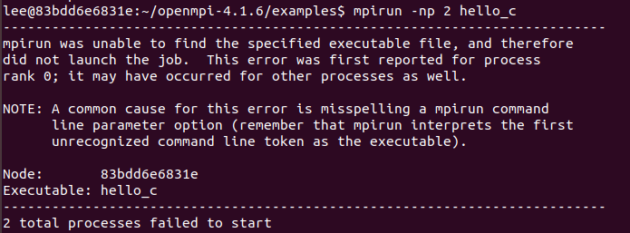

由于时间问题，该报错仍然没有解决

#### 3.2.2 手动构建镜像  
由于使用Dockerfile自动构建镜像（较为推荐的路径）需要一定的学习，这里就先尝试手动构建  

先从之前的镜像退出来，查看当前容器的情况  
```bash
docker ps -a
```  

  

手动构建  
```bash  
docker commit 83bdd6e6831e
```  
  

这样就可以在 `images` 中看到这个镜像  

  

```bash
docker save 2325aae77464 > node.tar
```
node.tar就是我们的镜像（但我真不知道怎么加载它） 

我们可以用  
```bash
docker run -it --name node01 2325aae77464 
```
来生成一个使用该镜像的容器  

  

但是在容器之间的网络问题上完全没有相关知识，所以bonus到这里也确实进行不下去了，先这样吧

---  


