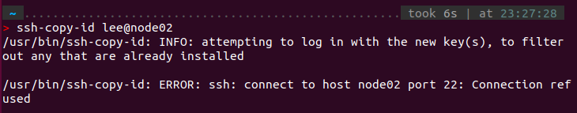

# Lab1 Report  
**软件安装**  
- [x] 下载OpenMPI、BLAS和HPL的源代码并编译安装
  
**集群搭建**  
- [x] 克隆虚拟机
- [x] 配置虚拟机互联
- [x] 测试节点间通信

**性能测试**  
- [x] 在虚拟机集群上使用openMPI运行HPL性能测试，记录测试结果
  
**Bonus（选做）**  
- [ ] 配置NFS并复现实验
- [ ] 使用Docker复现实验
- [ ] 使用Spack复现实验  

---
## 1. 虚拟机的搭建  
我搭建的虚拟机环境配置如下：
```bash  
Hypervisor : VMware Workstation Pro 17.5.2  
OS : ubuntu-18.04.6-64bit
Hard Disk : 20GB  
Memory : 4096MB  
Network Adapter : NAT  
Other Devices : 2CPU cores
```  


装机完成后为虚拟机下载必要的build-seeential软件包，其中包含了全面的编译器和构建工具  

```bash
sudo apt update
sudo apt install build-essential
```  

## 2. 任务一：从源码构建OpenMPI和HPL  
接下来的构建和安装分为三个部分  
### 2.1 BLAS & CBLAS  
#### BLAS
```bash  
wget "http://www.netlib.org/blas/blas-3.12.0.tgz"
tar xvf blas-3.12.0.tgz
cd BLAS-3.12.0
make
```  
前三句话没有问题，`make`的时候会报错  
```bash  
make : gfortran :No such file or directory  
```  
提示缺少了gfortran，需要下载:`sudo apt install gfortran`  
再次`make`后将刚下载到的库文件复制到系统库文件  
```bash  
sudo cp blas_LINUX.a /usr/local/lib/libblas.a
```  
  
  

#### CBLAS  
```bash  
wget http://www.netlib.org/blas/blast-forum/cblas.tgz
tar -xvf cblas.tgz
```  
接下来我们的目标是接下来我们要编译CBLAS文件，得到cblas_LINUX.a  

`make`之前需要修改Makefile。打开Makefile.in，可以看到

  

我们需要指定BLAS库的路径，刚刚我们已经把blas_LINUX.a复制到了系统库文件，修改路径如下

  

这样就可以`make`  


*P.S. 中间有几条warning，但没有error*  

  

成功在 /CBLAS/lib中生成了cblas_LINUX.a
把它也复制到`/usr/local/lib/libcblas.a`
```bash
sudo cp cblas_LINUX.a /usr/local/lib/libcblas.a  
```

### 2.2 OpenMPI 
```bash  
wget "https://download.open-mpi.org/release/open-mpi/v5.0/openmpi-5.0.3.tar.gz"
tar xvf openmpi-5.0.3.tar.gz
cd openmpi-5.0.3
```  
下载好后安装在特定的路径`/usr/local/openMPI`  
```bash
./configure --prefix=/usr/local/openMPI
make
sudo make install  
```  
漫长的等待后安装完成

接下来需要修改`PATH`和`LD_LIBRARY_PATH`(之后讲MPI的时候会提到)，我是使用nano打开修改的
```bash
nano ~/.bashrc
```   
在`.bashrc`的最上面配置环境变量  

  

最后运行一下使修改生效  
```bash  
source ~/.bashrc
```  

### 2.3 HPL  
```bash  
wget https://netlib.org/benchmark/hpl/hpl-2.3.tar.gz
tar -xvf hpl-2.3.tar.gz
cd hpl-2.3
```  
为HPL构建提供一个合适的Makefile文件  
```bash 
cp setup/Make.Linux_PII_CBLAS ./Make.Linux_PII 
```  
对这个Make.Linuc_PII文件进行修改  
```bash  
ARCH         = Linux_PII_CBLAS -> Linux_PII  
TOPdir       = $(HOME)/hpl-2.3 -> /home/lee/hpl-2.3  
MPdir        = /usr/local/mpi ->/usr/local/openmpi  
MPinc        = -I$(MPdir)/include
MPlib        = $(MPdir)/lib/libmpich.a -> $(MPdir)/lib/libmpi.so  
LAdir        = $(HOME)/netlib/ARCHIVES/Linux_PII -> /home/lee/CBLAS  
LAinc        =
LAlib        = $(LAdir)/libcblas.a $(LAdir)/libatlas.a -> /usr/local/lib/libcblas.a /usr/local/lib/libblas.a -lgfortran
CC           = /usr/bin/gcc -> /usr/local/openMPI/bin/mpicc
```
修改完成后，根据刚才修改的Makefile去make  
```bash  
make arch=Linux_PII
```  
可以在`/hpl-2.3/bin/Linux_PII`目录下找到的可执行文件xhpl  


*P.S 任务一源码构建的内容虽然看起来不甚复杂，但对于新手属实不友好。前置实验对Angband的构建中，对安装路径强调的不多，在实验文档中说
 ***./configure # 不带参数，将默认安装到 /usr/local/ 下，此时不需要修改 PATH 和 LD_LIBRARY_PATH 等 ; 如果你使用 --prefix 参数指定了安装路径，则可能需要修改 PATH 和 LD_LIBRARY_PATH。***   
 但在第一次使用尝试（ubuntu）的时候内存不足，第二次改用Debian发现并没有下载到local里，而是在/home/lee/下，BLAS也完全没有配好，既没有把库放在正确的位置，也没有在Makefile.Linux_PII中修改成正确的路径，导致一直error，花了很长时间一度很崩溃。第三次尝试又换回ubuntu，configure的时候用了--prefix指定/usr/local，添加了PATH和LD_LIBRTARY_PATH环境变量，按照Makefile去放置库*  


## 3. 任务二：使用HPL测试虚拟机集群的性能  
### 3.1 集群节点间的连接与互访  
用VMware Workstation自带的功能克隆虚拟机，命名为node01，node02，node03，node04。  
在克隆时选择*完整克隆*  
**注意，不只是在 Hypervisor 中修改名字，还需要在虚拟机中修改 /etc/hostname**
我们可以用`sudo nano /etc/hostname`来修改名称,之后`reboot`重启  
```bash
# 查看各台虚拟机的ip地址：
ip addr
node01：192.168.75.145
node02：192.168.75.143
node03：192.168.75.138
node04：192.168.75.142
```  
获取后在node01中修改`/etc/hosts`文件，添加其他节点的地址  


根据ssh原理，我们需要在主节点(node01)上生成公钥，把公钥放到node02/03/04上，建立链接。(这一过程类似于第一次登录ZJU集群时的操作)  
```bash
ssh-keygen # 注意不需要为密钥设置密码，全程回车即可  
ssh-copy-id user@hostname  #e.g.ssh-copy-id lee@node02
```   
  

*P.S 这里有个小失误，由于是重装了一台ubuntu来做的，所以之前没有装openssh-server和openssh-client，应该先装好再克隆的*   

  

之后再操作就不会error了  

  

根据提示尝试登录node02  
```bash  
ssh lee@node02
```  
  

红框处表面我们已经可以从node01登录node02的shell了  

对node03/node04做同样的操作  


### 3.2 测试MPI运行  
在node01上写一个hostfile，指定节点和进程数(直接新建就好，这里我建在了`/home/Documents`)  


*P.S 这个slots似乎是与当时设置的cores有关的，在前面测试MPI能否正常运行的时候，执行`mpirun -n 2 hello_c`是可以的，如果超过2个MPI processes就会error。似乎是MPI会计算CPU的算力上限，给出限制。*  
**SOLVED:设置环境变量声明`export OMP_NUM_THREADS=8`就可以设定线程数量**

  
 


简单测试MPI可以正常运行  
```bash  
mpirun --hostfile hostfile cat /etc/hostname
```
  

### 3.3 运行HPL  
切换工作目录到`HPL`所在目录，`xhpl`需要在工作目录下找到`HPL.dat`
```bash
cd /hpc-2.3/bin/Linux_PII
```  
找到xphl可执行文件，运行
```bash
mpirun --hostfile /home/lee/Documents/hostfile ./xhpl  
```

  

运行成功！

*P.S 在写实验报告的时候第二次过了一下流程，发现ssh居然连不上了，后来发现虚拟机重启后IP地址也变了(?)，需要修改`hosts`文件。* 

## 4.Bonus尝试（未成功） 

其实我完全还不清楚要怎么用Docker来复现集群的搭建，但我觉得Docker容器和虚拟机应该是十分类似的，我的基本想法是：在一个ubuntu容器中搭建一个类似之前The One一样的主节点，把它创建成镜像。用这个镜像再创建三个容器（类似于克隆虚拟机），让他们互相ping通，形成集群。概括来说是一台主机、四个容器的结构。  

但由于时间和能力有限，只在一个Docker容器中复现了The One的环境配置，并手动构建了镜像，这里只记录了遇到的问题，其他步骤与The One的配置一样  

---
新的ubuntu-container进去后只有root用户，需要自己创建一个用户、下载sudo，并把该用户添加到sudoers file中  

使用root用户权限，打开 /etc/sudoers ，添加  
```bash
lee ALL=(ALL) ALL
```

在配置CBLAS进行make的时候，本来的warning变成了error，需要在Makefile.in中对编译选项进行修改  
```bash
FC=gfortran --> FC=gfortran -fallow-argument-mismatch
```  
忽略这个报错，之后就可以正常make  

之后的构建与之前完全一致，但在测试OpenMPI的时候出现了问题  


由于时间问题，该报错仍然没有解决

手动构建镜像后可以再 `images` 中查看到该镜像  
```bash  
docker commit 83bdd6e6831e
```
 
  


我们可以用  
```bash
docker run -it --name node01 2325aae77464 
```
来生成一个使用该镜像的容器

  

后续应该需要设置容器的网络来实现相互的链接


## 5. 总结  
至此，Lab1的大部分工作告一段落。说实话，这对大佬来说当然是轻而易举的事情，作为一个之前连linux和虚拟机都从来没碰过的纯纯小白，当意识到有一个小集群运行在自己电脑上时，还是相当激动的。  
我不确定会在HPC这条路上走多远，但很高兴，已经开始了  
```bash  
hello new world
```  
