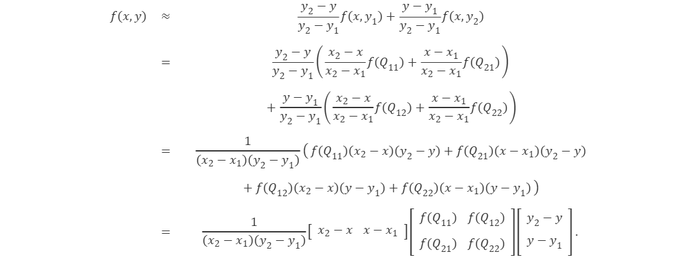
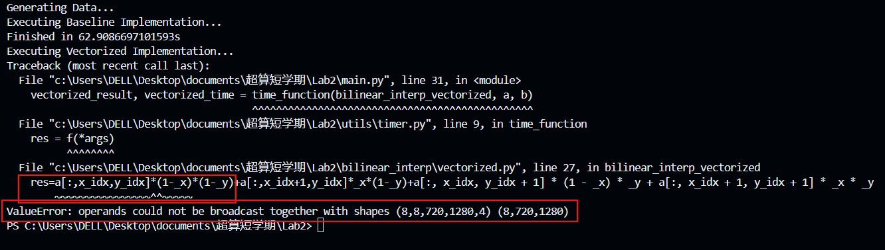
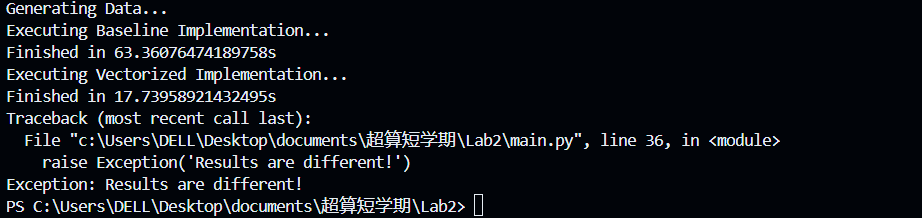
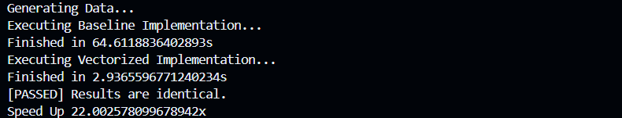

# Lab2 Report
- [x] 完成双线性插值的向量化版本  
- [x] 测试向量化实现的正确性和加速比  

---
## 2.1 基本概念  
### 2.1.1 双线性插值算法    
wikipedia给出了形式化的定义：  

假如我们想得到未知函数 f 在点 P=(x,y) 的值，假设我们已知函数 f 在 Q11=(x1,y1), Q12=(x1,y2), Q21=(x2,y1) 及 Q22=(x2,y2) 四个点的值。

 
 
首先在 x 方向进行线性插值，得到


然后在 y 方向进行线性插值，得到  



注意此处如果先在 y 方向插值、再在 x 方向插值，其结果与按照上述顺序双线性插值的结果是一样的。  

在 `basline` 版本中，
```py  
res[n, i, j] = a[n, x_idx, y_idx] * (1 - _x) * (1 - _y) + a[n, x_idx + 1, y_idx] * _x * (1 - _y) + a[n, x_idx, y_idx + 1] * (1 - _x) * _y + a[n, x_idx + 1, y_idx + 1] * _x * _y
```  
就是对公式 `f(x,y)` 的展开。  

### 2.1.2 NHWC 数据格式  
NHWC（样本数-高度-宽度-通道） 数据格式是卷积神经网络（CNN）中广泛使用的一种数据组织方式，尤其在处理图像、点云或特征图等多维数据时尤为重要。在NHWC格式中，数据按照以下顺序进行排列：
```bash
N：Batch Size（批次大小），表示一次处理的数据样本数量。
H：Height（高度），表示图像或特征图的高度。
W：Width（宽度），表示图像或特征图的宽度。
C：Channel（通道数），对于彩色图像来说，通常是RGB三个通道。
```  
真实情况下我们处理的数据都是以 batch 为单位的，按批进行处理的。<u>以双线性插值为例，我们往往会一次性送入 N 张大小为 H×W 的图片，每个像素上有 C 个通道，然后一次性返回这 N 张图片处理好的结果</u>。

## 2.2 实验过程  
### 2.2.1 完成向量化实现  
需要优化的部分就是3个 `for` 循环，通过向量化让b中不同批次(N)、不同位置(H,W)的点同时通过双线性插值算法得到对应值。  

第一次尝试没有考虑到维数不匹配的问题，出现报错  

  

原代码为：  

```py
# 接着计算差值  
_x,_y=b[:,:,:,0]-x_idx,b[:,:,:,1]-y_idx  

# 直接套公式  
res=a[:,x_idx,y_idx]*(1-_x)*(1-_y)+a[:,x_idx+1,y_idx]*_x*(1-_y)+a[:, x_idx, y_idx + 1] * (1 - _x) * _y + a[:, x_idx + 1, y_idx + 1] * _x * _y
```    

其中，a的shape是(N,H1,W1,C)，但_x的shape是(N,H1,W1)，_x缺少了通道数这个维度，所以需要为它加上这一维度  
```py  
_x=_x[:,:,:,np.newaxis]
_y=_y[:,:,:,np.newaxis] 
```  
`np.nuewaxis` 用于在数组的指定位置增加一个新的轴（axis），效果等同于在切片操作中指定一个 None 或空切片（:），但它提供了更明确的语义。
当对一个数组使用 `np.newaxis` 时，实际上是在告诉 NumPy 在数组的指定位置插入一个新的维度，该维度的大小为1。这不会改变数组中的任何数据，只是改变了它的形状（shape）   

但遗憾的是这样做虽然能让程序运行，但答案出现了错误： 

  

这个问题对我造成了极大的困扰  
实际上，对于 `a[N,H,W]` ，传入的时候它存了每个点C个通道的值，现在向量化之后，我们要对这些点一起做操作；我们以 `x_idx` 和 `y_idx` 作为索引把所有点作为整体，这两个索引具有[N,H,W]的三维结构，但是 `N` 不具备三维结构，所以我们需要将 `N` 拓展为三维的  

*P.S 描述的还是很模糊，仍然不是完全明白*

```py
new_n=np.arange(N)[:, np.newaxis, np.newaxis] # np.arange()生成给定范围的数组
```    
最后得到的 `bilinear_interp_vectorized` 函数如下：  
```py
def bilinear_interp_vectorized(a: np.ndarray, b: np.ndarray) -> np.ndarray:
    """
    This is the vectorized implementation of bilinear interpolation.
    - a is a ND array with shape [N, H1, W1, C], dtype = int64
    - b is a ND array with shape [N, H2, W2, 2], dtype = float64
    - return a ND array with shape [N, H2, W2, C], dtype = int64
    """
    # get axis size from ndarray shape
    N, H1, W1, C = a.shape
    N1, H2, W2, _ = b.shape
    assert N == N1

    # TODO: Implement vectorized bilinear interpolation  
    res = np.empty((N, H2, W2, C), dtype=int64)  
    
    # 首先找到相邻且左偏的点坐标，分为x和y
    x_idx,y_idx=np.floor(b[:,:,:,0]).astype(int64),np.floor(b[:,:,:,1]).astype(int64) 
    
    # 接着计算差值  
    _x,_y=b[:,:,:,0]-x_idx,b[:,:,:,1]-y_idx  

    #在_x,_y上添加空的C轴，以匹配a
    _x=_x[:,:,:,np.newaxis]
    _y=_y[:,:,:,np.newaxis]  

    new_n=np.arange(N)[:, np.newaxis, np.newaxis]

    # 直接套公式  
    # res=(a[:,x_idx,y_idx]*(1-_x)*(1-_y)+a[:,x_idx+1,y_idx]*_x*(1-_y)+a[:, x_idx, y_idx + 1] * (1 - _x) * _y + a[:, x_idx + 1, y_idx + 1] * _x * _y).astype(int64)

    res=(a[new_n,x_idx,y_idx]*(1-_x)*(1-_y)+a[new_n,x_idx+1,y_idx]*_x*(1-_y)+a[new_n, x_idx, y_idx + 1] * (1 - _x) * _y + a[new_n, x_idx + 1, y_idx + 1] * _x * _y).astype(int64)

    return res
```

### 2.2.2 检测实现正确与加速效果  
运行 `main.py`，查看输出：  

  

使用 `bilinear_interp_baseline` 函数耗时约64s，使用 `bilinear_interp_vectorized` 函数耗时约22s，加速比达到了22x  

该程序运行在自己的主机上，使用的是 12th Gen Intel(R) Core(TM) i5-12500H   2.50 GHz
