# PAC  
主要用于PAC比赛过程中学习的记录，会很不成体系，因为本来就是在疯狂补漏  

VPN选择SSL VPN  
网关：218.77.205.2:4433  
账号：paratera  
密码：VZXJqqtQTEFj2pxoWrsN  

集群ip：10.82.24.30  
集群账号：PAC20241612  
集群密码：19883202356  

[VScode通过ssh连接集群](https://blog.csdn.net/Oxford1151/article/details/137228119)  

加载环境 `source load.sh`


## winograd
这实在是一个痛苦的过程，像个无头苍蝇  
先简答介绍winograd算法，其实就是按下面的步骤做卷积运算  

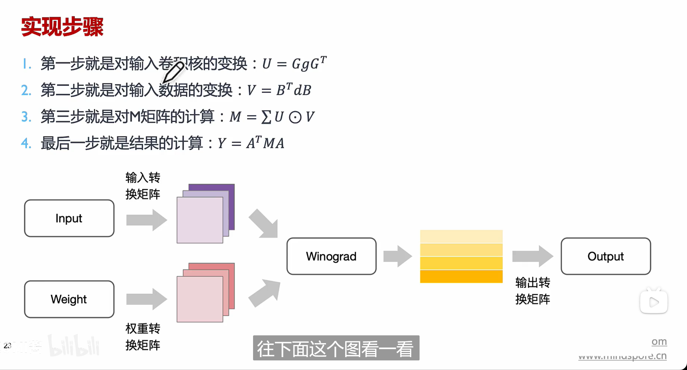  

我们要修改 `winograd.c` 文件  
我找的可能的突破口是 `sgemm` 函数，这是一个单精度通用矩阵乘法。在原代码中已经简单用了 `OpenMP` 中的指令来并行化嵌套，但肉眼可见这应该是一个效率很低的函数  

首先能想到的就是SIMD，也就是所谓的单指令多数据，也就是向量化    
要实现SIMD，我所知道的途径有  
```bash 
Lab2里面的手写SIMD
使用指令集去实现，比如NEON（在 ARM 处理器上）或 SSE/AVX（在 x86 处理器上）  
NVIDIA GPU,用CUDA编程  
```  

这里比赛给出的硬件参数是  

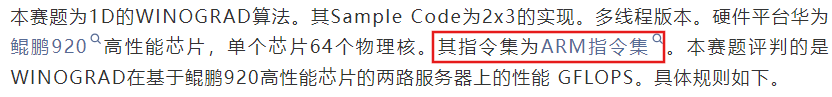  

所以尝试学习的是ARM SIMD指令集neon  
[CSDN文档](https://blog.csdn.net/m0_47324800/article/details/136841581)  
[b站视频](https://www.bilibili.com/video/BV1GJ411x7XW?p=2&vd_source=14ad5ada89d0491ad8ab06103ead6ad6)  
[官方指令集文档](https://developer.arm.com/architectures/instruction-sets/intrinsics/)  

## ARM-NEON-SIMD-COPROCESSOR  
ARM-NEON单指令多数据协处理器  

ARM平台下提供两种编程方式，一种是汇编语言（显然不会）；另一种是**NEON intrinsics**（C，类似函数调用），是底层汇编指令的封装，不需要用户考虑底层寄存器的分配（超出也可以自动分配）  

新的 Armv8a 架构有 32 个 128bit 向量寄存器，老的 ArmV7a架构有 32个 64bit(可当作 16 个128bit)向量寄存器，被用来存放向量数据，每个向量元素的类型必须相同，根据处理元素的大小可以划分为 2/4/8/16 个通道

  

### NEON 数据类型和指令类型  
#### NEON数据类型    
向量数据类型命名规则  
```bash  
<type><size>x<number_of_lanes>_t  
# 比如 int8x16_t 是一个16通道的向量，每个通道包含一个有符号8位整数  
```  

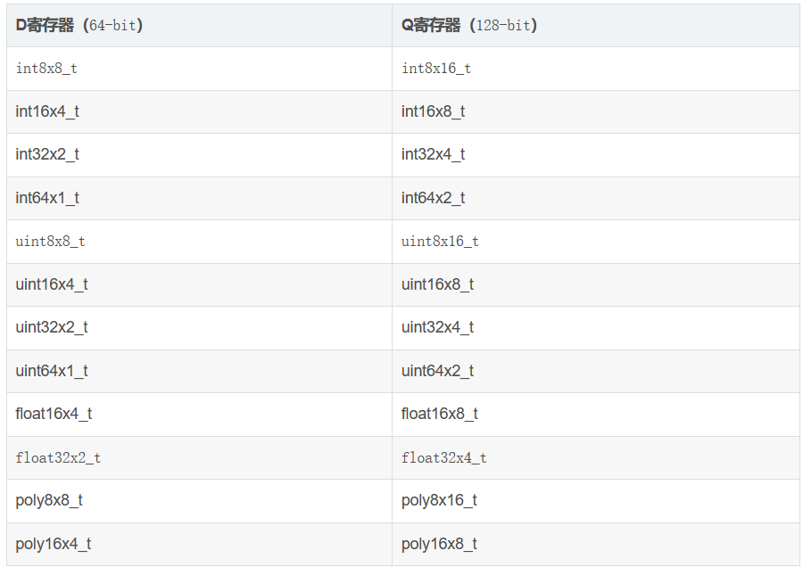  

D寄存器一次能够处理8个u8数据，Q处理器一次能够处理16个u8数据  

#### NEON指令类型  
NEON指令的函数名格式  
```bash  
v<mod><opname><shape><flags>_<type>  
# v:vector  
# mod有以下几种  
# q:饱和计算，h:折半计算，d:加倍计算，r:舍入计算，p：pairwise计算，具体见CSDN文档，一般就用饱和计算  
# opname:operation name  
# shape有一下几种  
# l:long，输出向量元素长度是输入的两倍  
# w:wide，第一个输入向量和输出向量类型一样，且是第二个输入向量元素长度的两倍  
# n:narrow，输出向量的元素长度是输入向量的1/2  
# _n:有标量参与向量计算  
# _lane:指定向量中某个通道参与向量计算  
```  
 
### NEON指令介绍  
一个NEON的指令执行以下流程  

  

### sgemm
NEON的基础内容十分冗长，而我要做的就是用NEON实现SIMD，所以我决定直接上手  

优化SGEMM的方法参考[如何加速矩阵乘法](https://renzibei.com/2021/06/30/optimize-gemm/)、[通用矩阵乘法（GEMM）优化——基于arm neon](https://blog.csdn.net/xiaoyi_jason/article/details/115289760?ops_request_misc=%257B%2522request%255Fid%2522%253A%2522172095190316800184169847%2522%252C%2522scm%2522%253A%252220140713.130102334.pc%255Fall.%2522%257D&request_id=172095190316800184169847&biz_id=0&utm_medium=distribute.pc_search_result.none-task-blog-2~all~first_rank_ecpm_v1~rank_v31_ecpm-19-115289760-null-null.142^v100^pc_search_result_base8&utm_term=GEMM%E4%BC%98%E5%8C%96&spm=1018.2226.3001.4187)  

使用到的命令可以在[Arm-neon-intrinsics Public](https://github.com/rogerou/Arm-neon-intrinsics) 中简单快速查找  

让我们开始  

SGEMM最原始的代码差不多是这样  
```c  
void sgemm(const float *A, const float *B, float *out, const int M, const int K, const int N) {
  for (int i = 0; i < M * N; ++i) {
    out[i] = 0.0f;
  }
  for (int i = 0; i < M; ++i)
    for (int j = 0; j < N; ++j)
       for (int k = 0; k < K; ++k)
          out[i * N + j]  += A[i * K + k] * B[k * N + j];
}
```  

跳过编译器优化，我们从利用neon intrinsic开始  

在ARM-v8中有32个128位定长寄存器，每个寄存器可以存4个单精度浮点数，支持SIMD向量化操作。利用这一特性，我们可以四个四个地计算矩阵out中的元素。

这里属实给我整的够呛，CSDN中虽然给了代码，但是列主序的，我是理解之后写的行主序  

```c  
void sgemm_parallel(const float *A, const float *B, float *out, const int M, const int K, const int N) {
  //#pragma omp parallel for collapse(2)
  int i,j;
  for (i=0;i<M;++i){
    for(j=0;j<((N)&(~3));j+=4){  //我采用横向同时计算out中的四个值，N有可能不是4的整数倍
      float32x4_t c=vmovq_n_f32(0.0f);  //从out中横向连续取出四个位置
      for(int k=0;k<K;++k){   
        float a=A[i*K+k];  //对于A就是对第i行一个个取，一共k个
        float32x4_t b=vld1q_f32(&B[k*N+j]);  //对于B就是纵向一个个取，同时取4列，一共k个
        c=vmlaq_n_f32(c,b,a);  //做乘法
      }
      vst1q_f32(&out[i*N+j],c);  //把寄存器中数据加载回内存
    }
    for(;j<N;++j){  //处理剩余的边界
      register float temp=0.0f;
      for(int k=0;k<K;++k){
        temp+=A[i*K+k]*B[k*N+j];
      }
      out[i*N+j]=temp;
    }
  }
}
```  

在这个版本中，每个内循环是A中1$\times$K的子矩阵乘以B中k$\times$4的子矩阵。显然A中元素的利用效率是很低的。我们也可以同时load A中相邻的4行元素，让内循环变成A中4$\times$k的子矩阵乘以B中k$\times$4的子矩阵。  

```c  
void sgemm_parallel(const float *A, const float *B, float *out, const int M, const int K, const int N) {
  int i,j,k;
  for(i=0;i<((M)&(~3));i+=4){
    for(j=0;j<((N)&(~3));j+=4){
      float *a_ptr_0,*a_ptr_1,*a_ptr_2,*a_ptr_3;
      a_ptr_0=&A[i*K+0];
      a_ptr_1=&A[(i+1)*K+0];
      a_ptr_2=&A[(i+2)*K+0];
      a_ptr_3=&A[(i+3)*K+0];

      float32x4_t c_sum_0={0};
      float32x4_t c_sum_1={0};
      float32x4_t c_sum_2={0};
      float32x4_t c_sum_3={0};

      float a_reg_0,a_reg_1,a_reg_2,a_reg_3;

      for(int k=0;k<K;k++){
        float32x4_t b_reg=vld1q_f32(&B[k*N+j]);
        a_reg_0 = *(a_ptr_0++);
        a_reg_1 = *(a_ptr_1++);
        a_reg_2 = *(a_ptr_2++);
        a_reg_3 = *(a_ptr_3++);

        c_sum_0=vmlaq_n_f32(c_sum_0,b_reg,a_reg_0);
        c_sum_1=vmlaq_n_f32(c_sum_1,b_reg,a_reg_1);
        c_sum_2=vmlaq_n_f32(c_sum_2,b_reg,a_reg_2);
        c_sum_3=vmlaq_n_f32(c_sum_3,b_reg,a_reg_3);
      }

      vst1q_f32(&out[i*N+j],c_sum_0);
      vst1q_f32(&out[(i+1)*N+j],c_sum_1);
      vst1q_f32(&out[(i+2)*N+j],c_sum_2);
      vst1q_f32(&out[(i+3)*N+j],c_sum_3);
    }
  }

  for(;j<N;j++){
    float c_0=0.0f,c_1=0.0f,c_2=0.0f,c_3=0.0f;
    for(int k=0;k<K;k++){
      c_0+=A[i*K+k]*B[k*N+j];
      c_1+=A[(i+1)*K+k]*B[k*N+j];
      c_3+=A[(i+2)*K+k]*B[k*N+j];
    }
    out[i*N+j]=c_0;
    out[(i+1)*N+j]=c_1;
    out[(i+2)*N+j]=c_2;
    out[(i+3)*N+j]=c_3;
  }
  for (;i<M;++i){
    for(j=0;j<((N)&(~3));j+=4){  //我采用横向同时计算out中的四个值，N有可能不是4的整数倍
      float32x4_t c=vmovq_n_f32(0.0f);  //从out中横向连续取出四个位置
      for(int k=0;k<K;++k){   
        float a=A[i*K+k];  //对于A就是对第i行一个个取，一共k个
        float32x4_t b=vld1q_f32(&B[k*N+j]);  //对于B就是纵向一个个取，同时取4列，一共k个
        c=vmlaq_n_f32(c,b,a);  //做乘法
      }
      vst1q_f32(&out[i*N+j],c);  //把寄存器中数据加载回内存
    }
    for(;j<N;++j){  //处理剩余的边界
      register float temp=0.0f;
      for(int k=0;k<K;++k){
        temp+=A[i*K+k]*B[k*N+j];
      }
    out[i*N+j]=temp;
    }
  }
}  
```
有了之前的经验，这个版本的实现比较好理解，就是把之前的操作重复四次；在处理边界的时候对于不足4列的部分还是直接使用for循环去算，对于不足4行的部分套用了上个版本中1$\times$4的矩阵去做  

值的一提的是，在测试数据中，4$\times$4的版本比1$\times$4的版本能够体现出优越性  

测试用例：

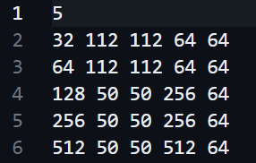

测试结果（在winograd算法中）：  

  

理论上接下还可以把4$\times$4拓展到8$\times$8，但这对于规模大的矩阵提升并不明显。而且规模越大对效率的降低越显著，这是因为对于out中同行不同列的子矩阵做计算的时候，A中4$\times$k的blocks要被多次加载，而A中的blocks每次取出的元素在内存上是不连续的，每次加载都会造成一定的**cache miss**

为此，我们可以尝试做**packing**，把A中4$\times$k的blocks给packing至某片连续的区域，这样下次访问的时候就是连续内存了，理论上可以减少cache miss的概率  

pakcing后的代码  
```c  
void sgemm_parallel(const float *A, const float *B, float *out, const int M, const int K, const int N) {
  int i,j,k;
  for(i=0;i<((M)&(~3));i+=4){
    for(j=0;j<((N)&(~3));j+=4){
      float *a_ptr_0,*a_ptr_1,*a_ptr_2,*a_ptr_3;
      /*a_ptr_0=&A[i*K+0];
      a_ptr_1=&A[(i+1)*K+0];
      a_ptr_2=&A[(i+2)*K+0];
      a_ptr_3=&A[(i+3)*K+0];*/  //可以packing

      float packedA[K*4]={0.0f};
      flaot* packedA_ptr=packedA;
      if(j==0){
        for(int k=0;k<K;k++){  //相当于将原来4*K的block转置成了K*4的block
          *(packedA_ptr++)=A[i*K+0];
          *(packedA_ptr++)=A[(i+1)*K+0];
          *(packedA_ptr++)=A[(i+2)*K+0];
          *(packedA_ptr++)=A[(i+3)*K+0];
        }
      }

      /*float32x4_t c_sum_0={0};
      float32x4_t c_sum_1={0};
      float32x4_t c_sum_2={0};
      float32x4_t c_sum_3={0};*/

      float32x4_t c_sum={0.0f};

      //float a_reg_0,a_reg_1,a_reg_2,a_reg_3;

      for(int k=0;k<K;k++){
        float32x4_t b_reg=vld1q_f32(&B[k*N+j]);
        /*a_reg_0 = *(a_ptr_0++);
        a_reg_1 = *(a_ptr_1++);
        a_reg_2 = *(a_ptr_2++);
        a_reg_3 = *(a_ptr_3++);*/
        float32x4_t a_reg=vld1q_f32(&packedA[k*4+0]);  //这样之后再取就可以用vld1q四个四个直接取

        /*c_sum_0=vmlaq_n_f32(c_sum_0,b_reg,a_reg_0);
        c_sum_1=vmlaq_n_f32(c_sum_1,b_reg,a_reg_1);
        c_sum_2=vmlaq_n_f32(c_sum_2,b_reg,a_reg_2);
        c_sum_3=vmlaq_n_f32(c_sum_3,b_reg,a_reg_3);*/  

        c_sum=vmul_f32(c_sum,a_reg,b_reg);  //后面的运算也不用逐位计算了
      }

      /*vst1q_f32(&out[i*N+j],c_sum_0);
      vst1q_f32(&out[(i+1)*N+j],c_sum_1);
      vst1q_f32(&out[(i+2)*N+j],c_sum_2);
      vst1q_f32(&out[(i+3)*N+j],c_sum_3);*/

      vst1q_f32(&out[i*N+j],c_sum);
    }
  }

  for(;j<N;j++){
    float c_0=0.0f,c_1=0.0f,c_2=0.0f,c_3=0.0f;
    for(int k=0;k<K;k++){
      c_0+=A[i*K+k]*B[k*N+j];
      c_1+=A[(i+1)*K+k]*B[k*N+j];
      c_3+=A[(i+2)*K+k]*B[k*N+j];
    }
    out[i*N+j]=c_0;
    out[(i+1)*N+j]=c_1;
    out[(i+2)*N+j]=c_2;
    out[(i+3)*N+j]=c_3;
  }
  for (;i<M;++i){
    for(j=0;j<((N)&(~3));j+=4){  //我采用横向同时计算out中的四个值，N有可能不是4的整数倍
      float32x4_t c=vmovq_n_f32(0.0f);  //从out中横向连续取出四个位置
      for(int k=0;k<K;++k){   
        float a=A[i*K+k];  //对于A就是对第i行一个个取，一共k个
        float32x4_t b=vld1q_f32(&B[k*N+j]);  //对于B就是纵向一个个取，同时取4列，一共k个
        c=vmlaq_n_f32(c,b,a);  //做乘法
      }
      vst1q_f32(&out[i*N+j],c);  //把寄存器中数据加载回内存
    }
    for(;j<N;++j){  //处理剩余的边界
      register float temp=0.0f;
      for(int k=0;k<K;++k){
        temp+=A[i*K+k]*B[k*N+j];
      }
    out[i*N+j]=temp;
    }
  }
}  
```  

packing后的代码在小规模的矩阵上没有优势，需要额外花packing的开销，但在大规模矩阵上有明显优势，对矩阵规模的敏感度下降。用上面的测试用例测试，速度快于1$\times$4子矩阵的版本，慢于4$\times$4子矩阵的版本。  

理论上还可以进行**blocking**优化，但对性能的提升有限，所以sgemm的优化就暂告段落。  

---

## CPUbench  
手册其实把这个东西讲得很清楚了，这里边看边摘出一点来
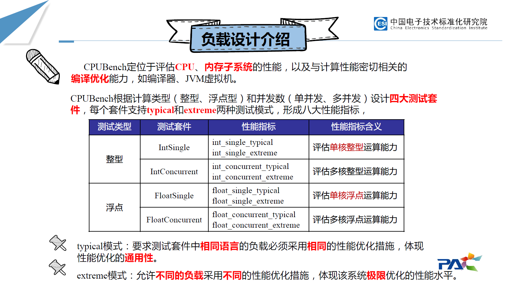  
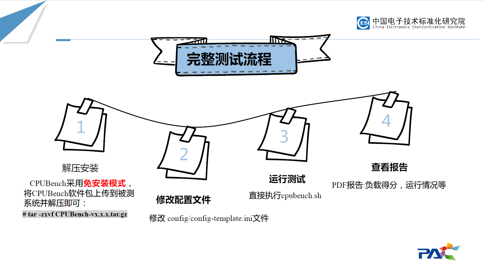
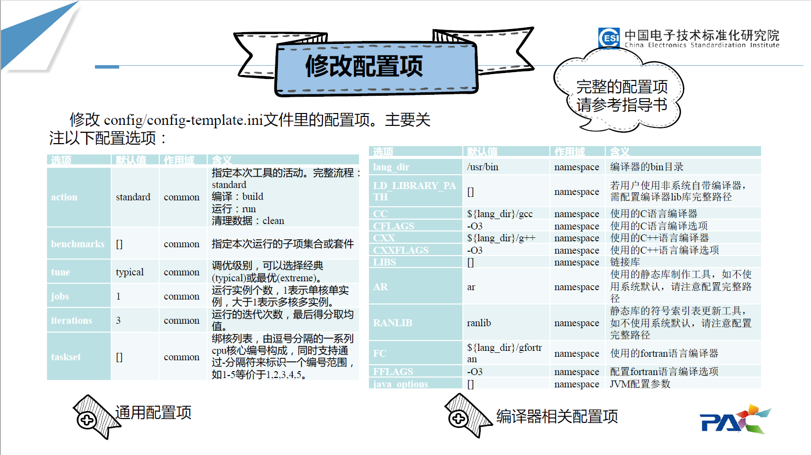  
  
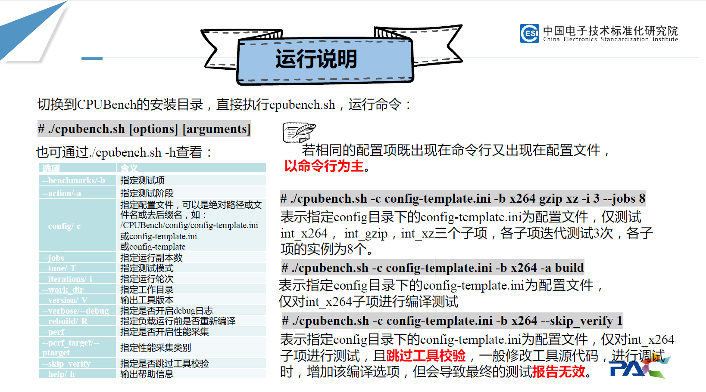  
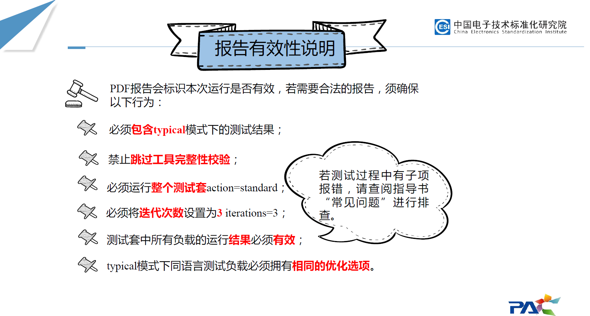  

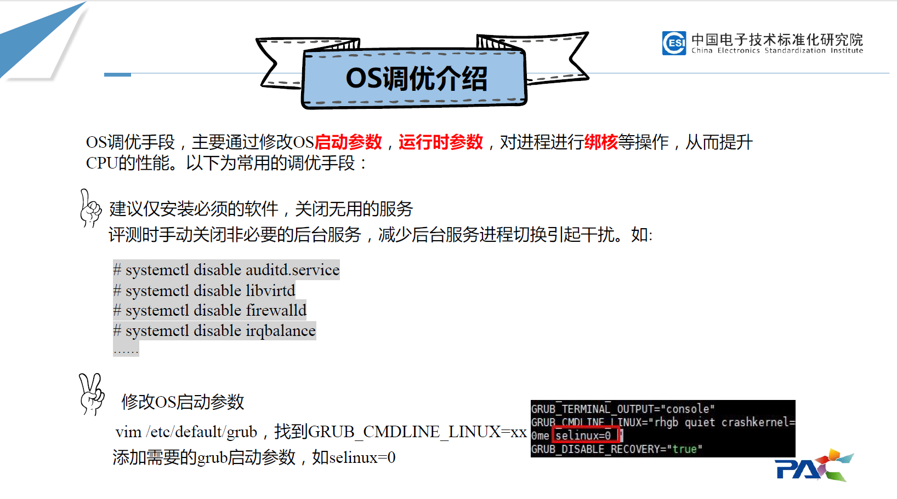
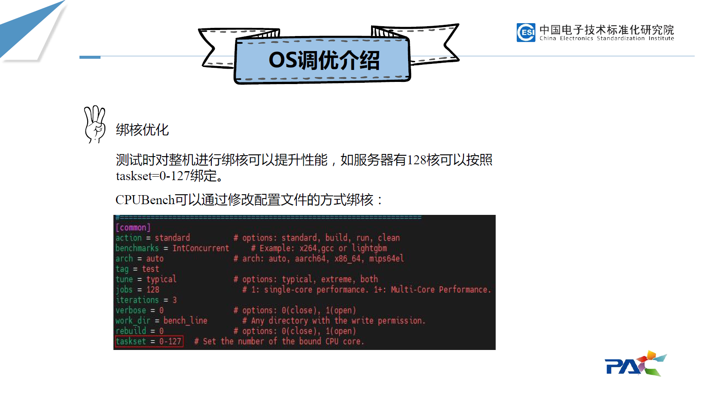
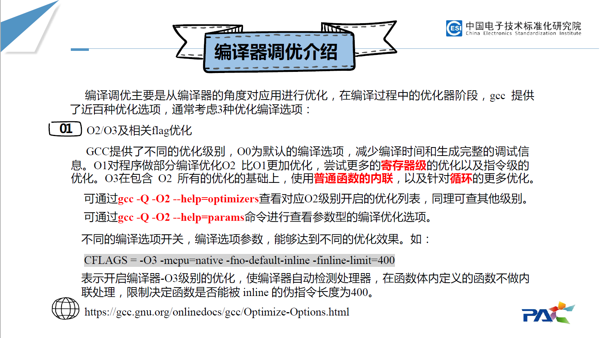
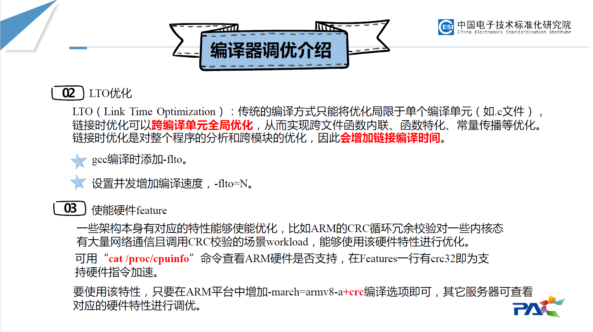
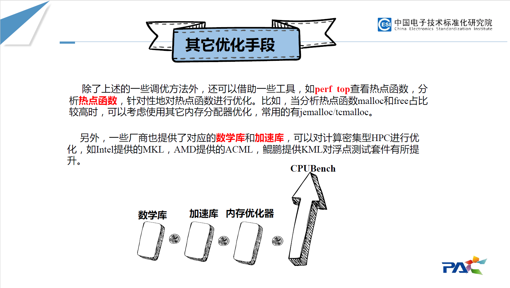


