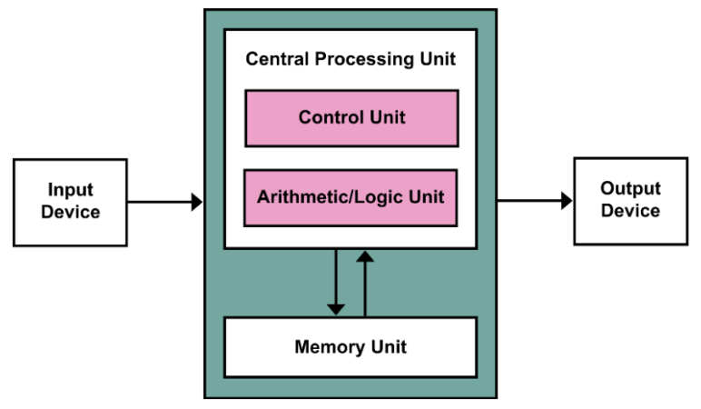
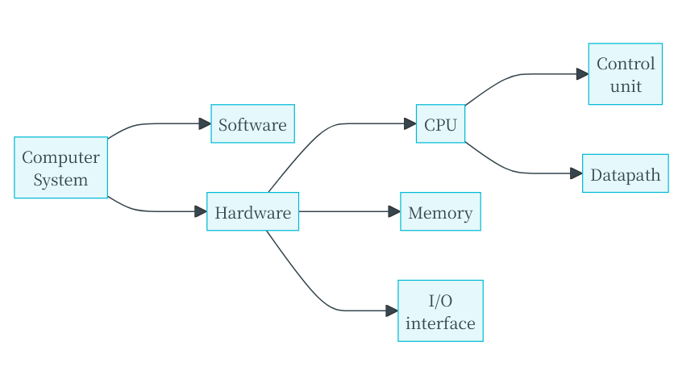
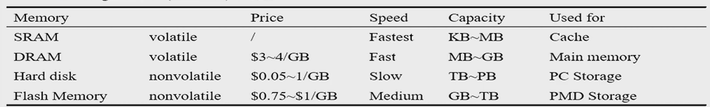
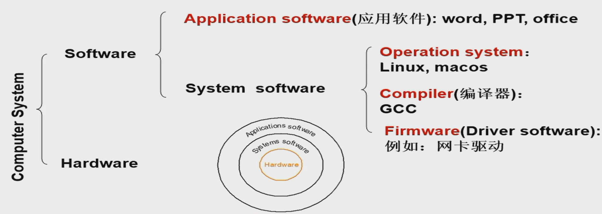
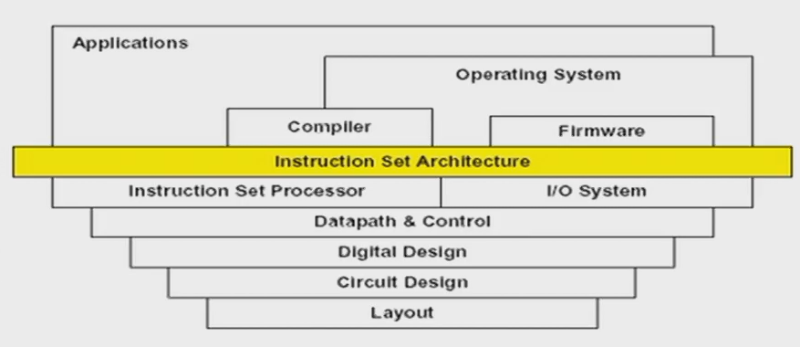
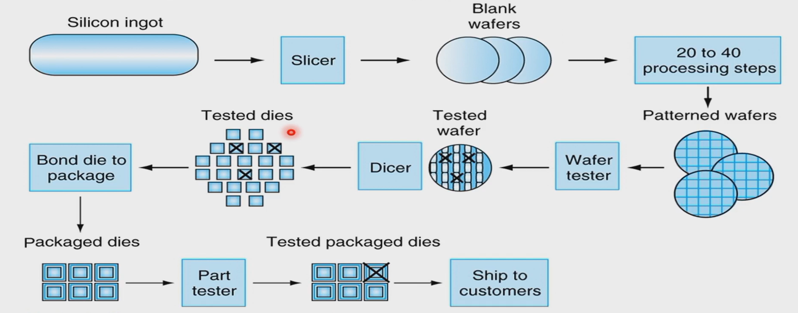
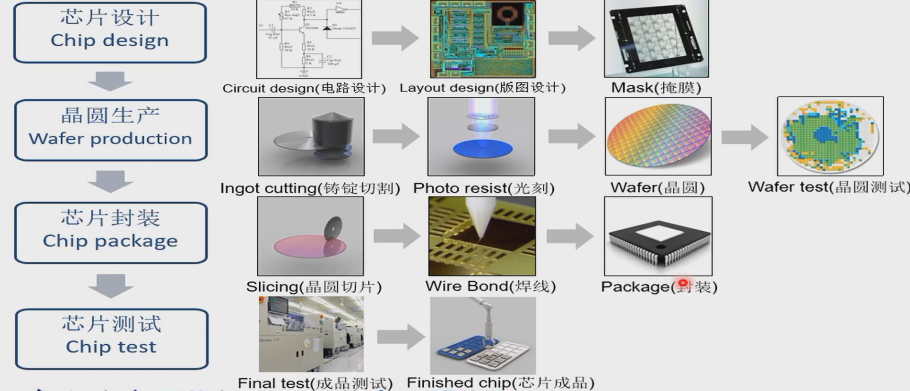

# Computer Organization & Design

## Chapter 1: Computer abstractions and Technology

### Introduction

#### von Neumann architecture
- Computation and memory are separated
- Memory that stores data and instructions
- Input and output mechanisms
- Istructions set architecture

#### RISC Architecture

RISC(Reduce Instruction Set Computer): a computer instruction set
- fewer cycles per instruction (CPI) than a Complex Instruction Set Computer(CISC)

#### What is a computer

Computer is an electronic device that manipulates data according to a list of instructions(program), with capability of Turing machine.

- Electronic realization
- A set of instructions in a well-defined manners
- Excution of a pre-recorded list of instructions
- Memory that can store instructions and data
- Turing-complete in theory

### Computer Organization

#### hardware

- input
- ouput
- memory:
  - Main Memory: volatile; used to hold programs while they are running(e.g. DRAM in computers)
  - Second memory: nonvolatile; used to store programs and data between runs(e.g. Flash in PMD, magnetic discks)
  - Volatile
    - DRAM(Dynamic Random Access Memory)
    - SRAM(Static Random Access Memory)
  - Nonvolatile
    - Solid state memory(Flash Memory)
    - Magnetic disk(Hard disk)
- CPU(Processor): active part of the computer, which adds numbers, test numbers, signals I/O devices to activate, and so on.
  - datapath: performs arithmetic operation
  - control: commands the datapath, memory, and I/O devices according to the instructions of the program

#### Software

- Application software
- System software
  - Operation system(Linux, macos)
  - Compiler: Translation of a program written in HLL(e.g. GCC)
  - Firmware: Software specially designed for a piece of hardware(Driver software) 

#### From a High-Level Language to the Language of Hardware

### Integrated circuits

#### Manufacturing ICs

