# Computer Organization & Design

<!-- 
f12  console
window.open(decodeURIComponent(document.getElementById('pdf-viewer').src.split("?file=")[1])); 
-->

## Chapter 1: Computer abstractions and Technology

### Introduction

#### von Neumann architecture
- Computation and memory are separated
- Memory that stores data and instructions
- Input and output mechanisms
- Istructions set architecture

#### RISC Architecture

RISC(Reduce Instruction Set Computer): a computer instruction set
- fewer cycles per instruction (CPI) than a Complex Instruction Set Computer(CISC)

#### What is a computer

Computer is an electronic device that manipulates data according to a list of instructions(program), with capability of Turing machine.

- Electronic realization
- A set of instructions in a well-defined manners
- Excution of a pre-recorded list of instructions
- Memory that can store instructions and data
- Turing-complete in theory

### Computer Organization

#### hardware

- input
- ouput
- memory:
  - Main Memory: volatile; used to hold programs while they are running(e.g. DRAM in computers)
  - Second memory: nonvolatile; used to store programs and data between runs(e.g. Flash in PMD, magnetic discks)
  - Volatile
    - DRAM(Dynamic Random Access Memory)
    - SRAM(Static Random Access Memory)
  - Nonvolatile
    - Solid state memory(Flash Memory)
    - Magnetic disk(Hard disk)
- CPU(Processor): active part of the computer, which adds numbers, test numbers, signals I/O devices to activate, and so on.
  - datapath: performs arithmetic operation
  - control: commands the datapath, memory, and I/O devices according to the instructions of the program

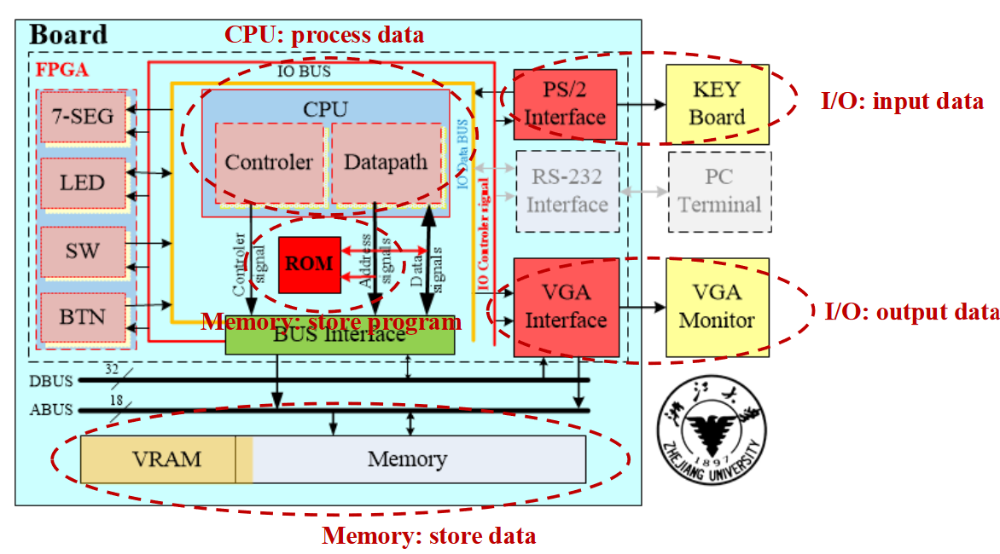

#### Software

- Application software
- System software
  - Operation system(Linux, macos)
  - Compiler: Translation of a program written in HLL(e.g. GCC)
  - Firmware: Software specially designed for a piece of hardware(Driver software) 

#### From a High-Level Language to the Language of Hardware

- Lower-level details are hidden to higher levels
- Instruction set architecture ---- the interface between hardware and lowest-level software
- Many implementations of varying cost and performance can run identical software

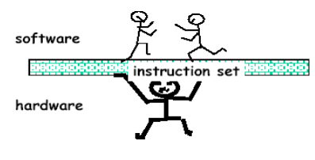

### Integrated Circuits

#### Transistor

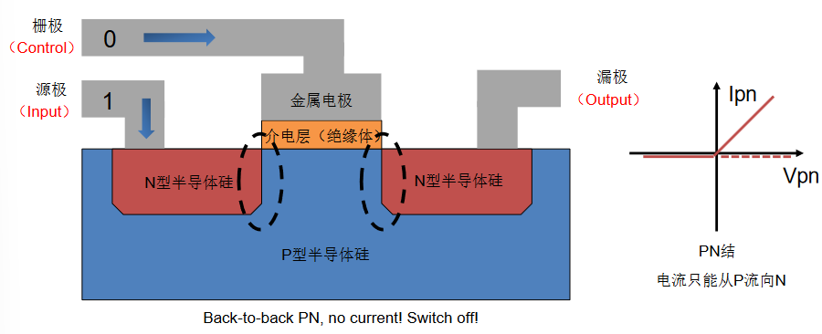

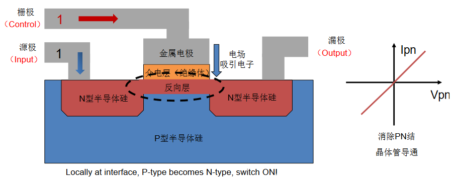

#### Manufacturing ICs

#### Integrated Circuit Cost

Yield: proportion of working dies per wafer

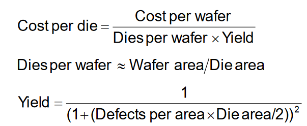

### Performance and Idea

#### Response Time and Throughput

- **Response time/execution time**: How long it takes to do a task
- **Throughput(bandwidth)**: Total work done per unit time

#### Relative Performance

Performance = 1 / Excution Time

e.g. 10s on A, 15s on B  
Excution Time~B~ / Excution Time~A~ / = 15s / 10s = 1.5  
So A is 1.5 times faster than B  

#### Measuring Excution Time

- **Elapsed time**: Total response time, including all aspects  
  - Processing, I/O, OS overhead, idle time  
- **CPU time**: Time spent porcessing a given job  

Operation of digital harware governed by a constant-rate clock

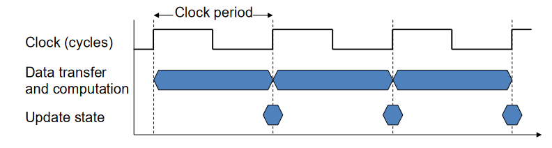

#### CPU Time

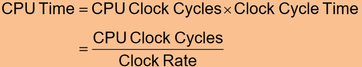

#### Instruction Count and CPI(Cycles per Instruction)

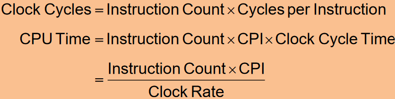

##### CPI in More Detail

If different instruction classes take diferrent numbers of cycles

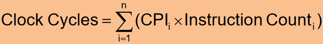

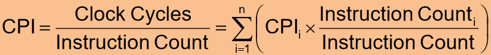

#### Performance Summary

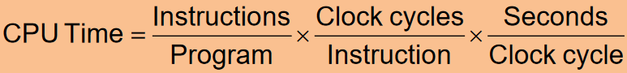

Performance depends on:
- Algorithm: affects IC, possibly CPI
- Programming language: affects IC, CPI
- Compiler: affects IC, CPI
- Instruction set architecture: affects IC, CPI, T~c~

#### Amdahl's Law

Corollary: make the common case fast

### Eight Great Ideas

- Design for Moore's Law  
- Use Abstraction to Simplify Design  
- Make the Common Case Fast
- Performance via Parallelism  
- Performance via Pipelining  
- Performance via Prediction  
- Hierarchy of Memories  
- Dependability via Redundancy  

## Chapter 3: Arithmetic for Computer  

### Introduction

##### Generic Implementation

- use program counter (PC) to link to instruction address  
- fetch the instrcution from memeory  
- the instruction tells what needs to be done  
- ALU will perform the specified arithmetic operations  

### Signed Number Representations  

|Sign Magnitude|Two's Complement|
|---------------------|----------|
|100 = -0|100 = -4|
|101 = -1|101 = -3|
|110 = -2|110 = -2|
|111 = -3|111 = -1|

### Addition, subtraction and ALU  

#### Addition & Subtraction  

Subtraction: Addition of 2's complement  

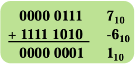  

#### Overflow conditions  

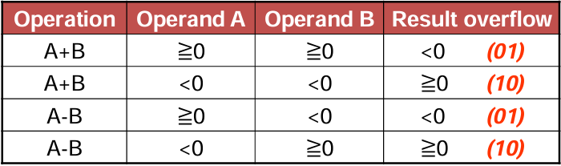  

#### Overflow process  

- Hardware detection in the ALU  
  - Generation of an exception (interrupt)  
- Save the instruction address (not PC) in special register EPC  
- Jump to specific routine in OS  
  - Correct & return to program  
  - Return to program with error code  
  - Abort program  

#### Consturcting an ALU  

Full adder Logic circuit  

